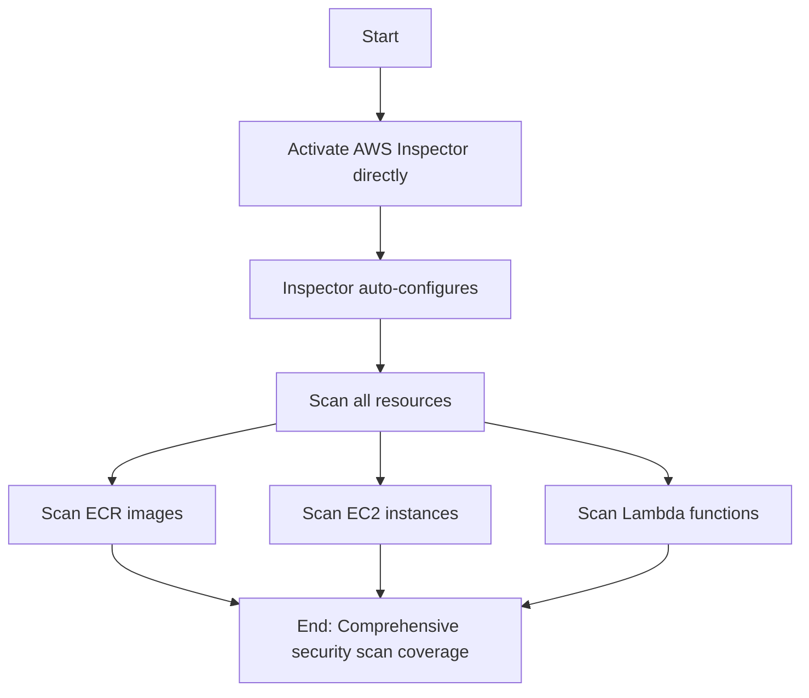
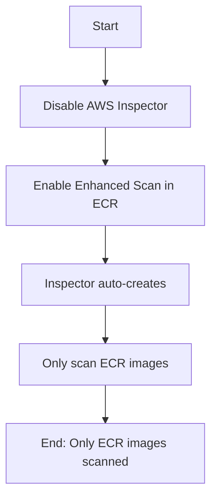
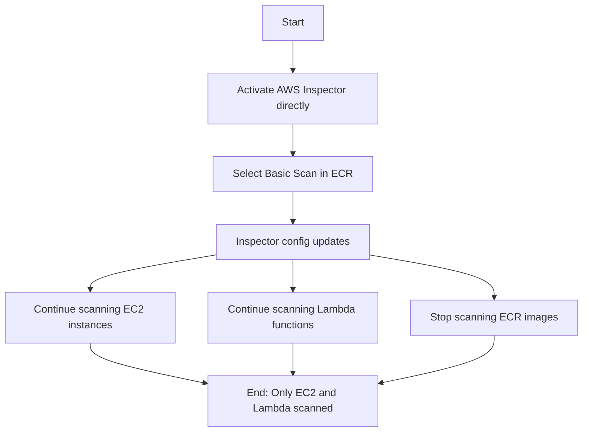
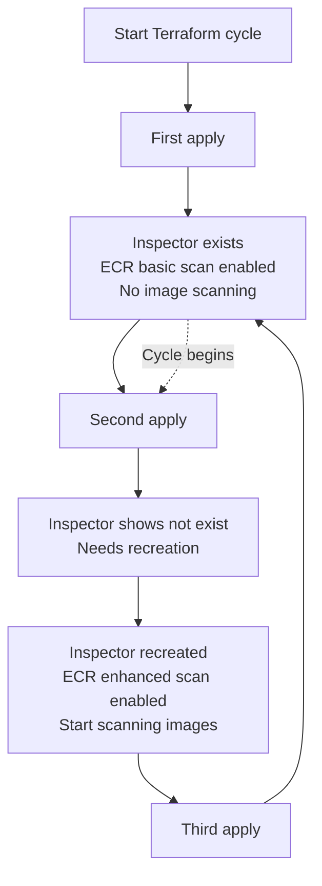
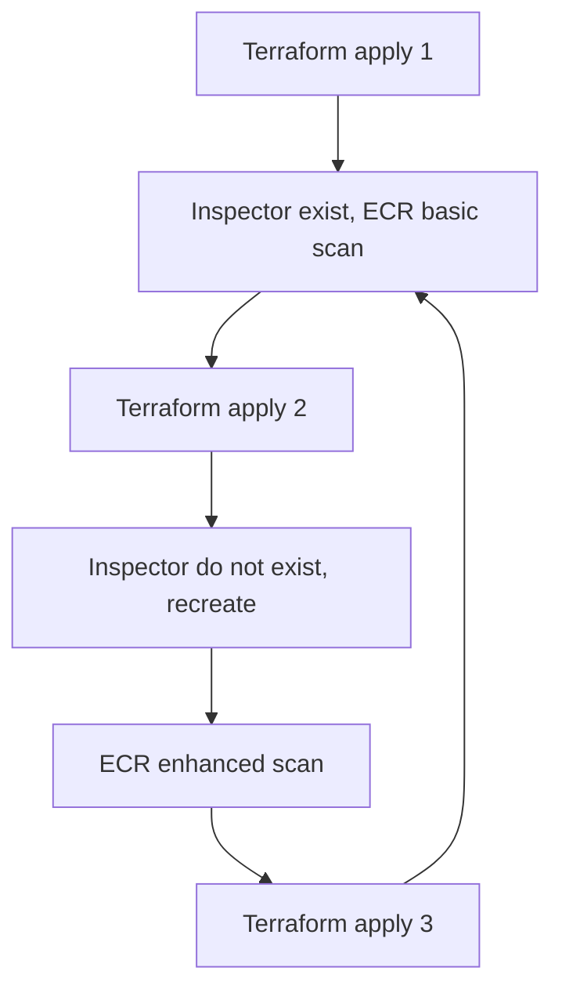
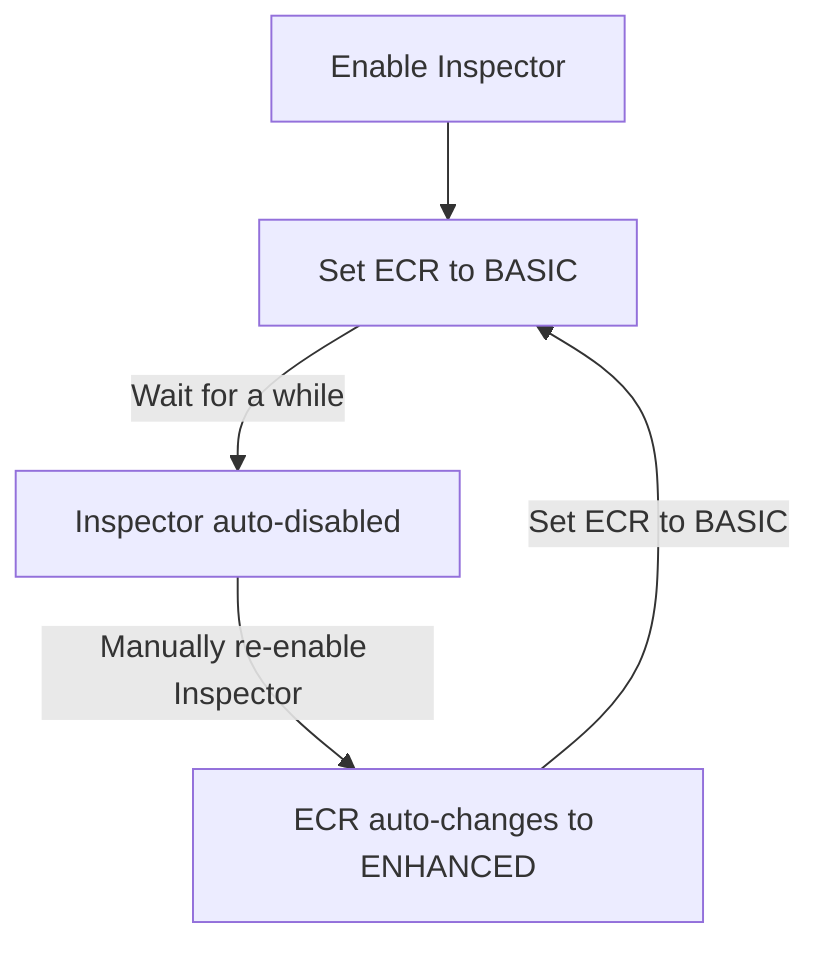

A mysterious cycle I discovered while setting up AWS Inspector.

(Article written on March 13, 2025. AWS may have updates since then.)

<!-- more -->

# Introduction to AWS Inspector and Business Requirements

AWS Inspector is a vulnerability scanning service from AWS that scans Lambda functions, EC2 instances, and ECR images. One of its selling points is its own vulnerability database. If you set the scan frequency to "CONTINUOUS_SCAN", it will rescan previously scanned images whenever new vulnerabilities are published, rather than only scanning when images are pushed to ECR.

For images, the official pricing is $0.90 per initial scan and $0.10 per rescan. Sounds great, right? But the problem is that the rescan frequency cannot be controlled. For example, if one of your images has 100 dependencies and each dependency publishes one vulnerability update per day, that image alone would cost $10 per day. In my own ECR with 45 images, Inspector estimated monthly costs of over $240. This was unacceptable, so I started exploring how to control AWS Inspector's behavior.

## 1. The Mysterious API-Console Mismatch

First, I checked the [Terraform documentation](https://registry.terraform.io/providers/hashicorp/aws/latest/docs/resources/ecr_registry_scanning_configuration)


And the [AWS documentation](https://docs.aws.amazon.com/ja_jp/AmazonECR/latest/APIReference/API_RepositoryScanningConfiguration.html)


Both show a "manual" option, but there's nowhere in the console to trigger it manually.

With this question in mind, I started trying to understand Inspector and ECR behavior through the web interface.

## 2. The Relationship Between Inspector and ECR



**Scenario 1 Analysis**: When I activate Inspector directly in the AWS console, it automatically configures to scan all supported resource types. This includes container images in ECR, EC2 instances, and Lambda functions. This is the most straightforward configuration, providing comprehensive security coverage, but may also lead to unnecessary scanning costs.



**Scenario 2 Analysis**: Interestingly, if I first disable Inspector and then enable Enhanced Scan in ECR configuration, AWS automatically creates an Inspector service instance, but it only configures to scan ECR images, not EC2 or Lambda. This behavior indicates that ECR Enhanced Scan actually depends on the Inspector service.



**Scenario 3 Analysis**: The most interesting is the third scenario. If I first activate Inspector, then change the scan type to Basic in ECR, Inspector continues scanning EC2 and Lambda resources but stops scanning ECR images. This shows that ECR scan settings can selectively enable or disable Inspector's image scanning without affecting other resource types.



## 3. The Mysterious Cycle When Using Terraform

Since Inspector only charges per scan, and we can set ECR to basic when Inspector exists, one approach is to keep the Inspector resource while setting ECR to basic, then enable enhanced (i.e., Inspector) during releases to catch vulnerabilities.

So I wrote my code like this:

```terraform
# Get current AWS account ID
data "aws_caller_identity" "current" {}

# AWS Inspector resource configuration
resource "aws_inspector2_enabler" "this" {
  account_ids    = [data.aws_caller_identity.current.account_id]
  resource_types = ["ECR"]

  lifecycle {
    prevent_destroy = true  # Prevent resource destruction
  }
}

# ECR scanning configuration
resource "aws_ecr_registry_scanning_configuration" "configuration" {
  scan_type = var.enable_scanning ? "ENHANCED" : "BASIC"

  # Add specific rules when enhanced scanning is enabled
  dynamic "rule" {
    for_each = var.enable_scanning ? [1] : []
    content {
      scan_frequency = "SCAN_ON_PUSH"
      repository_filter {
        filter      = var.scan_specific_repo ? "example/repo" : "*"
        filter_type = "WILDCARD"
      }
    }
  }

  # Add default rules when enhanced scanning is disabled
  dynamic "rule" {
    for_each = var.enable_scanning ? [] : [1]
    content {
      scan_frequency = "SCAN_ON_PUSH"
      repository_filter {
        filter      = "*"
        filter_type = "WILDCARD"
      }
    }
  }
}

# Variable definitions
variable "enable_scanning" {
  description = "Whether to enable enhanced scanning"
  type        = bool
  default     = false
}

variable "scan_specific_repo" {
  description = "Whether to scan only specific repositories"
  type        = bool
  default     = false
}
```

But something strange happened during apply:

1. **First `apply`**: Inspector resource exists, ECR is set to basic scan (BASIC), everything looks normal.
2. **Second `apply`**: Terraform suddenly says Inspector doesn't exist and needs to be recreated. After creation, ECR becomes enhanced scan (ENHANCED).
3. **Third `apply`**: Back to the first state, Inspector exists, ECR changes back to basic scan (BASIC).

This cycle is like an infinite loop, leaving me completely confused. The code hasn't changed, but the state keeps jumping around. What are you trying to do, Terraform?

### Mermaid Diagram Showing Terraform Cycle Behavior

To explain this cycle clearly, I drew a flowchart with Mermaid to visually show the state changes across multiple `apply` runs:



From the diagram, you can see the state switching between B (first time) and E (second time), then returning to B on the third time, forming a closed loop. It feels like Terraform is under some kind of "state curse".

## 4. Potential Reason

From this, I suspected that ECR configuration and Inspector aren't well separated, and there are some hidden connections behind the scenes.

**There's an implicit dependency between ECR scan configuration and Inspector state**, and AWS may automatically manage Inspector's lifecycle under certain conditions. Specifically:

1. **First apply**: Inspector exists, ECR is set to basic scan (BASIC). But since ECR uses basic scan and we haven't enabled scanning for EC2 and Lambda, Inspector becomes "idle" in this situation. **AWS may automatically destroy it in the background**.

2. **Second apply**: When Terraform checks, it finds Inspector no longer exists on AWS (AWS killed it), but it's still in Terraform's state file, causing state inconsistency. So Terraform recreates Inspector, and after creation, **the new Inspector automatically sets ECR scan mode to enhanced (ENHANCED)**.

3. **Third apply**: Inspector does exist, but ECR is set to enhanced scan, while our code requires basic scan. So Terraform only modifies ECR's scan type (from enhanced to basic), **without destroying the Inspector resource**. Then we're back to step one, and the cycle begins...

It's like AWS and Terraform are playing a game of "you create, I delete; you delete, I create", and we're stuck in this strange loop.

### Verification: Manually Reproducing the Cycle

To verify my hypothesis, I decided to manually reproduce this process in the AWS console:

1. First, enable Inspector in the console, then set ECR to basic scan (BASIC)
2. Wait for a while, and observe that **Inspector was automatically disabled**! This confirms my first hypothesis: in pure BASIC mode without other resource scanning enabled, Inspector gets automatically disabled
3. Then, I manually enable Inspector in this state
4. Something magical happened: **ECR's scan mode automatically changed from BASIC to ENHANCED**! This validates my second hypothesis



This completely confirms the root cause of the Terraform cycle! Now the phenomenon makes sense: **AWS has its own logic in the background that automatically manages Inspector's state based on ECR scan configuration, and vice versa**. Terraform doesn't know about these implicit dependencies, so each execution tries to maintain a balance that's destined to be broken.

For the Inspector and ECR case, I speculate:

- AWS Inspector may think that if there are no "enhanced" scan tasks, it has no reason to exist
- Similarly, when Inspector is activated, it may default ECR scan to enhanced mode so it can perform its function

But this "taking matters into its own hands" behavior is a nightmare for users using declarative configuration management, because we expect predictable, stable state management.

## 5. Solution

Since the two states are directly related, the simplest solution is to keep only one to manage resources. So my code became:

```terraform
# 🚫 Warning: Do not manually enable Inspector!
# 1. Enabling Inspector will scan all resources, causing unexpected costs
# 2. Manual activation may cause state inconsistency with Terraform management
# resource "aws_inspector2_enabler" "this" {
#   account_ids    = [local.account_id]
#   resource_types = ["ECR"]
#   lifecycle {
#     prevent_destroy = true
#   }
# }

locals {
  # Determine scan type based on variable
  scan_type = var.enable_enhanced_scanning ? "ENHANCED" : "BASIC"

  # If enhanced scanning is enabled, scan specific repos; otherwise scan all
  scan_repositories = (var.enable_enhanced_scanning ?
    [for repo in var.repositories_to_scan : "${var.registry_prefix}/${repo}"] : ["*"])
}

# Only manage ECR scanning configuration
resource "aws_ecr_registry_scanning_configuration" "configuration" {
  scan_type = local.scan_type

  dynamic "rule" {
    for_each = local.scan_repositories
    content {
      scan_frequency = var.scan_frequency
      repository_filter {
        filter      = rule.value
        filter_type = "WILDCARD"
      }
    }
  }
}
```

My solution is based on a key insight: **The root cause isn't the ECR configuration, but Terraform trying to manage the Inspector resource**. By adopting the following strategy, I successfully broke the cycle:

1. **Completely comment out the Inspector resource**: No longer try to manage `aws_inspector2_enabler`, avoiding conflicts with AWS's automatic behavior.

2. **Focus on managing ECR scan configuration**: Only control scanning behavior through the `aws_ecr_registry_scanning_configuration` resource.

3. **Dynamically set scan scope**:

   - When set to BASIC scan, use wildcard `"*"` to cover all repositories
   - When set to ENHANCED scan, precisely specify the list of repositories to scan

4. **Clear warning comments**: Remind team members not to manually enable Inspector to avoid falling into state issues again.

### Advantages of This Solution

1. **Stable and reliable**: Without the state cycle, Terraform's behavior becomes predictable.

2. **Maintains flexibility**: Can still control whether to enable enhanced scanning through variables.

3. **Cost control**: Avoid unnecessary costs by precisely specifying repositories that need enhanced scanning.

4. **No need to worry about Inspector state**: Let AWS manage Inspector's creation and destruction on its own, no longer trying to intervene in this process.

### Practical Results

After implementing this solution, I found Terraform's behavior became extremely stable. No matter how many times `apply` is run, the state remains consistent, with no strange cycles or drift.

When I set `enable_enhanced_scanning` to `false`, the scan type becomes BASIC, and AWS automatically disables Inspector (because there's no need for it). When I set it to `true`, AWS automatically creates Inspector and starts enhanced scanning on the specified repositories.

This approach perfectly aligns with AWS's internal logic, no longer trying to fight AWS's automatic behavior, but going with it and letting the system run naturally.

## 6. Summary

This discovery made me realize that **there may be many implicit associations and automatic behaviors between AWS services that we don't understand**. These "behind-the-scenes behaviors" aren't necessarily clearly documented, but they greatly affect our infrastructure management. Especially when using IaC tools like Terraform, these implicit dependencies can cause state inconsistencies, cyclic changes, and other issues.
