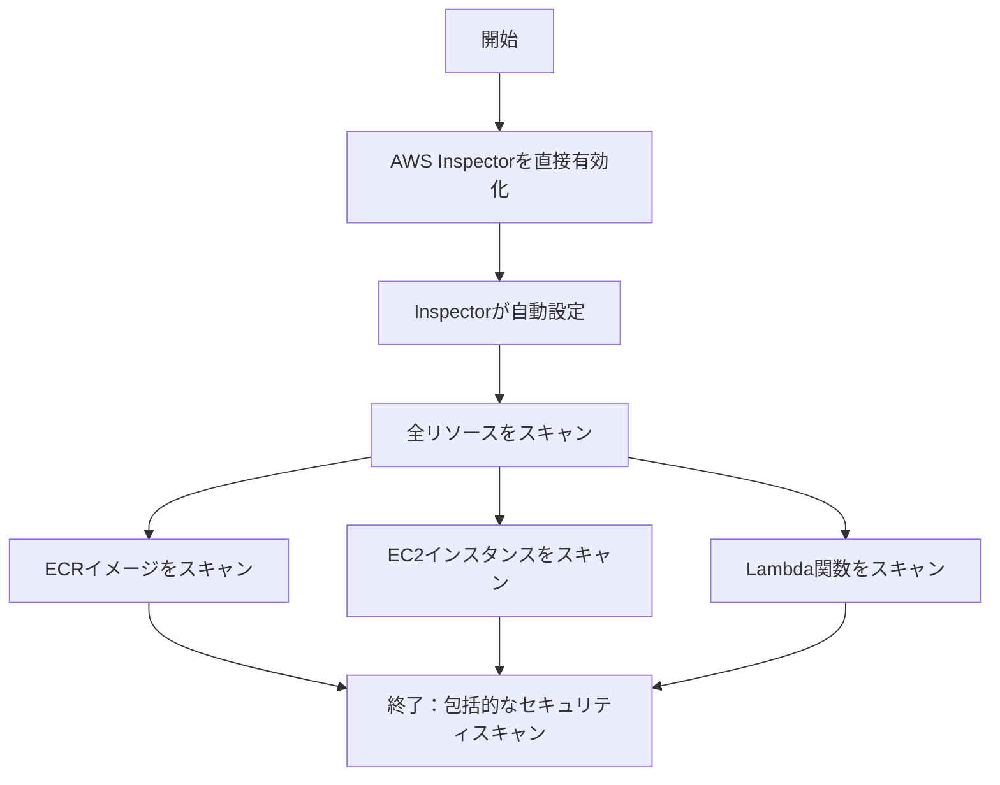
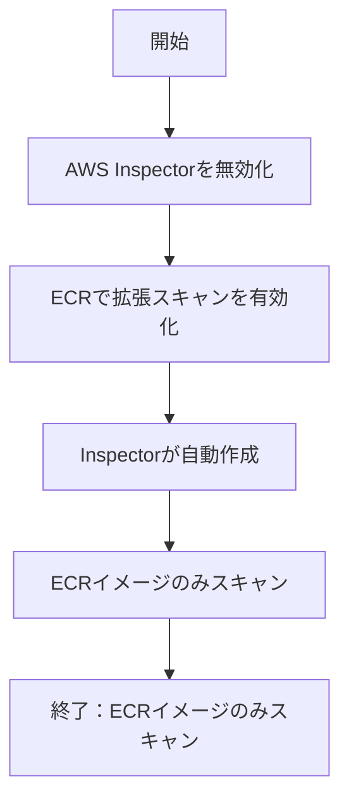
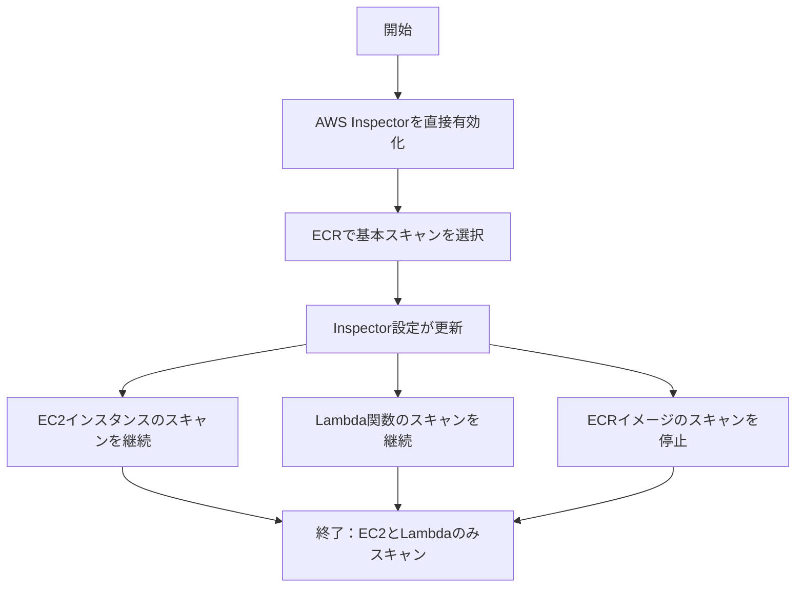
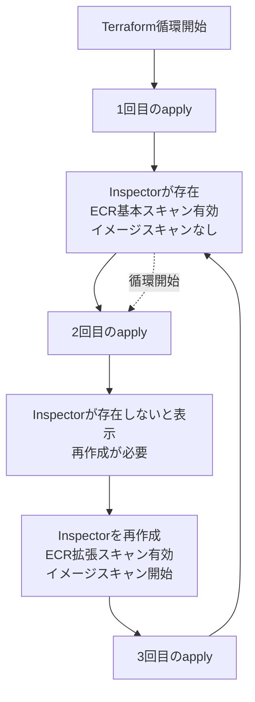
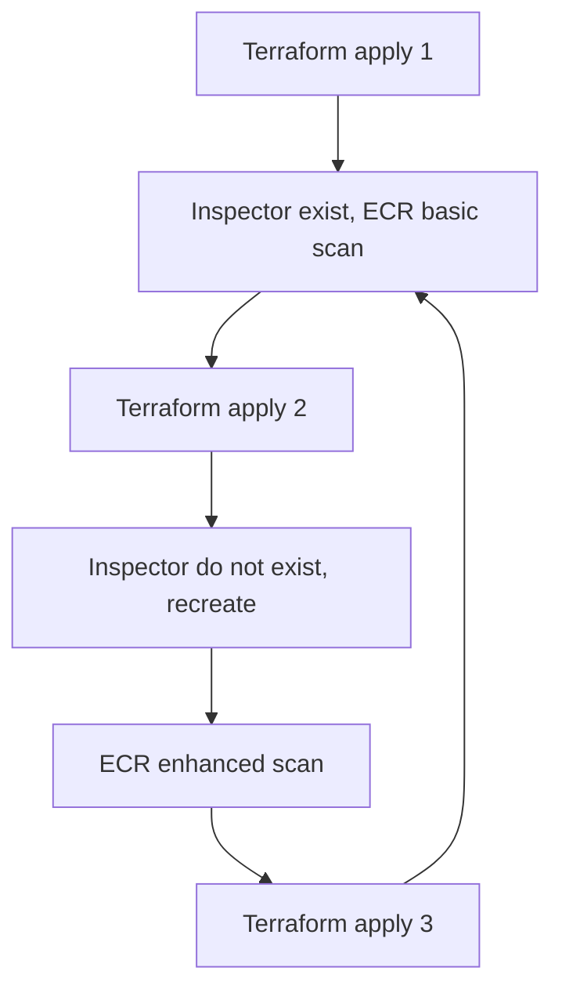
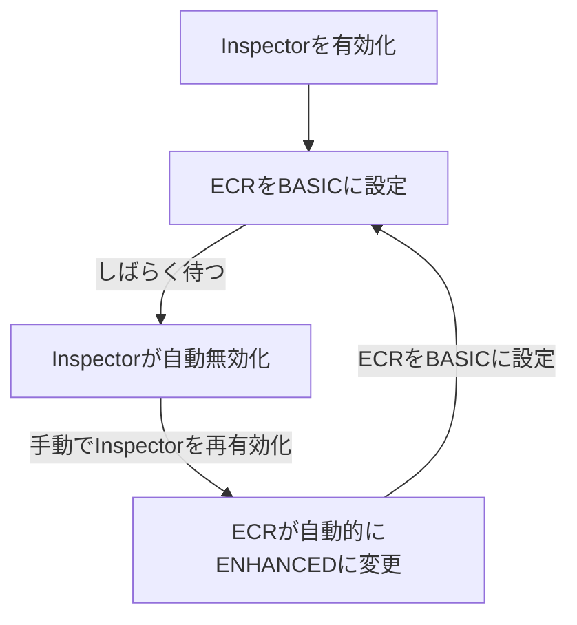

AWS Inspectorの設定中に発見した不思議な循環について。

（本記事は2025年3月13日に執筆。その後AWSに更新がある可能性があります。）

<!-- more -->

# AWS Inspectorとビジネス要件の紹介

AWS InspectorはAWSが提供する脆弱性スキャンサービスで、Lambda関数、EC2インスタンス、ECRイメージをスキャンします。セールスポイントの一つは独自の脆弱性データベースを持っていることです。スキャン頻度を「CONTINUOUS_SCAN」に設定すると、新しい脆弱性が公開されるたびに、ECRにイメージをプッシュした時だけでなく、以前スキャンしたイメージを再スキャンします。

イメージの場合、公式価格は初回スキャンが0.9ドル、再スキャンが0.1ドルです。素晴らしいですよね？しかし問題は、この再スキャンの頻度を制御できないことです。例えば、あるイメージに100の依存関係があり、各依存関係が1日に1回脆弱性更新を公開すると、そのイメージだけで1日10ドルかかります。私のECRには45のイメージがあり、Inspectorの月額コスト見積もりは240ドル以上でした。これは受け入れられないため、AWS Inspectorの動作を制御する方法を探り始めました。

## 1. 不思議なAPIとコンソールの不一致

まず、[Terraformのドキュメント](https://registry.terraform.io/providers/hashicorp/aws/latest/docs/resources/ecr_registry_scanning_configuration)を確認しました。


そして[AWSドキュメント](https://docs.aws.amazon.com/ja_jp/AmazonECR/latest/APIReference/API_RepositoryScanningConfiguration.html)


両方とも「manual」オプションがありますが、コンソールには手動でトリガーする場所がありません。

この疑問を持ちながら、Webインターフェースを通じてInspectorとECRの動作を理解しようとしました。

## 2. InspectorとECRの関連



**シナリオ1の分析**：AWSコンソールでInspectorを直接有効化すると、サポートされているすべてのリソースタイプをスキャンするように自動設定されます。これにはECRのコンテナイメージ、EC2インスタンス、Lambda関数が含まれます。これは最も直接的な設定方法で、包括的なセキュリティカバレッジを提供しますが、不要なスキャンコストが発生する可能性もあります。



**シナリオ2の分析**：興味深いことに、まずInspectorを無効化してからECR設定で拡張スキャン（Enhanced Scan）を有効にすると、AWSは自動的にInspectorサービスインスタンスを作成しますが、ECRイメージのみをスキャンするように設定され、EC2やLambdaは含まれません。この動作は、ECR拡張スキャンが実際にはInspectorサービスに依存していることを示しています。



**シナリオ3の分析**：最も興味深いのは3番目のシナリオです。まずInspectorを有効化し、その後ECRでスキャンタイプを基本スキャン（Basic）に変更すると、InspectorはEC2とLambdaリソースのスキャンを継続しますが、ECRイメージのスキャンは停止します。これは、ECRのスキャン設定がInspectorのイメージスキャンを選択的に有効/無効にでき、他のリソースタイプには影響しないことを示しています。



## 3. Terraform使用時の不思議な循環

Inspectorはスキャンごとに課金され、Inspectorが存在する時にECRを基本に設定できるので、一つのアプローチはInspectorリソースを保持しながらECRを基本に設定し、リリース時に拡張（つまりInspector）を有効にして脆弱性をキャッチすることです。

そこで、以下のようにコードを書きました：

```terraform
# 現在のAWSアカウントIDを取得
data "aws_caller_identity" "current" {}

# AWS Inspectorリソース設定
resource "aws_inspector2_enabler" "this" {
  account_ids    = [data.aws_caller_identity.current.account_id]
  resource_types = ["ECR"]

  lifecycle {
    prevent_destroy = true  # リソースの破棄を防止
  }
}

# ECRスキャン設定
resource "aws_ecr_registry_scanning_configuration" "configuration" {
  scan_type = var.enable_scanning ? "ENHANCED" : "BASIC"

  # 拡張スキャン有効時に特定のルールを追加
  dynamic "rule" {
    for_each = var.enable_scanning ? [1] : []
    content {
      scan_frequency = "SCAN_ON_PUSH"
      repository_filter {
        filter      = var.scan_specific_repo ? "example/repo" : "*"
        filter_type = "WILDCARD"
      }
    }
  }

  # 拡張スキャン無効時にデフォルトルールを追加
  dynamic "rule" {
    for_each = var.enable_scanning ? [] : [1]
    content {
      scan_frequency = "SCAN_ON_PUSH"
      repository_filter {
        filter      = "*"
        filter_type = "WILDCARD"
      }
    }
  }
}

# 変数定義
variable "enable_scanning" {
  description = "拡張スキャンを有効にするかどうか"
  type        = bool
  default     = false
}

variable "scan_specific_repo" {
  description = "特定のリポジトリのみスキャンするかどうか"
  type        = bool
  default     = false
}
```

しかし、apply時に不思議な現象が発生しました：

1. **1回目の`apply`**：Inspectorリソースが存在し、ECRは基本スキャン（BASIC）に設定され、すべて正常に見えます。
2. **2回目の`apply`**：Terraformが突然Inspectorが存在しないと言い、再作成が必要になります。作成後、ECRは拡張スキャン（ENHANCED）になります。
3. **3回目の`apply`**：最初の状態に戻り、Inspectorが存在し、ECRは基本スキャン（BASIC）に戻ります。

この循環はまるで無限ループのようで、完全に混乱しました。コードは変更していないのに、状態が飛び回り続けています。Terraform、何をしようとしているの？

### Mermaid図でTerraformの循環動作を表示

この循環現象を明確に説明するために、Mermaidでフローチャートを描き、複数の`apply`実行時の状態変化を視覚的に示しました：



図から、状態がB（1回目）とE（2回目）の間で切り替わり、3回目でBに戻り、閉ループを形成していることがわかります。まるでTerraformが「状態の呪い」にかかっているようです。

## 4. 考えられる原因

これにより、ECRの設定とInspectorの間がうまく分離されておらず、裏で何らかの関連があると推測しました。

**ECRスキャン設定とInspector状態の間には暗黙の依存関係が存在し**、AWSは特定の条件下でInspectorのライフサイクルを自動的に管理する可能性があります。具体的には：

1. **1回目のapply**：Inspectorが存在し、ECRは基本スキャン（BASIC）に設定されています。しかし、ECRが基本スキャンを使用し、EC2とLambdaのスキャンも有効にしていないため、Inspectorは「やることがない」状態になります。**AWSはバックグラウンドで自動的に破棄する可能性があります**。

2. **2回目のapply**：Terraformがチェックすると、AWS上のInspectorはもう存在しません（AWSが削除した）が、Terraformの状態ファイルにはまだ存在しており、状態の不整合が発生します。そのためTerraformはInspectorを再作成し、作成後、**新しいInspectorは自動的にECRスキャンモードを拡張（ENHANCED）に設定します**。

3. **3回目のapply**：Inspectorは確かに存在しますが、ECRは拡張スキャンに設定されており、コードは基本スキャンを要求しています。そのためTerraformはECRのスキャンタイプのみを変更し（拡張から基本へ）、**Inspectorリソースは破棄しません**。そして、最初のステップに戻り、循環が始まります...

まるでAWSとTerraformが「あなたが作れば私が削除、あなたが削除すれば私が作成」というゲームをしているようで、私たちはこの奇妙なループに閉じ込められています。

### 検証：手動で循環を再現

仮説を検証するために、AWSコンソールで手動でこのプロセスを再現することにしました：

1. まず、コンソールでInspectorを有効にし、ECRを基本スキャン（BASIC）に設定
2. しばらく待つと、**Inspectorが自動的に無効化されました**！これは最初の仮説を確認します：他のリソーススキャンを有効にしていない純粋なBASICモードでは、Inspectorは自動的に無効化されます
3. 次に、この状態で手動でInspectorを有効化
4. 不思議なことが起きました：**ECRのスキャンモードが自動的にBASICからENHANCEDに変更されました**！これは2番目の仮説を検証します



これはTerraform循環の根本原因を完全に確認しました！これで現象が理解できます：**AWSはバックグラウンドで独自のロジックを持ち、ECRスキャン設定に基づいてInspectorの状態を自動管理し、その逆も同様です**。Terraformはこれらの暗黙の依存関係を知らないため、実行のたびに破られる運命にあるバランスを維持しようとします。

InspectorとECRのケースについて、私は推測します：

- AWS Inspectorは、「拡張」スキャンタスクがなければ、存在する理由がないと考えるかもしれません
- 同様に、Inspectorが有効化されると、機能を実行できるようにECRスキャンをデフォルトで拡張モードに設定するかもしれません

しかし、この「勝手に判断する」動作は、宣言的な設定管理を使用するユーザーにとっては悪夢です。なぜなら、予測可能で安定した状態管理を期待しているからです。

## 5. 解決策

2つの状態が直接関連しているので、最も簡単な解決策はリソースを管理するために1つだけを残すことです。そこで、コードは以下のようになりました：

```terraform
# 🚫 警告: Inspectorを手動で有効にしないでください！
# 1. Inspectorを有効にすると全リソースがスキャンされ、予期しないコストが発生します
# 2. 手動での有効化はTerraform管理との状態不整合を引き起こす可能性があります
# resource "aws_inspector2_enabler" "this" {
#   account_ids    = [local.account_id]
#   resource_types = ["ECR"]
#   lifecycle {
#     prevent_destroy = true
#   }
# }

locals {
  # 変数に基づいてスキャンタイプを決定
  scan_type = var.enable_enhanced_scanning ? "ENHANCED" : "BASIC"

  # 拡張スキャンが有効な場合は特定のリポジトリをスキャン、そうでなければ全てをスキャン
  scan_repositories = (var.enable_enhanced_scanning ?
    [for repo in var.repositories_to_scan : "${var.registry_prefix}/${repo}"] : ["*"])
}

# ECRスキャン設定のみを管理
resource "aws_ecr_registry_scanning_configuration" "configuration" {
  scan_type = local.scan_type

  dynamic "rule" {
    for_each = local.scan_repositories
    content {
      scan_frequency = var.scan_frequency
      repository_filter {
        filter      = rule.value
        filter_type = "WILDCARD"
      }
    }
  }
}
```

私の解決策は重要な洞察に基づいています：**問題の根本原因はECR設定ではなく、TerraformがInspectorリソースを管理しようとしていることです**。以下の戦略を採用することで、循環を打破することに成功しました：

1. **Inspectorリソースを完全にコメントアウト**：`aws_inspector2_enabler`の管理を試みず、AWSの自動動作との競合を回避。

2. **ECRスキャン設定の管理に集中**：`aws_ecr_registry_scanning_configuration`リソースのみでスキャン動作を制御。

3. **スキャン範囲を動的に設定**：
   - BASICスキャンに設定時は、ワイルドカード`"*"`で全リポジトリをカバー
   - ENHANCEDスキャンに設定時は、スキャンするリポジトリリストを正確に指定

4. **明確な警告コメント**：チームメンバーにInspectorを手動で有効にしないよう注意喚起し、状態問題の再発を防止。

### この解決策の利点

1. **安定性と信頼性**：状態循環がなくなり、Terraformの動作が予測可能に。

2. **柔軟性を維持**：変数を通じて拡張スキャンの有効/無効を制御可能。

3. **コスト管理**：拡張スキャンが必要なリポジトリを正確に指定し、不要なコストを回避。

4. **Inspector状態を心配する必要なし**：AWSにInspectorの作成と破棄を任せ、このプロセスに介入しない。

### 実際の適用結果

この解決策を実装した後、Terraformの動作が非常に安定しました。何回`apply`を実行しても、状態は一貫しており、奇妙な循環やドリフトはありません。

`enable_enhanced_scanning`を`false`に設定すると、スキャンタイプはBASICになり、AWSは自動的にInspectorを無効化します（必要がないため）。`true`に設定すると、AWSは自動的にInspectorを作成し、指定されたリポジトリの拡張スキャンを開始します。

このアプローチはAWSの内部ロジックと完全に一致し、AWSの自動動作と戦うのではなく、それに従い、システムを自然に動作させます。

## 6. まとめ

この発見により、**AWSサービス間には私たちが理解していない多くの暗黙の関連と自動動作が存在する可能性がある**ことに気づきました。これらの「舞台裏の動作」は必ずしもドキュメントに明確に記載されていませんが、インフラストラクチャ管理に大きな影響を与えます。特にTerraformのようなIaCツールを使用する場合、これらの暗黙の依存関係は状態の不整合、循環的な変更などの問題を引き起こす可能性があります。
