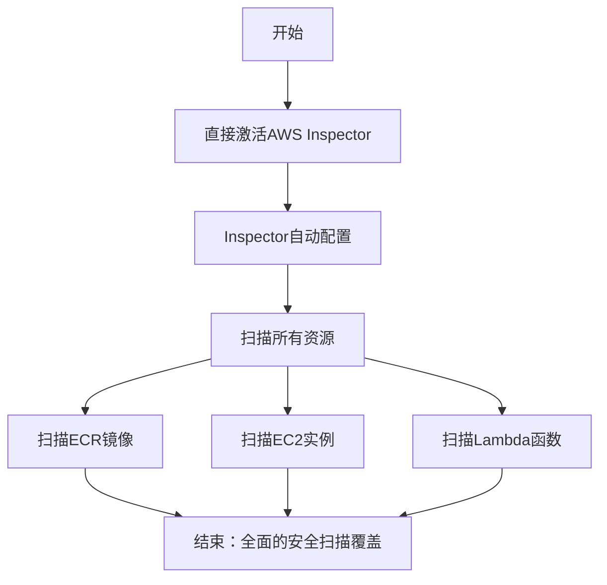
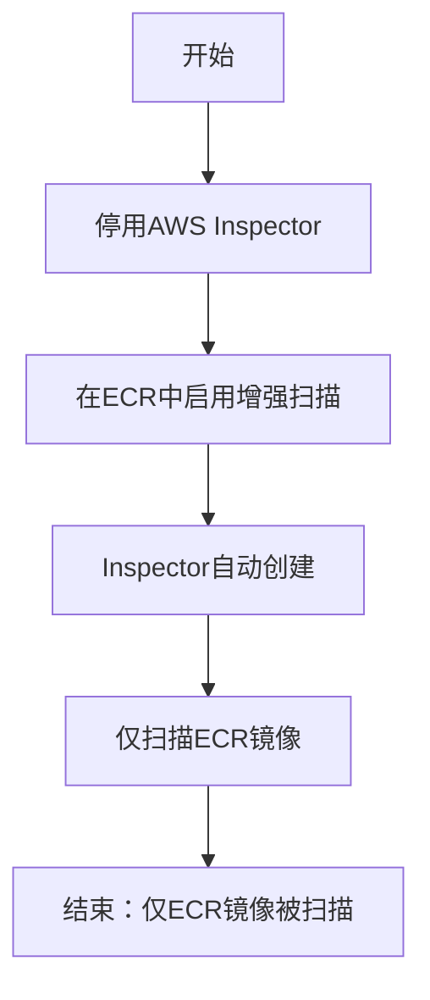
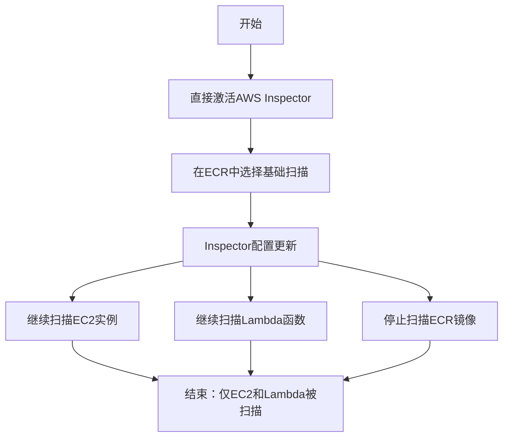
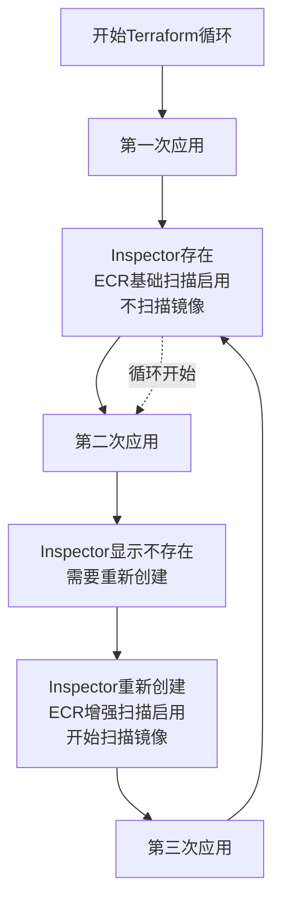
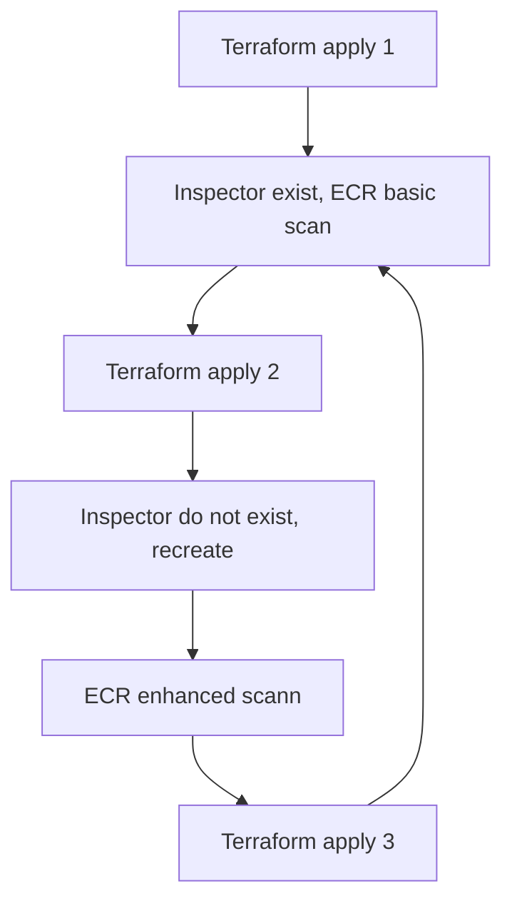
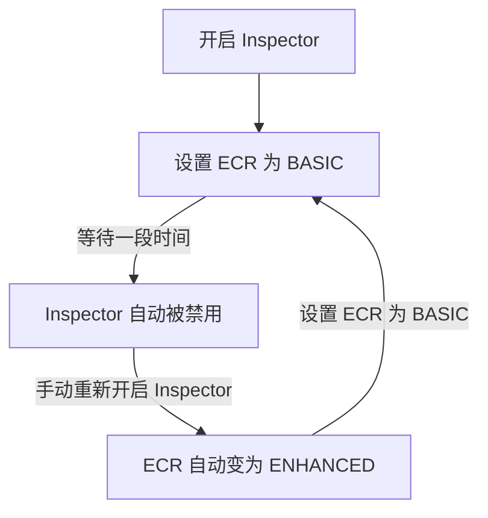

最近在设置AWS Inspector的时候发现的一个神奇循环。

（文章写于2025年3.13，后续aws可能有更新）

<!-- more -->

# AWS Inspector及业务需求介绍

AWS Inspector是AWS推出的一个依赖包漏洞扫描的服务，扫描的对象包括lambda, EC2和ECR Image。官方介绍的卖点之一是他有自己的一个漏洞数据库，如果你把scan的频率设置为"CONTINUOUS_SCAN"，每当有新的漏洞发布时，就会对已经扫描过的image再进行一次扫描，而不是只在把image推到ecr时进行一次扫描。

对于image，官方定价是initial scan 0.9刀一次，rescan0.1刀一次。听起来很不错是不是，但是问题在于这个rescan的频率是无法进行操控的，比如你的一个image有100个依赖，每个依赖一天发一次漏洞更新，那么这一天一个image就要花10刀。以我自己的ECR为例，45个image，inspector给我估计的每月要在这上面花的钱大概要240多刀。这是不可接受的，于是就在探索如何才能控制aws inspector的行为。

## 1.神奇的API与界面不匹配

先去查看了[Terraform的文档]([Terraform Registry](https://registry.terraform.io/providers/hashicorp/aws/latest/docs/resources/ecr_registry_scanning_configuration))


与[AWS文档](https://docs.aws.amazon.com/ja_jp/AmazonECR/latest/APIReference/API_RepositoryScanningConfiguration.html)


这里都有manual这个选项，但是在consoles上都看不到有哪里能manual触发。

怀着这个疑问，我开始尝试在网页上理解Inspector和ECR的行为

## 2.Inspector与ECR的关联



**场景1分析**：当我在AWS控制台中直接激活Inspector服务时，它会自动配置为扫描所有支持的资源类型。这包括ECR中的容器镜像、EC2实例以及Lambda函数。这是最直接的配置方式，提供了全面的安全覆盖，但也可能导致不必要的扫描成本。



**场景2分析**：有趣的是，如果我先停用Inspector服务，然后在ECR配置中启用增强扫描(Enhanced Scan)，AWS会自动创建Inspector服务实例，但它只配置为扫描ECR镜像，而不包括EC2或Lambda。这种行为表明ECR增强扫描实际上依赖于Inspector服务。



**场景3分析**：最有趣的是第三种情况。如果我先激活Inspector，然后在ECR中将扫描类型更改为基础扫描(Basic)，Inspector会继续扫描EC2和Lambda资源，但会停止对ECR镜像的扫描。这表明ECR的扫描设置可以选择性地启用或禁用Inspector对镜像的扫描，而不影响其他资源类型。



## 3. 利用Terraform时的神奇循环

既然Inspector是每次扫描才收费，并且有Inspector的时候我们可以把ECR设置为basic，那么有一个方案是保留Inspector资源，同时把ECR设置为basic，等到release的时候开启一次enhanced(即Inspector)来补漏洞。

于是我的代码是这么写的

```terraform
# 获取当前 AWS 账户 ID
data "aws_caller_identity" "current" {}

# AWS Inspector 资源配置
resource "aws_inspector2_enabler" "this" {
  account_ids    = [data.aws_caller_identity.current.account_id]
  resource_types = ["ECR"]

  lifecycle {
    prevent_destroy = true  # 防止资源被销毁
  }
}

# ECR 扫描配置
resource "aws_ecr_registry_scanning_configuration" "configuration" {
  scan_type = var.enable_scanning ? "ENHANCED" : "BASIC"

  # 当启用增强扫描时，添加特定规则
  dynamic "rule" {
    for_each = var.enable_scanning ? [1] : []
    content {
      scan_frequency = "SCAN_ON_PUSH"
      repository_filter {
        filter      = var.scan_specific_repo ? "example/repo" : "*"
        filter_type = "WILDCARD"
      }
    }
  }

  # 当禁用增强扫描时，添加默认规则
  dynamic "rule" {
    for_each = var.enable_scanning ? [] : [1]
    content {
      scan_frequency = "SCAN_ON_PUSH"
      repository_filter {
        filter      = "*"
        filter_type = "WILDCARD"
      }
    }
  }
}

# 变量定义
variable "enable_scanning" {
  description = "是否启用增强扫描"
  type        = bool
  default     = false
}

variable "scan_specific_repo" {
  description = "是否只扫描特定仓库"
  type        = bool
  default     = false
}
```

但是在apply的时候却产生了神奇的现象

1. **第一次 `apply`**：Inspector 资源存在，ECR 设置为基本扫描（BASIC），一切看起来正常。
2. **第二次 `apply`**：Terraform 突然说 Inspector 不存在，需要重新创建。创建后，ECR 变成了增强扫描（ENHANCED）。
3. **第三次 `apply`**：又回到第一次的状态，Inspector 存在，ECR 变回基本扫描（BASIC）。

这循环简直像个“死循环”，让我完全摸不着头脑。明明代码没改，状态却一直在跳来跳去，Terraform 你是想干啥？

### Mermaid 图展示 Terraform 周期行为

为了把这个循环现象讲清楚，我用 Mermaid 画了个流程图，直观展示 Terraform 在多次 `apply` 时的状态变化：



从图里可以看到，状态在 B（第一次）和 E（第二次）之间来回切换，第三次又回到 B，形成了闭环。这让我感觉 Terraform 像是中了什么“状态诅咒”。

## 4. Potential Reason

由此，我猜测ECR的configuration和Inspector之间并没有被分离的很好，存在一些背后的关联。

**ECR 扫描配置和 Inspector 状态之间存在某种隐含的依赖关系**，而且 AWS 可能会在某些条件下自动管理 Inspector 的生命周期。具体来说：

1. **第一次 apply**：Inspector 存在，ECR 设置为基本扫描(BASIC)。但由于 ECR 用的是基本扫描，同时我们又没有为 EC2 和 Lambda 开启扫描，这种情况下 Inspector 变得"无事可做"，**AWS 可能会在后台自动销毁它**。

2. **第二次 apply**：Terraform 检查时发现 AWS 上 Inspector 已不存在（被 AWS 自己干掉了），但 Terraform 状态文件中它还在，这就导致了状态不一致。于是 Terraform 重新创建 Inspector，而创建后，**新的 Inspector 会自动将 ECR 扫描模式设为增强扫描(ENHANCED)**。

3. **第三次 apply**：Inspector 确实存在，但 ECR 被设置成了增强扫描，而我们的代码要求它是基本扫描。所以 Terraform 执行时只会修改 ECR 的扫描类型（从增强变为基本），**不会销毁 Inspector 资源**。然后，我们回到了第一步的状态，循环开始...

就像是 AWS 和 Terraform 在玩一个"你创我删，你删我创"的游戏，而我们就被困在这个奇怪的循环中。

### 验证：手动重现循环

为了验证我的猜测，我决定手动在 AWS 控制台上重现这个过程：

1. 首先在控制台上启用 Inspector，然后将 ECR 设置为基本扫描(BASIC)
2. 等待一段时间，观察到 **Inspector 被自动禁用了**！这证实了我的第一个猜测：在没有开启其他资源扫描的情况下，纯 BASIC 模式会导致 Inspector 自动被禁用
3. 然后，我在这种状态下直接手动启用 Inspector
4. 结果神奇的事情发生了：**ECR 的扫描模式自动从 BASIC 变成了 ENHANCED**！这验证了我的第二个猜测



这完全印证了 Terraform 循环的根本原因！现在这个现象解释得通了：**AWS 在后台有一套自己的逻辑，会根据 ECR 扫描配置自动管理 Inspector 的状态，反之亦然**。而 Terraform 并不知道这些隐含的依赖关系，所以每次执行时都在试图维护一个注定会被打破的平衡。

对于 Inspector 和 ECR 的案例，我推测：

- AWS Inspector 可能认为，如果没有任何"增强"扫描任务，它就没有存在的必要
- 同样，当 Inspector 被激活时，它可能默认将 ECR 扫描设为增强模式，以便能够执行其功能

但这种"自作主张"的行为对于使用声明式配置管理的用户来说简直是噩梦，因为我们期望的是可预测、稳定的状态管理。

## 5. solution

既然两个状态直接会有关联，那就只留一个来管理资源，这是最简单的解决方案。于是我的代码变成了这样

```terraform
# 🚫 警告: 不要手动启用 Inspector!
# 1. 启用 Inspector 会导致对所有资源进行扫描，产生意外费用
# 2. 手动激活可能导致与 Terraform 管理的状态不一致
# resource "aws_inspector2_enabler" "this" {
#   account_ids    = [local.account_id]
#   resource_types = ["ECR"]
#   lifecycle {
#     prevent_destroy = true
#   }
# }

locals {
  # 根据变量决定扫描类型
  scan_type = var.enable_enhanced_scanning ? "ENHANCED" : "BASIC"

  # 如果启用增强扫描，则扫描特定仓库，否则扫描全部
  scan_repositories = (var.enable_enhanced_scanning ?
    [for repo in var.repositories_to_scan : "${var.registry_prefix}/${repo}"] : ["*"])
}

# 只管理 ECR 扫描配置
resource "aws_ecr_registry_scanning_configuration" "configuration" {
  scan_type = local.scan_type

  dynamic "rule" {
    for_each = local.scan_repositories
    content {
      scan_frequency = var.scan_frequency
      repository_filter {
        filter      = rule.value
        filter_type = "WILDCARD"
      }
    }
  }
}
```

我的解决方案基于一个关键洞察：**问题的根源不是 ECR 配置，而是 Terraform 试图管理 Inspector 资源**。通过采取以下策略，我成功打破了循环：

1. **完全注释掉 Inspector 资源**：不再尝试管理 `aws_inspector2_enabler`，避免了与 AWS 自动行为的冲突。

2. **专注于管理 ECR 扫描配置**：只通过 `aws_ecr_registry_scanning_configuration` 资源来控制扫描行为。

3. **动态设置扫描范围**：
   
   - 当设置为 BASIC 扫描时，使用通配符 `"*"` 覆盖所有仓库
   - 当设置为 ENHANCED 扫描时，可以精确指定需要扫描的仓库列表

4. **清晰的警告注释**：提醒团队成员不要手动启用 Inspector，避免再次陷入状态问题。

### 这个方案的优势

1. **稳定可靠**：没有了状态循环，Terraform 的行为变得可预测。

2. **保持灵活性**：仍然可以通过变量控制是否启用增强扫描。

3. **成本控制**：通过精确指定需要增强扫描的仓库，避免不必要的开销。

4. **无需担心 Inspector 状态**：让 AWS 自行管理 Inspector 的创建和销毁，不再尝试干预这个过程。

### 实际应用效果

在实施这个方案后，我发现 Terraform 的行为变得极其稳定。无论运行多少次 `apply`，状态都保持一致，不再有任何奇怪的循环或漂移。

当我将 `enable_enhanced_scanning` 设为 `false` 时，扫描类型变为 BASIC，AWS 会自动停用 Inspector（因为没有使用它的必要）。当我将其设为 `true` 时，AWS 会自动创建 Inspector 并开始对指定的仓库进行增强扫描。

这种方式与 AWS 的内部逻辑完美契合，不再试图对抗 AWS 的自动行为，而是顺应它，让系统自然运行。

## 6. Sum up

这个发现让我意识到，**AWS 服务间可能存在大量我们不了解的隐性关联和自动行为**。这些"幕后行为"不一定在文档中写得很清楚，但会极大地影响我们的基础设施管理。特别是在使用 Terraform 这类 IaC 工具时，这些隐性依赖会导致状态不一致、循环变更等问题。 