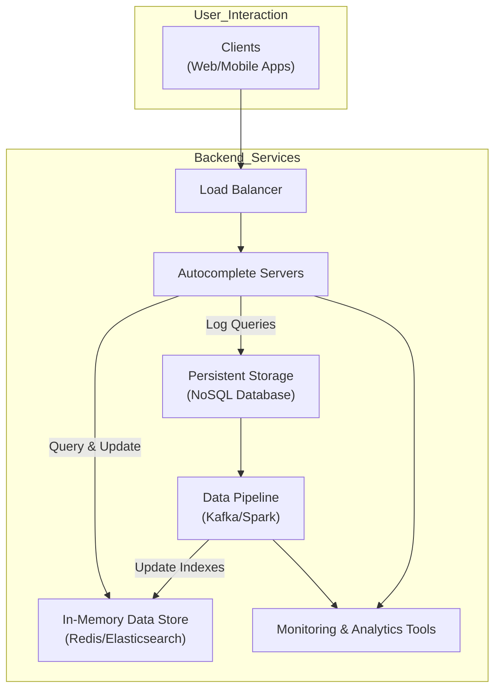
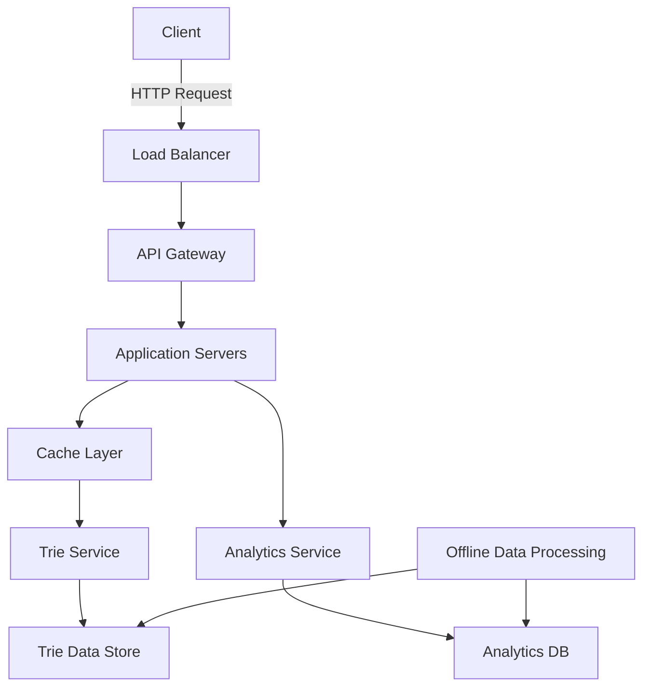

Let's compare in two way, Algorithm and system design.

TLDR: ChatGP o1-preview, excels in both algorithmic and system design. Therefore, I will cancel my Claude 3.5 Sonnet subscription and continue using ChatGPT.

<!-- more -->

# Algorithm

The question is [077 - Planes on a 2D Plane（★7）](https://atcoder.jp/contests/typical90/tasks/typical90_by))

## First round

Let's see the result without any promote and do not provide any test case.

### ChatGPT o1-preview

```python
# Read input
import sys

import threading
def main():
    import sys
    sys.setrecursionlimit(1 << 25)

    N, T = map(int, sys.stdin.readline().split())
    AX = []
    AY = []
    for _ in range(N):
        x, y = map(int, sys.stdin.readline().split())
        AX.append(x)
        AY.append(y)
    BX = []
    BY = []
    for _ in range(N):
        x, y = map(int, sys.stdin.readline().split())
        BX.append(x)
        BY.append(y)

    direction_map = {
        (1, 0): 1,
        (1, 1): 2,
        (0, 1): 3,
        (-1, 1): 4,
        (-1, 0): 5,
        (-1, -1): 6,
        (0, -1): 7,
        (1, -1): 8
    }

    D = []
    if T == 0:
        for i in range(N):
            if AX[i] != BX[i] or AY[i] != BY[i]:
                print("No")
                return
            D.append(1)  # Assign any direction
    else:
        for i in range(N):
            delta_x = BX[i] - AX[i]
            delta_y = BY[i] - AY[i]
            if delta_x % T != 0 or delta_y % T != 0:
                print("No")
                return
            dx = delta_x // T
            dy = delta_y // T
            if dx not in [-1, 0, 1] or dy not in [-1, 0, 1]:
                print("No")
                return
            if dx == 0 and dy == 0:
                print("No")
                return
            if (dx, dy) not in direction_map:
                print("No")
                return
            D.append(direction_map[(dx, dy)])

    print("Yes")
    print(' '.join(map(str, D)))

threading.Thread(target=main).start()
```


### Claude 3.5 sonnet

```python
import sys

def get_possible_directions(ax, ay, bx, by, t):
    dx = bx - ax
    dy = by - ay
    possible = []
    for d in range(1, 9):
        nx = ax + t * [1, 1, 0, -1, -1, -1, 0, 1][d-1]
        ny = ay + t * [0, 1, 1, 1, 0, -1, -1, -1][d-1]
        if nx == bx and ny == by:
            possible.append(d)
    return possible

def solve():
    n, t = map(int, input().split())
    a = [list(map(int, input().split())) for _ in range(n)]
    b = [list(map(int, input().split())) for _ in range(n)]

    directions = [get_possible_directions(ax, ay, bx, by, t) for (ax, ay), (bx, by) in zip(a, b)]

    if any(len(d) == 0 for d in directions):
        return "No"

    while True:
        changed = False
        for i in range(n):
            if len(directions[i]) == 1:
                continue
            for d in directions[i][:]:
                nx = a[i][0] + t * [1, 1, 0, -1, -1, -1, 0, 1][d-1]
                ny = a[i][1] + t * [0, 1, 1, 1, 0, -1, -1, -1][d-1]
                if (nx, ny) in [(ax, ay) for j, (ax, ay) in enumerate(a) if j != i]:
                    directions[i].remove(d)
                    changed = True
                    break
            if len(directions[i]) == 0:
                return "No"
        if not changed:
            break

    if all(len(d) == 1 for d in directions):
        return "Yes\n" + " ".join(str(d[0]) for d in directions)
    else:
        return "No"

print(solve())
```


## Second round

Let's give some test cases to them.

### ChatGPT o1-preview

```python
import sys
import threading

def main():
    import sys
    sys.setrecursionlimit(1 << 25)

    N, T = map(int, sys.stdin.readline().split())
    AX = []
    AY = []
    for _ in range(N):
        x, y = map(int, sys.stdin.readline().split())
        AX.append(x)
        AY.append(y)
    BX = []
    BY = []
    for _ in range(N):
        x, y = map(int, sys.stdin.readline().split())
        BX.append(x)
        BY.append(y)

    direction_map = {
        (1, 0): 1,
        (1, 1): 2,
        (0, 1): 3,
        (-1, 1): 4,
        (-1, 0): 5,
        (-1, -1): 6,
        (0, -1): 7,
        (1, -1): 8
    }

    from collections import deque

    # Build the bipartite graph
    graph = [[] for _ in range(N)]
    for i in range(N):  # For each plane
        for j in range(N):  # For each possible final position
            delta_x = BX[j] - AX[i]
            delta_y = BY[j] - AY[i]
            if T == 0:
                if delta_x == 0 and delta_y == 0:
                    graph[i].append(j)
            else:
                if delta_x % T != 0 or delta_y % T != 0:
                    continue
                dx = delta_x // T
                dy = delta_y // T
                if dx not in [-1, 0, 1] or dy not in [-1, 0, 1]:
                    continue
                if dx == 0 and dy == 0:
                    continue
                if (dx, dy) in direction_map:
                    graph[i].append(j)

    # Bipartite matching (Kuhn's algorithm)
    match_to = [-1] * N

    def bpm(u, vis):
        for v in graph[u]:
            if not vis[v]:
                vis[v] = True
                if match_to[v] == -1 or bpm(match_to[v], vis):
                    match_to[v] = u
                    return True
        return False

    result = []
    for u in range(N):
        vis = [False] * N
        if not bpm(u, vis):
            print("No")
            return

    # Build the directions
    D = [0] * N
    for j in range(N):
        i = match_to[j]
        delta_x = BX[j] - AX[i]
        delta_y = BY[j] - AY[i]
        if T == 0:
            D[i] = 1  # Any direction
        else:
            dx = delta_x // T
            dy = delta_y // T
            D[i] = direction_map[(dx, dy)]

    print("Yes")
    print(' '.join(map(str, D)))

threading.Thread(target=main).start()
```


### Claude 3.5 sonnet

```python
import sys

def get_possible_directions(ax, ay, bx, by, t):
    dx = bx - ax
    dy = by - ay
    possible = []
    for d in range(1, 9):
        nx = ax + t * [1, 1, 0, -1, -1, -1, 0, 1][d-1]
        ny = ay + t * [0, 1, 1, 1, 0, -1, -1, -1][d-1]
        if nx == bx and ny == by:
            possible.append(d)
    return possible

def solve():
    n, t = map(int, input().split())
    a = [list(map(int, input().split())) for _ in range(n)]
    b = [list(map(int, input().split())) for _ in range(n)]

    directions = [get_possible_directions(ax, ay, bx, by, t) for (ax, ay), (bx, by) in zip(a, b)]

    if any(len(d) == 0 for d in directions):
        return "No"

    while True:
        changed = False
        for i in range(n):
            if len(directions[i]) == 1:
                continue
            for d in directions[i][:]:
                nx = a[i][0] + t * [1, 1, 0, -1, -1, -1, 0, 1][d-1]
                ny = a[i][1] + t * [0, 1, 1, 1, 0, -1, -1, -1][d-1]
                if (nx, ny) in [(ax, ay) for j, (ax, ay) in enumerate(a) if j != i]:
                    directions[i].remove(d)
                    changed = True
                    break
            if len(directions[i]) == 0:
                return "No"
        if not changed:
            break

    if all(len(d) == 1 for d in directions):
        return "Yes\n" + " ".join(str(d[0]) for d in directions)
    else:
        return "No"
```


## Summary

In the first round they gave actually same level code. But in the second round, claude 3.5 sonnet go to wrong direction. That is also my feeling when I'm using claude. Claude could not keep long context and always forget my promot. This make claude always have good result in a specific task without deep level logic.

ChatGPT o1-preview get excellent result when adding new cases. It reveals it's ablitiy of self check and long context.

In this round obviously, ChatGPT o1-preview is the winner.

# System Design

In this round I will give promot, and the question is useing the [System Design Interview Volume 2 Chapter 13](https://github.com/shams-imran/books/blob/master/System%20Design/system-design-interview-an-insiders-guide-volume-2.pdf)

> When searching on Google or shopping at Amazon, as you type in the search box, one or more matches for the search term are presented to you. This feature is referred to as autocomplete, typeahead, search-as-you-type, or incremental search. Figure 13-1 presents an example of a Google search showing a list of autocompleted results when “dinner” is typed into the search box. Search autocomplete is an important feature of many products.
> 
> 

My promot is

> Please work like a senior developer and working on a system desgin. When searching on Google or shopping at Amazon, as you type in the search box, one or more matches for the search term are presented to you. This feature is referred to as autocomplete, typeahead, search-as-you-type, or incremental search. Search autocomplete is an important feature of many products. Please design a search autocomplete system for me and you can ask me key questions to complete the design.

And whaterever they responsed for the first message, I will reply the Back of the envolop estimation from that book.

> • Assume 10 million daily active users (DAU).  
> • An average person performs 10 searches per day. • 20 bytes of data per query string:
> 
> • Assume we use ASCII character encoding. 1 character = 1 byte  
> • Assume a query contains 4 words, and each word contains 5 characters on average. • That is 4 x 5 = 20 bytes per query.
> 
> • For every character entered into the search box, a client sends a request to the backend for autocomplete suggestions. On average, 20 requests are sent for each search query. For example, the following 6 requests are sent to the backend by the time you finish typing “dinner”.
> 
> search?q=d
> 
> search?q=di
> 
> search?q=din
> 
> search?q=dinn
> 
> search?q=dinne
> 
> search?q=dinner
> 
> • ~24,000 query per second (QPS) = 10,000,000 users * 10 queries / day * 20 characters / 24 hours / 3600 seconds.
> 
> • Peak QPS = QPS * 2 = ~48,000
> 
> • Assume 20% of the daily queries are new. 10 million * 10 queries / day * 20 byte per query * 20% = 0.4 GB. This means 0.4GB of new data is added to storage daily.

Here is the result of their second reply

### ChatGPT o1-preview

**Designing a High-Performance Search Autocomplete System**

Based on the details you've provided, I'll proceed to design a search autocomplete system that meets your requirements. Here's a comprehensive design plan:

---

#### **1. Requirements Summary**

**Functional Requirements:**

- **Autocomplete Suggestions:** Provide relevant suggestions as users type each character.
- **High Throughput:** Handle an average of 24,000 QPS, peaking at 48,000 QPS.
- **Data Growth:** Incorporate approximately 0.4 GB of new query data daily.
- **Relevance Ranking:** Rank suggestions based on relevance and popularity.

**Non-Functional Requirements:**

- **Low Latency:** Autocomplete suggestions should be delivered within 100 milliseconds.
- **Scalability:** System must scale horizontally to accommodate growth.
- **High Availability:** Aim for 99.9% uptime.
- **Data Freshness:** New queries should be reflected in suggestions promptly.

#### **2. High-Level Architecture**



**Components:**

1. **Clients (Web/Mobile Apps):** Users interact with the search box.
2. **Load Balancer:** Distributes incoming requests across autocomplete servers.
3. **Autocomplete Servers:** Backend servers handling autocomplete logic.
4. **In-Memory Data Store (Redis/ElasticSearch):** Stores trie structures or indices for fast lookup.
5. **Persistent Storage (NoSQL Database):** Stores query logs and user data.
6. **Data Pipeline (Kafka/Spark):** Processes new queries and updates indices.
7. **Monitoring & Analytics Tools:** Tracks system performance and user behavior.

---

#### **3. Data Modeling**

**Query Representation:**

- **Queries:** Average of 20 bytes per query.
- **Storage Requirement:** For 100 million queries/day, total storage is about 2 GB/day (including metadata).

**Trie Data Structure:**

- Use a **compressed trie (prefix tree)** to efficiently store and retrieve query suggestions based on prefixes.
- **Nodes:** Represent characters.
- **Edges:** Connect characters to form words.
- **Leaves:** Contain complete query strings and metadata like frequency.

**Ranking Metadata:**

- **Frequency Counts:** Number of times a query has been searched.
- **Timestamp:** Recency of the query to boost newer trends.
- **User Engagement Metrics:** Click-through rates if available.

---

#### **4. Autocomplete Logic**

**Suggestion Retrieval:**

- As the user types, the client sends the current prefix to the server.
- The server looks up the prefix in the in-memory trie.
- Retrieves top N suggestions based on ranking criteria.

**Ranking Criteria:**

1. **Popularity:** Higher frequency queries are ranked higher.
2. **Recency:** Recent queries get a slight boost.
3. **Personalization (Optional):** Tailor suggestions based on user's history.

**Handling Typos and Synonyms (Advanced):**

- Implement fuzzy matching algorithms like **Levenshtein Distance**.
- Use **probabilistic data structures** like Bloom filters for quick typo detection.

---

#### **5. Scalability and Performance**

**Distributed Tries:**

- **Sharding:** Split the trie across multiple servers based on hash of the prefix or first character(s).
- **Replication:** Replicate shards to multiple servers for fault tolerance.

**Caching Strategies:**

- **Local Cache:** Use LRU caches on each server for most frequently accessed prefixes.
- **CDN Edge Caching:** For static suggestions, cache responses closer to the user.

**Load Balancing:**

- Employ load balancers (e.g., **NGINX**, **HAProxy**) to distribute traffic evenly.
- Use health checks and automatic failover mechanisms.

---

#### **6. Data Pipeline for Updates**

**Real-Time Data Ingestion:**

- Use **Apache Kafka** to stream new queries as they happen.
- **Consumers** process the stream and update in-memory data stores.

**Batch Processing:**

- Schedule jobs using **Apache Spark** to process daily query logs.
- Update frequency counts and rebuild indices if necessary.

**Data Consistency:**

- Since we're dealing with high read/write volumes, implement **eventual consistency**.
- Use **distributed locks** or **versioning** to handle concurrent updates.

---

#### **7. Infrastructure and Technology Stack**

**Servers:**

- Use **stateless** microservices for the autocomplete servers.
- Written in performance-optimized languages like **Go** or **Java**.

**In-Memory Data Store:**

- **Redis Cluster** or **Elasticsearch** for fast read/write operations.
- **Redis:** Suitable for simple key-value storage with pub/sub capabilities.
- **Elasticsearch:** Provides advanced search capabilities and supports sharding out of the box.

**Persistent Storage:**

- **NoSQL Databases** like **Cassandra** or **MongoDB** to store query logs.
- Designed for high write throughput and horizontal scalability.

**Messaging System:**

- **Apache Kafka** for handling real-time data streams.

**Containerization and Orchestration:**

- Use **Docker** for containerization.
- **Kubernetes** or **Docker Swarm** for orchestration and deployment.

---

#### **8. Handling High QPS**

**Concurrency:**

- Implement **asynchronous I/O** and non-blocking operations.
- Optimize thread pools and connection handling.

**Scaling Strategy:**

- **Horizontal Scaling:** Add more servers during peak times.
- **Auto-Scaling Groups:** Automatically scale based on CPU usage or network I/O.

**Optimization:**

- **Efficient Algorithms:** Optimize trie traversal and minimize memory usage.
- **Compression:** Use techniques like **DAWG (Directed Acyclic Word Graph)** to reduce duplication.

---

#### **9. Latency Minimization**

**Geographical Distribution:**

- Deploy servers in multiple regions closer to users.
- Use **Anycast DNS** to route users to the nearest server.

**Network Optimizations:**

- Keep response payloads small.
- Use **HTTP/2** for multiplexing and header compression.

---

#### **10. Data Freshness and Updates**

**Incremental Updates:**

- Apply updates to the in-memory trie without full reloads.
- Use **lock-free** data structures or **copy-on-write** mechanisms.

**Full Rebuilds:**

- Schedule off-peak times for full trie rebuilds if necessary.
- Deploy new versions atomically to avoid downtime.

---

#### **11. Monitoring and Alerting**

**Metrics Collection:**

- Use **Prometheus** for metrics gathering.
- Monitor QPS, latency, error rates, CPU/memory usage.

**Logging:**

- Centralize logs using the **ELK Stack** (Elasticsearch, Logstash, Kibana).
- Implement log rotation and archival policies.

**Alerting:**

- Set up alerts via **Grafana** or **PagerDuty** for critical issues.
- Implement thresholds for anomalies in traffic or resource usage.

---

#### **12. Security and Compliance**

**Data Protection:**

- Encrypt data at rest and in transit using **TLS**.
- Comply with data regulations like **GDPR** or **CCPA**.

**Access Control:**

- Implement **API authentication** using tokens or API keys.
- Use **RBAC (Role-Based Access Control)** for internal services.

**Input Validation:**

- Sanitize all inputs to prevent injection attacks.
- Implement rate limiting to prevent abuse.

---

#### **13. Optional Features**

**Personalization:**

- If user authentication is available, personalize suggestions.
- Store user profiles securely and respect privacy settings.

**Multi-Language Support:**

- Use Unicode encoding to support multiple languages.
- Implement language detection and load appropriate trie structures.

**Machine Learning Integration:**

- Use ML models to predict user intent.
- Continuously train models on collected query data.

---

#### **14. Development and Deployment Plan**

**Phase 1: MVP Development (1-2 Months)**

- Implement basic autocomplete functionality.
- Set up infrastructure and basic monitoring.

**Phase 2: Scaling and Optimization (2-3 Months)**

- Optimize data structures and algorithms.
- Implement sharding and replication.

**Phase 3: Advanced Features and Fine-Tuning (2 Months)**

- Add personalization and machine learning components.
- Enhance security measures and compliance checks.

---

#### **15. Cost Considerations**

**Infrastructure Costs:**

- Optimize instance types and sizes.
- Use reserved instances for cost savings on cloud providers.

**Data Storage Costs:**

- Compress logs and use lifecycle policies to move older data to cheaper storage.

**Operational Costs:**

- Automate as much as possible to reduce manual intervention.
- Use open-source tools where feasible to reduce licensing fees.

---

#### **Conclusion**

The proposed design addresses the high throughput and low latency requirements by utilizing efficient data structures, in-memory caching, and a scalable distributed architecture. By incorporating real-time data processing and advanced ranking algorithms, the system will provide relevant and timely autocomplete suggestions to users.

---

**Next Steps:**

- **Prototype Development:** Build a small-scale version to test core functionalities.
- **Load Testing:** Simulate traffic to ensure the system meets QPS requirements.
- **Iteration:** Refine based on testing results and user feedback.

Please let me know if you'd like to delve deeper into any specific component or have additional requirements to consider.

### Claude 3.5 sonnet

Thank you for providing these detailed requirements. This gives us a clear picture of the scale and performance needs of the system. Let's design the autocomplete system based on this information.



Based on the requirements you've provided, here's a high-level design for the autocomplete system:

1. Client: The user interface where queries are entered.

2. Load Balancer: Distributes incoming requests across multiple API Gateways to ensure high availability and even load distribution.

3. API Gateway: Handles incoming requests, performs rate limiting, and routes requests to the appropriate services.

4. Application Servers: Process incoming requests, interact with the cache and Trie service, and return results to the client.

5. Cache Layer: Stores frequently accessed autocomplete results to reduce latency and load on the backend services.

6. Trie Service: Manages the Trie data structure used for efficient prefix matching.

7. Trie Data Store: Persistent storage for the Trie data structure.

8. Analytics Service: Collects and processes query data for improving autocomplete suggestions.

9. Analytics DB: Stores processed query data for analysis and offline processing.

10. Offline Data Processing: Periodically updates the Trie with new and trending searches.

Now, let's dive into some key components and considerations:

Data Structure: We'll use a Trie (prefix tree) as the core data structure. It's efficient for prefix matching and can be easily updated.

Trie Service:

- Handles prefix matching operations.
- Supports fast lookups and updates.
- Can be horizontally scaled for high availability and performance.

Caching:

- Use a distributed cache like Redis to store frequent autocomplete results.
- Implement an LRU (Least Recently Used) eviction policy.
- Cache hit rate should be high due to the power-law distribution of search queries.

Application Servers:

- Stateless servers that can be easily scaled horizontally.
- Handle request processing, cache interactions, and Trie service calls.

Analytics and Data Processing:

- Collect query data for offline processing.
- Periodically update the Trie with new and trending searches.
- Use techniques like Lossy Counting for efficient processing of streaming data.

Handling Scale and Performance:

- With 48,000 peak QPS, we need a distributed system that can handle this load.
- Use consistent hashing for distributing data across multiple Trie servers.
- Implement aggressive caching to reduce load on backend services.

Data Freshness:

- Implement a real-time pipeline for urgent updates (e.g., breaking news).
- Use a batch processing pipeline for less time-sensitive updates.

Fault Tolerance and High Availability:

- Implement data replication for the Trie data store.
- Use multiple data centers for geographical redundancy.
- Implement circuit breakers to handle failures gracefully.

This design should meet the scale and performance requirements you've outlined. The system can handle the high QPS, provide low-latency responses through caching, and accommodate the daily data growth of 0.4GB.

Would you like me to elaborate on any specific part of this design or discuss any particular challenges you foresee?

## Summary

In my perspective, ChatGPT o1-preview showed strong technical skills but may have over-engineered the solution, which could be a concern for practical implementation. Claude 3.5 sonnet, while practical and concise, might not have fully addressed the scalability needs for this large-scale system.

I would say ChatGPT o1-preview is better as it correctly understand my requirement of DAU.

# Conclusion

ChatGPT o1-preview excels in both algorithm and system design. I will stop claude 3.5 sonnet subscription and continue using ChatGPT now.