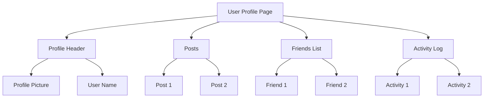

In the past, I found it quite hard to understand React code as a backend developer. But recently, I gained some insights from my daily development work, and I want to share them with you.


過去に、バックエンド開発者としてReactのを理解するのがとても難しいと感じました。しかし最近、日々の開発作業からいくつかの洞察を得ることができたので、それを皆さんと共有したいと思います。

<!-- more -->

# Understanding the Web Page

A web page has three parts:

- HTML: Structure and content
- CSS: Style
- JavaScript/TypeScript: Interaction

For example, here is a native web page of a counter without any framework:

```html
<!DOCTYPE html>
<html lang="en">
  <head>
    <meta charset="UTF-8" />
    <!-- Setting the viewport to control layout on different devices -->
    <meta name="viewport" content="width=device-width, initial-scale=1.0" />
    <!-- Ensuring compatibility with Internet Explorer -->
    <meta http-equiv="X-UA-Compatible" content="ie=edge" />
    <!-- Linking an external CSS file for styling -->
    <link rel="stylesheet" type="text/css" href="../styles.css" />
    <title>Static Template</title>
  </head>
  <body>
    <!-- Section starts here -->
    <h1>Native JS DEMO</h1>
    <div id="dom-app">
      <!-- Displaying a counter -->
      <span id="count">0</span>
      <!-- Button to increase the counter -->
      <button id="addBtn" type="button" onclick="addBtnHandler()">
        +
      </button>
    </div>

    <!-- JavaScript for the counter -->
    <script type="text/javascript">
      // Get the element to display the count
      const $count = document.getElementById("count");

      // Function to handle the click event of the add button
      function addBtnHandler() {
        // Increase the count and update the display
        $count.innerText = Number($count.innerText) + 1;
      }
    </script>

  </body>
</html>
```

The key points are:

1. The whole file is HTML (HyperText Markup Language) - a special kind of markup language.
   XML (Extensible Markup Language) and Markdown are other types of markup languages. Similarly, they both have **markup** like `<html></html>`, which is used to define the structure.
   For example, an XML might look like:

```xml
<?xml version="1.0" encoding="UTF-8"?>
<ShoppingList>
    <Item>
        <Name>Milk</Name>
        <Quantity>1</Quantity>
        <Unit>Litre</Unit>
    </Item>
    <Item>
        <Name>Bread</Name>
        <Quantity>2</Quantity>
        <Unit>Pieces</Unit>
    </Item>
    <Item>
        <Name>Apples</Name>
        <Quantity>6</Quantity>
        <Unit>Pieces</Unit>
    </Item>
</ShoppingList>
```

   The attribute is in `<Name>` and the value is `Milk`. It is flexible. As the purpose of XML is to **store data**. But for HTML:

```html
<!DOCTYPE html>
<html>
<head>
    <title>My Shopping List</title>
</head>
<body>
    <h1>Shopping List</h1>
    <ul>
        <li>Milk</li>
        <li>Bread</li>
        <li>Apples</li>
    </ul>
</body>
</html>
```

   The purpose is to **represent** data. So, something like `<head>` is fixed to make such files render correctly in different applications. Such rules are called HTML5, and `<head>` is referred to as tags.

2. The style is defined by `<link rel="stylesheet" type="text/css" href="../styles.css" />`, typically in the head and imported.

3. The interaction is defined in `<script></script>` and will be triggered by `onclick`.

So no matter what kind of framework is used, the ultimate goal is to compose an HTML file like that.

# How React Does That

Here is some React code that could achieve the same function:

```javascript
import React from "react";
import "./styles.css";

export default class App extends React.Component {
  state = {
    count: 0
  };

  handleClick = () => {
    this.setState({
      count: this.state.count + 1
    });
  };

  render() {
    return (
      <div className="app">
        <span>{this.state.count}</span>
        <button type="button" onClick={this.handleClick}>
          +


 </button>
      </div>
    );
  }
}
```

The things I could not understand before in this code are:

1. What is React.Component? Why is it `extends`, and why is it `export`?
2. What is state (similarly, what are useEffect and hooks)?
3. What is `render()`, why does it follow `{}` and return a part of HTML?
4. Who uses the returned HTML, and how is it composed into HTML?

As a backend developer, I focused on data, and frameworks like Spring handled a lot of things that do not directly relate to data like Dependency Management, Database Connection, Application Build, and Run. The flow of data is all in my control. So React makes me uncomfortable, the logic is like "My ultimate goal is to build an HTML file, so all the things related to the HTML file should be in my control, where React should not handle". But obviously, React handled more than I expected and eventually made it a kind of "black box" to me.

In order to answer the four questions, let's start from zero. Let's start to consider why we need a framework and what specific problems React solved.

## What Happened If We Used Native JS to Write All the Pages?

### DOM Rendering

Reference: [Difference between Virtual DOM and Real DOM - GeeksforGeeks](https://www.geeksforgeeks.org/difference-between-virtual-dom-and-real-dom/)  
[The difference between Virtual DOM and DOM - React Kung Fu](https://reactkungfu.com/2015/10/the-difference-between-virtual-dom-and-dom/)

The first problem is DOM (Document Object Model) rendering. Simply speaking, HTML is a file, and DOM is the instance of the file inside memory. It is stored using a tree structure.



This DOM provides an API for query and update, like getElementById or removeChild. So, while we want to modify the content of the web, we can use such methods to traverse trees easily.

But easily does not mean quickly.

Imagine a case where we have updated the post from 2 lines to 1000 lines. In this case, the following things will happen:

1. **Layout Recalculations (Reflow)**: If post 2 is under post 1, it is very easy to know that post 2 will be moved down to accommodate the update of post 1. And in this step, the DOM needs to use data from CSS to do the recalculation.

2. **Repaints**: After the recalculation, the browser needs to reload the part of the pixel that was affected.

So, the update could be easy and efficient, but the aftermath could be time-consuming. 
A intuitive way is to ask, **can we just update the parts that were updated? Other parts just keep the same, do not need reflow and repaints**.

### Maintainability Problems

Another thing is about maintainability. One important aspect of modern software development is object-oriented programming. For example, if we have two buttons: plus and minus. Obviously, they could reuse most of the parts. But in the current case, we have to write them separately.

An intuitive way is to ask, **Is it possible to abstract the HTML**?

# How React Solves These Problems?

### Virtual DOM

For the first problem, React introduces the concept of the Virtual DOM, an abstraction of the actual DOM. It is a lightweight copy where React does all its manipulations before making any real DOM updates.

React performs operations on the Virtual DOM in two key phases—batching and diffing—which help to optimize DOM updates:

- **Batching**: React batches multiple updates to the Virtual DOM. Instead of applying each state change to the DOM as it occurs, React holds these changes in memory and updates the Virtual DOM in one go. This reduces the workload on the real DOM by avoiding continuous re-render cycles for each change.

- **Diffing**: Once React updates the Virtual DOM, it needs to update the real DOM to reflect these changes. This is done through a process called reconciliation. React compares the current Virtual DOM with the previous snapshot of the Virtual DOM (before the updates). This comparison is optimized with a diffing algorithm that identifies exactly which parts of the DOM need to be updated.

This is the most important thing that made me feel uncomfortable and made me feel like React is a **black box. ** 

**I'm not working on the real HTML object, but I'm working on the abstraction provided by React. **

To compare with this, in backend development, when I'm working on an instance, I'm working on a real object that even I can trace the life of data using the address and pointer—even it's an address provided by the operating system, not a physical location, but at least I can. 
In the frontend, it is quite different. I'm not working on a real DOM object. 
The Virtual DOM was not created by React, but React made it simpler and open-source.

### Components

The way that React could find where it is updated is by building a webpage with blocks. Such a block is called a Component. Each component manages its own state and has its own lifecycle methods that allow it to react to changes over time. Components can be composed together to build complex UIs.

For example, in the previous React code

#### JSX (JavaScript XML)

JSX is a syntax extension for JavaScript that looks similar to HTML and is used in React to describe what the UI should look like. It allows you to write HTML structures in the same file as your JavaScript code, making the code easier to understand and develop. React elements are created from JSX. The JSX code is then transpiled into regular JavaScript at build time by tools like Babel.

in the previous code

```javascript
return (
  <div className="app">
    <span>{this.state.count}</span>
    <button type="button" onClick={this.handleClick}>
      +
    </button>
  </div>
);
```

This part of the code defines a React element tree using JSX. It describes a `div` element with a `className` attribute (note `className` instead of `class`, since `class` is a reserved word in JavaScript), containing a `span` that displays the current count and a button that users can click to increment the count.

#### React Component

A React component can be defined as a class or a function that returns a React element. It encapsulates the behavior and rendering logic of a part of the UI. Components manage their own state and can be reused throughout the application.

```javascript
export default class App extends React.Component {
  state = {
    count: 0
  };

  handleClick = () => {
    this.setState({
      count: this.state.count + 1
    });
  };

  render() {
    return (
      <div className="app">
        <span>{this.state.count}</span>
        <button type="button" onClick={this.handleClick}>
          +
        </button>
      </div>
    );
  }
}
```

- **Class Component**: Here, `App` is a class-based component that extends `React.Component`. Class components provide more features like local state and lifecycle methods.
- **State**: The `state` is an object where you store property values that belong to the component. When the state changes, the component re-renders.
- **Event Handling**: The `handleClick` method is used to update the state when the button is clicked, triggering a re-render of the component.
- **Render Method**: The `render` method is a lifecycle method of React class components. It returns the JSX that should be rendered to the DOM.

I will not go deep into React about state and hooks.

### Declarative UI

In a declarative UI paradigm, you describe **what** you want to render, not **how** to render it. This contrasts with an imperative approach where you manually construct the UI and specify the exact steps to update it based on changes in data. React is a declarative UI library, meaning you write code that specifies the end state of the UI, and React takes care of the actual rendering process and updates to the DOM.

```javascript
import React, { useState } from 'react';

function ToggleComponent() {
  const [isVisible, setIsVisible] = useState(true);

  return (
    <div>
      <button onClick={() => setIsVisible(!isVisible)}>
        {isVisible ? 'Hide' : 'Show'}
      </button>
      {isVisible && <p>This is some text!</p>}
    </div>
  );
}
```

We describe the UI based on the `isVisible` state. If `isVisible` is true, the text is shown. You don’t manually manipulate the DOM to hide or show the text; React handles these operations based on the state.

### Unidirectional Data Flow

Unidirectional data flow means that the data in an application follows a single path; typically, this is from parent components to child components through props. State is often managed in higher-level components, and data or functions to manipulate the data are passed down to child components as props. This makes the data flow predictable and debugging easier.

```javascript
import React, { useState } from 'react';

function ParentComponent() {
  const [isVisible, setIsVisible] = useState(true);

  return (
    <div>
      <button onClick={() => setIsVisible(!isVisible)}>
        {isVisible ? 'Hide' : 'Show'}
      </button>
      <ChildComponent isVisible={isVisible} />
    </div>
  );
}

function ChildComponent({ isVisible }) {
  return (
    <div>
      {isVisible && <p>Text from the child component!</p>}
    </div>
  );
}
```

- **Unidirectional Data Flow**: The `ParentComponent` manages the state (`isVisible`). This state, along with a function to modify it (`setIsVisible`), dictates what both the parent and the child component display.
- **Data from Parent to Child**: The `isVisible` state is passed to the `ChildComponent` as a prop. The child component uses this prop to decide whether to show or hide its text. It does not modify the prop directly, which maintains the unidirectional flow.


# Summary

Now we can answer the four questions:

 1. What is React.Component? Why is it `extends` and why is it `export`?

- **React.Component**: This is a base class from the React library from which your components inherit. By extending `React.Component`, your component gains access to React's lifecycle methods and state management capabilities, allowing it to respond to changes and re-render as needed.

- **`extends`**: This keyword is used in class declarations to create a class as a child of another class. In the context of React, it means your component is a specialized type of React component, inheriting functionality from `React.Component`.

- **`export`**: This is used to make components or functions available for import into other files within your project or in other projects. `export` makes the class public, allowing other components to instantiate and use it.

2. What is state (similarly, what is useEffect and hooks)?

- **State**: In React, state refers to data or properties that need to be tracked in your application. State changes can trigger a re-render of the component. State in a React component can be considered as the local data that the component itself manages.

- **Hooks**: Introduced in React 16.8, hooks allow you to use state and other React features without writing a class. `useState` is a hook that lets you add React state to function components.

- **useEffect**: This is another hook that manages side effects in function components. It serves the same purpose as `componentDidMount`, `componentDidUpdate`, and `componentWillUnmount` in React classes, allowing you to perform side effects like data fetching,
  
  subscriptions, or manually changing the DOM from React components.

 3. What is `render()`, why does it follow `{}` and return a part of HTML?

- **`render()`**: This is a lifecycle method in React class components that specifies what should be displayed on the screen. It needs to be pure, meaning it must return the same output given the same input and should not modify component state.

- **`{}`**: These braces are used in JSX to embed JavaScript expressions. React and JSX use curly braces to evaluate variables and expressions inside JSX code.

- **Returns HTML**: Technically, `render()` returns JSX, not HTML. JSX is a syntax extension that looks like HTML and is ultimately transpiled to JavaScript calls that create React elements. These elements are then used by React to construct the DOM.

 4. Who uses the returned HTML, and how is it composed into HTML?

- **Who uses it?**: The JSX returned from `render()` is used by React. React takes this JSX and converts it into actual DOM elements to be mounted in the browser's DOM tree.

- **Composition into HTML**: Under the hood, React transforms JSX into `React.createElement()` calls. These calls return objects that React uses to keep track of the tree's structure and to ultimately construct and update the DOM efficiently. React handles the creation and update lifecycle of these DOM elements in response to state and props changes.