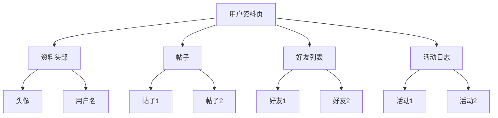

过去，作为后端开发者，我发现理解React代码相当困难。但最近，我从日常开发工作中获得了一些见解，想与大家分享。

<!-- more -->

# 理解网页

网页由三部分组成：

- HTML：结构和内容
- CSS：样式
- JavaScript/TypeScript：交互

例如，这是一个不使用任何框架的原生计数器网页：

```html
<!DOCTYPE html>
<html lang="en">
  <head>
    <meta charset="UTF-8" />
    <!-- 设置视口以控制不同设备上的布局 -->
    <meta name="viewport" content="width=device-width, initial-scale=1.0" />
    <!-- 确保与Internet Explorer兼容 -->
    <meta http-equiv="X-UA-Compatible" content="ie=edge" />
    <!-- 链接外部CSS文件用于样式 -->
    <link rel="stylesheet" type="text/css" href="../styles.css" />
    <title>Static Template</title>
  </head>
  <body>
    <!-- 部分从这里开始 -->
    <h1>Native JS DEMO</h1>
    <div id="dom-app">
      <!-- 显示计数器 -->
      <span id="count">0</span>
      <!-- 增加计数器的按钮 -->
      <button id="addBtn" type="button" onclick="addBtnHandler()">
        +
      </button>
    </div>

    <!-- 计数器的JavaScript -->
    <script type="text/javascript">
      // 获取显示计数的元素
      const $count = document.getElementById("count");

      // 处理添加按钮点击事件的函数
      function addBtnHandler() {
        // 增加计数并更新显示
        $count.innerText = Number($count.innerText) + 1;
      }
    </script>

  </body>
</html>
```

关键点是：

1. 整个文件是HTML（超文本标记语言）——一种特殊的标记语言。
   XML（可扩展标记语言）和Markdown是其他类型的标记语言。类似地，它们都有**标记**如`<html></html>`，用于定义结构。
   例如，XML可能看起来像：

```xml
<?xml version="1.0" encoding="UTF-8"?>
<ShoppingList>
    <Item>
        <Name>Milk</Name>
        <Quantity>1</Quantity>
        <Unit>Litre</Unit>
    </Item>
    <Item>
        <Name>Bread</Name>
        <Quantity>2</Quantity>
        <Unit>Pieces</Unit>
    </Item>
</ShoppingList>
```

   属性在`<Name>`中，值是`Milk`。它很灵活，因为XML的目的是**存储数据**。但对于HTML：

```html
<!DOCTYPE html>
<html>
<head>
    <title>My Shopping List</title>
</head>
<body>
    <h1>Shopping List</h1>
    <ul>
        <li>Milk</li>
        <li>Bread</li>
        <li>Apples</li>
    </ul>
</body>
</html>
```

   目的是**展示**数据。所以，像`<head>`这样的东西是固定的，以使这些文件在不同应用程序中正确渲染。这些规则称为HTML5，`<head>`被称为标签。

2. 样式由`<link rel="stylesheet" type="text/css" href="../styles.css" />`定义，通常在head中导入。

3. 交互在`<script></script>`中定义，由`onclick`触发。

所以无论使用什么框架，最终目标都是组成这样的HTML文件。

# React如何做到这一点

这是一些能实现相同功能的React代码：

```javascript
import React from "react";
import "./styles.css";

export default class App extends React.Component {
  state = {
    count: 0
  };

  handleClick = () => {
    this.setState({
      count: this.state.count + 1
    });
  };

  render() {
    return (
      <div className="app">
        <span>{this.state.count}</span>
        <button type="button" onClick={this.handleClick}>
          +
        </button>
      </div>
    );
  }
}
```

在这段代码中，我之前无法理解的是：

1. 什么是React.Component？为什么是`extends`，为什么是`export`？
2. 什么是state（类似地，什么是useEffect和hooks）？
3. 什么是`render()`，为什么它后面跟着`{}`并返回一部分HTML？
4. 谁使用返回的HTML，它是如何组成HTML的？

作为后端开发者，我专注于数据，像Spring这样的框架处理了很多与数据不直接相关的事情，如依赖管理、数据库连接、应用构建和运行。数据流完全在我的控制之下。所以React让我不舒服，逻辑像是"我的最终目标是构建一个HTML文件，所以所有与HTML文件相关的事情都应该在我的控制之下，React不应该处理"。但显然，React处理的比我预期的多，最终对我来说成了一种"黑盒"。

为了回答这四个问题，让我们从零开始。让我们开始思考为什么需要框架以及React解决了什么具体问题。

## 如果用原生JS写所有页面会发生什么？

### DOM渲染

参考：[虚拟DOM和真实DOM的区别 - GeeksforGeeks](https://www.geeksforgeeks.org/difference-between-virtual-dom-and-real-dom/)
[虚拟DOM和DOM的区别 - React Kung Fu](https://reactkungfu.com/2015/10/the-difference-between-virtual-dom-and-dom/)

第一个问题是DOM（文档对象模型）渲染。简单来说，HTML是一个文件，DOM是该文件在内存中的实例。它使用树结构存储。



这个DOM提供了查询和更新的API，如getElementById或removeChild。所以，当我们想修改网页内容时，可以使用这些方法轻松遍历树。

但轻松并不意味着快速。

想象一个场景，我们把帖子从2行更新到1000行。在这种情况下，会发生以下事情：

1. **布局重新计算（回流）**：如果帖子2在帖子1下面，很容易知道帖子2会向下移动以适应帖子1的更新。在这一步，DOM需要使用CSS的数据进行重新计算。

2. **重绘**：重新计算后，浏览器需要重新加载受影响的像素部分。

所以，更新可能很容易和高效，但后续处理可能很耗时。
一个直观的问题是，**我们能不能只更新被更新的部分？其他部分保持不变，不需要回流和重绘**。

### 可维护性问题

另一件事是关于可维护性。现代软件开发的一个重要方面是面向对象编程。例如，如果我们有两个按钮：加和减。显然，它们可以重用大部分部分。但在当前情况下，我们必须分别编写它们。

一个直观的问题是，**是否可以抽象HTML**？

# React如何解决这些问题？

### 虚拟DOM

对于第一个问题，React引入了虚拟DOM的概念，它是实际DOM的抽象。它是一个轻量级副本，React在进行任何真实DOM更新之前在其上进行所有操作。

React在两个关键阶段对虚拟DOM执行操作——批处理和差异比较——这有助于优化DOM更新：

- **批处理**：React将多个更新批量处理到虚拟DOM。React不是在每个状态变化发生时将其应用到DOM，而是将这些变化保存在内存中，一次性更新虚拟DOM。这通过避免每次变化的连续重新渲染周期来减少真实DOM的工作量。

- **差异比较**：一旦React更新了虚拟DOM，它需要更新真实DOM以反映这些变化。这是通过一个称为协调的过程完成的。React将当前虚拟DOM与之前的虚拟DOM快照（更新前）进行比较。这种比较通过差异算法进行优化，该算法精确识别DOM的哪些部分需要更新。

这是让我感到不舒服并让我觉得React是一个**黑盒**的最重要的事情。

**我不是在真实的HTML对象上工作，而是在React提供的抽象上工作。**

与此相比，在后端开发中，当我处理一个实例时，我处理的是一个真实对象，我甚至可以使用地址和指针追踪数据的生命周期——即使它是操作系统提供的地址，不是物理位置，但至少我可以。
在前端，情况完全不同。我不是在真实的DOM对象上工作。
虚拟DOM不是React创建的，但React使它更简单并开源了。

### 组件

React能够找到更新位置的方式是通过块来构建网页。这样的块称为组件。每个组件管理自己的状态，并有自己的生命周期方法，允许它随时间响应变化。组件可以组合在一起构建复杂的UI。

例如，在之前的React代码中

#### JSX（JavaScript XML）

JSX是JavaScript的语法扩展，看起来类似于HTML，在React中用于描述UI应该是什么样子。它允许你在同一个文件中编写HTML结构和JavaScript代码，使代码更容易理解和开发。React元素是从JSX创建的。JSX代码然后在构建时由Babel等工具转译为常规JavaScript。

在之前的代码中

```javascript
return (
  <div className="app">
    <span>{this.state.count}</span>
    <button type="button" onClick={this.handleClick}>
      +
    </button>
  </div>
);
```

这部分代码使用JSX定义了一个React元素树。它描述了一个带有`className`属性的`div`元素（注意是`className`而不是`class`，因为`class`是JavaScript中的保留字），包含一个显示当前计数的`span`和一个用户可以点击来增加计数的按钮。

#### React组件

React组件可以定义为返回React元素的类或函数。它封装了UI一部分的行为和渲染逻辑。组件管理自己的状态，可以在整个应用程序中重用。

```javascript
export default class App extends React.Component {
  state = {
    count: 0
  };

  handleClick = () => {
    this.setState({
      count: this.state.count + 1
    });
  };

  render() {
    return (
      <div className="app">
        <span>{this.state.count}</span>
        <button type="button" onClick={this.handleClick}>
          +
        </button>
      </div>
    );
  }
}
```

- **类组件**：这里，`App`是一个基于类的组件，继承自`React.Component`。类组件提供更多功能，如本地状态和生命周期方法。
- **状态**：`state`是一个对象，用于存储属于组件的属性值。当状态改变时，组件会重新渲染。
- **事件处理**：`handleClick`方法用于在按钮被点击时更新状态，触发组件的重新渲染。
- **渲染方法**：`render`方法是React类组件的生命周期方法。它返回应该渲染到DOM的JSX。

我不会深入讨论React的状态和hooks。

### 声明式UI

在声明式UI范式中，你描述**想要**渲染什么，而不是**如何**渲染它。这与命令式方法形成对比，在命令式方法中，你手动构建UI并指定根据数据变化更新它的确切步骤。React是一个声明式UI库，意味着你编写指定UI最终状态的代码，React负责实际的渲染过程和DOM更新。

```javascript
import React, { useState } from 'react';

function ToggleComponent() {
  const [isVisible, setIsVisible] = useState(true);

  return (
    <div>
      <button onClick={() => setIsVisible(!isVisible)}>
        {isVisible ? 'Hide' : 'Show'}
      </button>
      {isVisible && <p>This is some text!</p>}
    </div>
  );
}
```

我们根据`isVisible`状态描述UI。如果`isVisible`为true，则显示文本。你不需要手动操作DOM来隐藏或显示文本；React根据状态处理这些操作。

### 单向数据流

单向数据流意味着应用程序中的数据遵循单一路径；通常是从父组件到子组件通过props。状态通常在更高级别的组件中管理，数据或操作数据的函数作为props传递给子组件。这使数据流可预测，调试更容易。

```javascript
import React, { useState } from 'react';

function ParentComponent() {
  const [isVisible, setIsVisible] = useState(true);

  return (
    <div>
      <button onClick={() => setIsVisible(!isVisible)}>
        {isVisible ? 'Hide' : 'Show'}
      </button>
      <ChildComponent isVisible={isVisible} />
    </div>
  );
}

function ChildComponent({ isVisible }) {
  return (
    <div>
      {isVisible && <p>Text from the child component!</p>}
    </div>
  );
}
```

- **单向数据流**：`ParentComponent`管理状态（`isVisible`）。这个状态以及修改它的函数（`setIsVisible`）决定了父组件和子组件显示什么。
- **从父到子的数据**：`isVisible`状态作为prop传递给`ChildComponent`。子组件使用这个prop来决定是否显示或隐藏其文本。它不直接修改prop，这保持了单向流。

# 总结

现在我们可以回答这四个问题：

1. 什么是React.Component？为什么是`extends`，为什么是`export`？

- **React.Component**：这是React库中的一个基类，你的组件从它继承。通过继承`React.Component`，你的组件可以访问React的生命周期方法和状态管理功能，允许它响应变化并根据需要重新渲染。

- **`extends`**：这个关键字用于类声明中，将一个类创建为另一个类的子类。在React的上下文中，它意味着你的组件是React组件的特殊类型，继承了`React.Component`的功能。

- **`export`**：用于使组件或函数可以被项目中的其他文件或其他项目导入。`export`使类公开，允许其他组件实例化和使用它。

2. 什么是state（类似地，什么是useEffect和hooks）？

- **状态**：在React中，状态指的是需要在应用程序中跟踪的数据或属性。状态变化可以触发组件的重新渲染。React组件中的状态可以被视为组件自身管理的本地数据。

- **Hooks**：在React 16.8中引入，hooks允许你在不编写类的情况下使用状态和其他React功能。`useState`是一个hook，让你可以向函数组件添加React状态。

- **useEffect**：这是另一个管理函数组件中副作用的hook。它的作用与React类中的`componentDidMount`、`componentDidUpdate`和`componentWillUnmount`相同，允许你执行数据获取、订阅或从React组件手动更改DOM等副作用。

3. 什么是`render()`，为什么它后面跟着`{}`并返回一部分HTML？

- **`render()`**：这是React类组件中的生命周期方法，指定应该在屏幕上显示什么。它需要是纯的，意味着给定相同的输入必须返回相同的输出，并且不应该修改组件状态。

- **`{}`**：这些大括号在JSX中用于嵌入JavaScript表达式。React和JSX使用大括号在JSX代码中计算变量和表达式。

- **返回HTML**：技术上，`render()`返回的是JSX，而不是HTML。JSX是一种看起来像HTML的语法扩展，最终被转译为创建React元素的JavaScript调用。这些元素然后被React用来构建DOM。

4. 谁使用返回的HTML，它是如何组成HTML的？

- **谁使用它？**：从`render()`返回的JSX被React使用。React获取这个JSX并将其转换为实际的DOM元素，挂载到浏览器的DOM树中。

- **组成HTML**：在底层，React将JSX转换为`React.createElement()`调用。这些调用返回React用来跟踪树结构的对象，并最终高效地构建和更新DOM。React处理这些DOM元素的创建和更新生命周期，以响应状态和props的变化。
