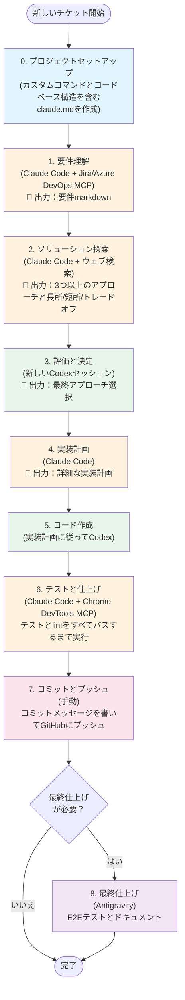
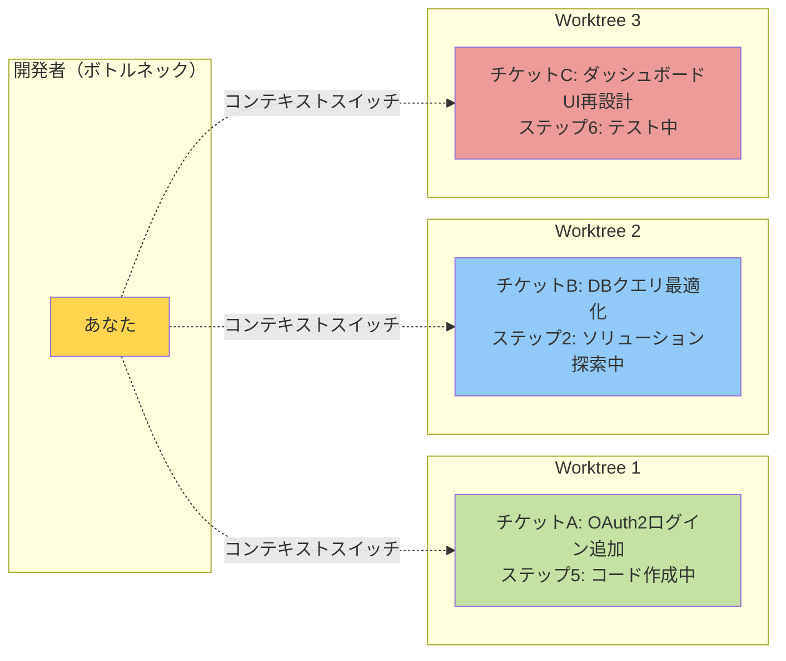

**免責事項**：このアプローチは個人プロジェクトでのみ使用しており、仕事ではまだ試していません。チームで上手くいくかは分かりませんが、私個人には効果的です。

これは2025年12月8日時点のワークフローです。今後変わる可能性があります。
<!-- more -->

# ツールとモデル

ツールキットはかなりシンプルで、主に3つだけです：

1. Claude Code + Claude Sonnet 4.5
2. Codex + GPT-5.1/5.2（推論高、要約自動）
3. Antigravity

よく使うMCP：

1. Github
2. Jira/Azure Devops
3. Sequential thinking
4. Chrome devtools
5. Context7

# コンテキスト管理

`compact`はタスクの重要なコンテキストを失わせると感じるので、常にコンテキストウィンドウの少なくとも30%を確保するようにしています。残りのコンテキストが30%を下回ったら、Claude Code（またはCodex）に現在の進捗をMarkdownファイルにまとめてもらい、新しいセッションを開始します。

# 私のワークフロー

ワークフローを紹介する前に、GPT 5.1/5.2とClaude Sonnet 4.5の違いについて学んだことを共有します。

1. **GPT 5.1/5.2は推論に優れている** — 行き詰まった難しい問題に特に有効です。例えば、明確な原因がない問題をデバッグする際、GPTはよく解決策を見つけます。
2. **GPT 5.1/5.2は受動的** — コードベースを積極的に探索せず、回答も簡潔で分かりにくいことがあります。
3. **Codexはローカルコマンドが苦手** — サンドボックス環境で動いているようで、gitのような汎用コマンドは問題ありませんが、リポジトリ固有のツール（gradlew、terraformなど）では問題が発生しがちです。Claude Codeはこの点で優れています。
4. **Claude Code Sonnet 4.5は徹底的** — コードベースを積極的に探索し、詳細で分かりやすい説明を提供します。ツールやコマンドの実行も上手です。欠点は、過剰なエッジケース処理やコメントで過度に設計しがちなことです。

簡単な比較：

| ツール | 強み | 弱み |
|------|-----------|------------|
| **GPT 5.1/5.2 (Codex)** | ✓ 難問への優れた推論力 ✓ 行き詰まった問題のデバッグに最適 | ✗ 探索が受動的 ✗ 回答が簡潔で分かりにくい ✗ ローカルコマンドが苦手 |
| **Claude Code Sonnet 4.5** | ✓ 積極的なコードベース探索 ✓ 詳細で分かりやすい説明 ✓ ツール実行が優秀 | ✗ 過度な設計傾向 ✗ エッジケース処理が過剰 |
| **Antigravity** | ✓ Chrome統合内蔵 ✓ E2Eテストに最適 | （オプションツール、必要に応じて使用） |

私のワークフローは通常こうなります：

0. **プロジェクトセットアップ** — デフォルトの`init`コマンドでプロジェクト用の`claude.md`ファイルを作成します。（[テンプレート](https://gist.github.com/lifeodyssey/3171ce1b58ce7ffa940970bdb6c7ec91)を共有しています。）重要な内容：カスタムコマンド（`./gradlew ktlintFormat detekt`、`pre-commit run --all-files`、`uv sync`、taskfile/makefileのコマンドなど）と、エージェントが各ディレクトリの役割を理解できるようにコードベース構造を含めます。
1. **要件理解** — Jira/Azure DevOpsのMCPでチケット説明を取得し、Claude Codeにビジネス要件の理解を手伝ってもらい、すべてをmarkdownファイルにまとめます。
2. **ソリューション探索** — Claude Codeにコードベースを探索させ、ソリューションを考えてもらいます。常に少なくとも3つの異なるアプローチと、それぞれの長所・短所・トレードオフをmarkdownに記録するよう求めます。このステップではウェブ検索も使うことがあります。[シンプルなプロンプト](https://gist.github.com/lifeodyssey/99005b0725bf5c88d84bbc55332ff9f8)を使っています。
3. **評価と決定** — 新しいCodexセッションを開いてソリューションを評価し、最終アプローチを選択（または統合）します。
4. **実装計画** — Claude Codeに戻り、最終ソリューションに基づいた詳細な実装計画を生成します。[プロンプトはこちら](https://gist.github.com/lifeodyssey/0446c1a6dde0ef492fc7cf700aa225a5)。
5. **コード作成** — 実装計画に従ってCodexにコードを書いてもらいます。[このプロンプト](https://gist.github.com/lifeodyssey/a66b23ab0e29f679fe536186ac2112f1)で実行をガイドします。
6. **テストと仕上げ** — Claude Codeでテストとlintをすべてパスするまで実行します。Chrome DevTools MCPをテストとデバッグに使うこともあります。
7. **コミットとプッシュ** — この部分はまだ手動です — コミットメッセージを書いてGitHubにプッシュします。
8. **（オプション）最終仕上げ** — 必要に応じて、Antigravityでエンドツーエンドテスト（Chrome統合内蔵）とドキュメント作成を行います。

## ビジュアルワークフロー

ワークフローの視覚的表現：

### 並列作業パターン

実際には、3つのgit worktreeを使って3つのチケットを同時に作業しています：

## よくある質問

**1. スラッシュコマンド、サブエージェント、スキルは使いますか？**

lintとテスト用のスラッシュコマンドは設定しています。カスタムスキルはまだ探索していません。サブエージェントは試しましたが期待通りではありませんでした。理由は以下で説明します。

**2. これを自動化ワークフローにしようとしましたか？**

はい、LangChainで試しました。問題は、コーディング時に各ステップを慎重にレビューする必要があることです。自動化ワークフローは人間の介入が多すぎて、目的を達成できません。これがサブエージェントを使わない理由でもあります — 出力を十分に監視できないのです。

Claude Codeインスタンスで別のClaude Codeを呼び出したり調整したりすることも試しました。しかし実際には期待通りの結果は得られませんでした。主に3つの問題があります：

- 人間がループに入ることは依然として必須です。

    人間はAIの推論と出力を注意深く追い、何か問題があればすぐに中断して修正入力を提供する必要があります。そうしないと、プロセスは簡単に間違った方向に進みます。Claudeは過度に同意的な傾向もあり、明示的にプロンプトしても「おっしゃる通りです」のような反応をし、十分に強い批判的フィードバックを提供しません。

- 長時間実行エージェントはメモリとコンテキスト管理に苦労します。

    最近この記事を見つけました：https://www.anthropic.com/engineering/effective-harnesses-for-long-running-agents。有望なアイデアがありますが、まだ実践していないので、これは未解決の問題です。

- 開発ワークフローは時間とともに進化します。

    タスクが進むにつれて、開発プロセス自体がよく変わります。これにより、すべてを事前に固定ワークフローにロックすることが難しくなります。現在のモデルは、プロジェクトの特定の状態に基づいて最も適切な次の開発ステップを確実に決定するほど賢くありません。

**3. spec-kitやBMADはどうですか？**

それらも試しました。かなり厳格なウォーターフォール式ワークフロー（constitution→specify→clarify→plan→analyse→tasks→check→implement）に従います。各ステップが独自のmarkdownファイルを生成し、時々互いに矛盾します。主な問題は、実装中に問題を見つけてアプローチを変更する必要がある場合、フロー全体を再開しなければならないことです。また、エンジニアとして、何かにどうアプローチするかの直感を持っていることが多いので、そのオーバーヘッドは不要に感じます。

**4. 時間がかかりそうですね。本当に速くなりますか？**

良い質問です。最初は約20%の速度向上しか見られませんでした。しかし気づいたのは：本当の力は1つのタスクを速くすることではなく、*複数のタスクを並行して*行うことです。今は通常3つのgit worktreeを開いて、3つの異なるチケットを同時に作業しています。（3つが私の限界です — それ以上だとコンテキストスイッチとコードレビューについていけません。私がボトルネックになります。）

結果として全体で約2倍速くなりました。（3つのチケットを作業しているのになぜ3倍ではないのか？各チケットでレビューとデバッグにより多くの時間を費やす必要があるからです。自分で書いていないコードは通常レビューに時間がかかります。他の人が書いたPRを慎重にレビューする必要があるのと同じです。）
