**Disclaimer**: I have only been using this approach for my personal projects and have not tried it at work yet. I am not sure if it would work well for a team, but it has been working well for me so far.

This is my workflow as of December 8th, 2025. It will probably evolve over time.
<!-- more -->

# Tools and Models

I keep my toolkit pretty minimal — just three main tools:

1. Claude Code + Claude Sonnet 4.5
2. Codex + GPT-5.1/5.2 (reasoning high, summaries auto) 
3. Antigravity

And here are the MCPs I regularly use:

1. Github
2. Jira/Azure Devops
3. Sequential thinking
4. Chrome devtools
5. Context7

# Context management

I feel `compact` can cause a task to lose key context, so I’ll always keep at least 30% of the context window available. If the remaining context drops below 30%, I’ll ask Claude Code (or Codex) to summarize the current progress into a Markdown file and then start a new session.

# My Workflow

Before diving into my workflow, let me share what I have learned about the differences between GPT 5.1/5.2 and Claude Sonnet 4.5.

1. **GPT 5.1/5.2 excels at reasoning** — it is particularly good for difficult problems where you are stuck. For example, when debugging an issue with no obvious cause, GPT often finds a solution.
2. **GPT 5.1/5.2 tends to be passive** — it does not actively explore the codebase, and its answers can be quite brief and cryptic, making them harder to understand.
3. **Codex struggles with local commands** — it appears to run in some kind of sandbox environment, which works fine for generic commands like git, but when it comes to repo-specific tools (gradlew, terraform, etc.), it often encounters issues. Claude Code handles this better.
4. **Claude Code Sonnet 4.5 is thorough** — it actively explores the codebase and provides detailed, easy-to-understand explanations. It is also better at executing tools and commands. The downside is that it tends to over-engineer solutions with excessive edge case handling and comments.

Here is a quick comparison:

| Tool | Strengths | Weaknesses |
|------|-----------|------------|
| **GPT 5.1/5.2 (Codex)** | ✓ Excellent reasoning for difficult problems ✓ Great for debugging stuck issues | ✗ Passive exploration ✗ Brief/cryptic answers ✗ Struggles with local commands |
| **Claude Code Sonnet 4.5** | ✓ Active codebase exploration ✓ Detailed, easy-to-understand explanations ✓ Better tool execution | ✗ Over-engineering tendency ✗ Excessive edge case handling |
| **Antigravity** | ✓ Built-in Chrome integration ✓ Good for E2E testing | (Optional tool, used as needed) |

Here is how my workflow typically goes:

0. **Project setup** — I start by using the default `init` command to create a `claude.md` file for the project. (I have shared [a template](https://gist.github.com/lifeodyssey/3171ce1b58ce7ffa940970bdb6c7ec91) if you want to use it.) The important things to include: your custom commands (like `./gradlew ktlintFormat detekt`, `pre-commit run --all-files`, `uv sync`, plus anything from your taskfile/makefile), and your codebase structure so the agent understands what each directory does.
1. **Understand requirements** — Pull the ticket description from Jira/Azure DevOps using their MCP, then have Claude Code help me understand the business requirements and summarize everything into a markdown file.
2. **Explore solutions** — Let Claude Code explore the codebase and come up with solutions. I always ask for at least 3 different approaches with their pros, cons, and tradeoffs documented in markdown. Sometimes I will use web searches for this step as well. [Here is a simple prompt](https://gist.github.com/lifeodyssey/99005b0725bf5c88d84bbc55332ff9f8) I use.
3. **Evaluate and decide** — Open a fresh Codex session to evaluate those solutions and pick (or synthesize) the final approach.
4. **Plan implementation** — Back to Claude Code to generate a detailed implementation plan based on that final solution. I have [a prompt here](https://gist.github.com/lifeodyssey/0446c1a6dde0ef492fc7cf700aa225a5).
5. **Write code** — Hand it over to Codex to write the code following the implementation plan. I use [this prompt](https://gist.github.com/lifeodyssey/a66b23ab0e29f679fe536186ac2112f1) to guide the execution.
6. **Test and polish** — Use Claude Code to run tests and linting until everything passes. I will sometimes use the Chrome DevTools MCP for testing and debugging as well.
7. **Commit and push** — I still do this part manually — write the commit message and push to GitHub.
8. **(Optional) Final touches** — If needed, I will use Antigravity for end-to-end testing (it has Chrome integration built-in) and for writing documentation.

## Visual Workflow

Here is a visual representation of the workflow:

```mermaid
flowchart TD
    Start([Start New Ticket]) --> Step0["0. Project Setup<br/>(Create claude.md with custom commands & codebase structure)"]
    Step0 --> Step1["1. Understand Requirements<br/>(Claude Code + Jira/Azure DevOps MCP)<br/>📝 Output: Requirements markdown"]
    Step1 --> Step2["2. Explore Solutions<br/>(Claude Code + Web Search)<br/>📝 Output: 3+ approaches with pros/cons/tradeoffs"]
    Step2 --> Step3["3. Evaluate and Decide<br/>(Fresh Codex session)<br/>📝 Output: Final approach selection"]
    Step3 --> Step4["4. Plan Implementation<br/>(Claude Code)<br/>📝 Output: Detailed implementation plan"]
    Step4 --> Step5["5. Write Code<br/>(Codex with implementation plan)"]
    Step5 --> Step6["6. Test and Polish<br/>(Claude Code + Chrome DevTools MCP)<br/>Run tests & linting until all pass"]
    Step6 --> Step7["7. Commit and Push<br/>(Manual)<br/>Write commit message & push to GitHub"]
    Step7 --> Step8{"Need final<br/>touches?"}
    Step8 -->|Yes| Step8a["8. Final Touches<br/>(Antigravity)<br/>E2E testing & documentation"]
    Step8 -->|No| End([Done])
    Step8a --> End
    
    style Step0 fill:#e1f5ff
    style Step1 fill:#fff3e0
    style Step2 fill:#fff3e0
    style Step3 fill:#e8f5e9
    style Step4 fill:#fff3e0
    style Step5 fill:#e8f5e9
    style Step6 fill:#fff3e0
    style Step7 fill:#fce4ec
    style Step8a fill:#f3e5f5
```

### Parallel Work Pattern

In practice, I work on 3 tickets simultaneously using 3 git worktrees:

## FAQ

Here are some common questions you might have:

**1. Do you use slash commands, sub agents, and skills?**

I have set up slash commands for linting and testing. I have not explored custom skills yet. I tried sub agents but they did not meet my expectations — I will explain why below.

**2. Have you tried making this into an automated workflow?**

Yes, I tried using LangChain for this. The problem is that when coding, you need to review each step carefully. An automated workflow requires too much human intervention, which defeats the purpose. This is also why I do not use sub agents — I cannot monitor their output closely enough.

I also tried to use a Claude Code instance to call or coordinate with another Claude code. However, in practice, the results were not as good as I expected. I see three main issues:

- Human-in-the-loop is still mandatory.

    The human has to closely follow the AI’s reasoning and outputs, interrupt it promptly when something goes wrong, and provide corrective input. Otherwise, the process can easily drift in the wrong direction. Claude also tends to be overly agreeable—it often responds with things like “you are absolutely right” and does not provide sufficiently strong or critical feedback, even when I explicitly prompt it to do so.

- Long-running agents struggle with memory and context management.

    I recently came across this article: https://www.anthropic.com/engineering/effective-harnesses-for-long-running-agents. While it offers some promising ideas, I haven’t yet put those patterns into practice, so this remains an unresolved problem for me.

- Development workflows evolve over time.

    As a task progresses, the development process itself often changes. This makes it difficult to lock everything into a fixed workflow upfront. Current models are still not intelligent enough to reliably determine the most appropriate next development step based on the specific state of the project.

**3. What about spec-kit or BMAD?**

I tried those as well. They follow a fairly rigid, waterfall-style workflow (constitution→specify→clarify→plan→analyse→tasks→check→implement). Each step generates its own markdown file, and sometimes they contradict each other. The main issue is when you find problems during implementation and need to change your approach — you have to restart the entire flow. Additionally, as an engineer, I often have an intuition for how to approach something step-by-step, so all that overhead feels unnecessary.

**4. This seems time-consuming. Does it actually make you faster?**

This is a good question. At first, I only saw about a 20% speed improvement. But then I realized: the real power is not doing one task faster — it is doing *multiple tasks in parallel*. Now I typically have three git worktrees open, working on three different tickets simultaneously. (Three is my limit — more than that and I cannot keep up with context switching and code reviews. I become the bottleneck.)

The result is about 2x faster overall. (Why not 3x if I am working on three tickets? Because for each ticket, I need to spend more time reviewing and debugging. Code I did not write myself typically takes longer to review, similar to how you need to carefully review a PR that someone else wrote.)

