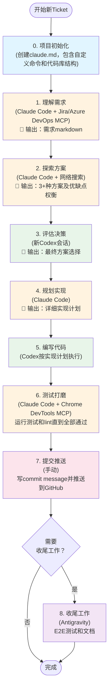
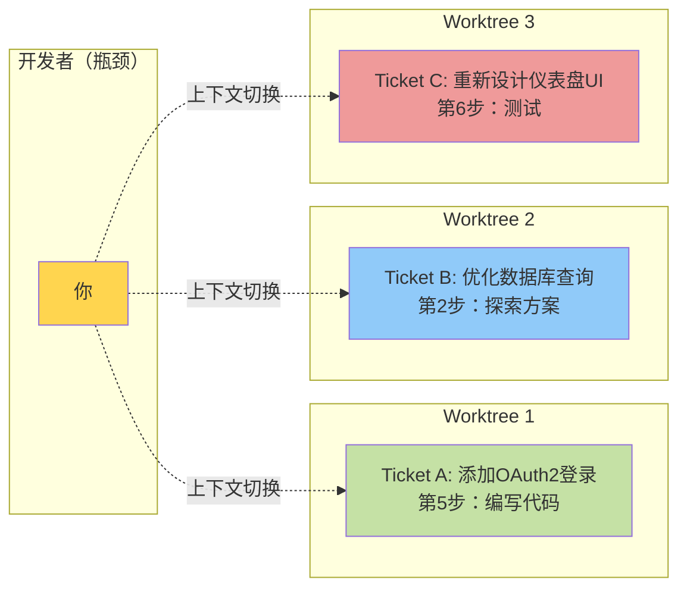

**声明**：这套方法目前只用于我的个人项目，还没在工作中尝试过。不确定是否适合团队协作，但对我个人来说效果不错。

这是截至2025年12月8日的工作流，后续可能会有变化。
<!-- more -->

# 工具和模型

我的工具箱比较精简，主要就三个：

1. Claude Code + Claude Sonnet 4.5
2. Codex + GPT-5.1/5.2（推理模式高，摘要自动）
3. Antigravity

常用的MCP：

1. Github
2. Jira/Azure Devops
3. Sequential thinking
4. Chrome devtools
5. Context7

# 上下文管理

我觉得`compact`会导致任务丢失关键上下文，所以我会始终保持至少30%的上下文窗口可用。如果剩余上下文低于30%，我会让Claude Code（或Codex）把当前进度总结到一个Markdown文件里，然后开启新会话。

# 我的工作流

在介绍工作流之前，先说说我对GPT 5.1/5.2和Claude Sonnet 4.5的理解：

1. **GPT 5.1/5.2擅长推理** — 特别适合解决卡住的难题。比如调试一个找不到明显原因的问题时，GPT往往能找到解决方案。
2. **GPT 5.1/5.2比较被动** — 不会主动探索代码库，回答也比较简短晦涩，不太好理解。
3. **Codex处理本地命令有困难** — 似乎运行在某种沙箱环境中，通用命令如git没问题，但遇到项目特定工具（gradlew、terraform等）时经常出问题。Claude Code在这方面做得更好。
4. **Claude Code Sonnet 4.5很全面** — 会主动探索代码库，解释详细易懂，执行工具和命令也更顺畅。缺点是容易过度设计，加太多边界情况处理和注释。

简单对比：

| 工具 | 优势 | 劣势 |
|------|-----------|------------|
| **GPT 5.1/5.2 (Codex)** | ✓ 难题推理能力强 ✓ 调试卡住的问题很有效 | ✗ 探索不主动 ✗ 回答简短晦涩 ✗ 本地命令处理困难 |
| **Claude Code Sonnet 4.5** | ✓ 主动探索代码库 ✓ 解释详细易懂 ✓ 工具执行更好 | ✗ 容易过度设计 ✗ 边界情况处理过多 |
| **Antigravity** | ✓ 内置Chrome集成 ✓ 适合E2E测试 | （可选工具，按需使用） |

我的工作流通常是这样的：

0. **项目初始化** — 用默认的`init`命令为项目创建`claude.md`文件。（如果需要可以参考[我的模板](https://gist.github.com/lifeodyssey/3171ce1b58ce7ffa940970bdb6c7ec91)。）重点包括：自定义命令（如`./gradlew ktlintFormat detekt`、`pre-commit run --all-files`、`uv sync`，以及taskfile/makefile中的命令），还有代码库结构说明，让agent理解每个目录的作用。
1. **理解需求** — 用Jira/Azure DevOps的MCP拉取ticket描述，让Claude Code帮我理解业务需求，并总结到markdown文件中。
2. **探索方案** — 让Claude Code探索代码库并提出解决方案。我总是要求至少3种不同方案，并在markdown中记录各自的优缺点和权衡。有时这一步也会用到网络搜索。[这是我用的简单提示词](https://gist.github.com/lifeodyssey/99005b0725bf5c88d84bbc55332ff9f8)。
3. **评估决策** — 开一个新的Codex会话来评估这些方案，选择（或综合）最终方案。
4. **规划实现** — 回到Claude Code，基于最终方案生成详细的实现计划。[这是我的提示词](https://gist.github.com/lifeodyssey/0446c1a6dde0ef492fc7cf700aa225a5)。
5. **编写代码** — 交给Codex按照实现计划写代码。[这是我用的提示词](https://gist.github.com/lifeodyssey/a66b23ab0e29f679fe536186ac2112f1)。
6. **测试打磨** — 用Claude Code运行测试和lint直到全部通过。有时也会用Chrome DevTools MCP来测试和调试。
7. **提交推送** — 这部分我还是手动做——写commit message然后推送到GitHub。
8. **（可选）收尾工作** — 如果需要，用Antigravity做端到端测试（它内置了Chrome集成）和写文档。

## 可视化工作流

工作流的可视化表示：

### 并行工作模式

实际上，我会用3个git worktree同时处理3个ticket：

## 常见问题

一些你可能会问的问题：

**1. 你用斜杠命令、子agent和技能吗？**

我设置了lint和测试的斜杠命令。自定义技能还没探索过。试过子agent但没达到预期——下面会解释原因。

**2. 你试过把这个做成自动化工作流吗？**

试过，用LangChain做的。问题是写代码时需要仔细审查每一步。自动化工作流需要太多人工干预，这就失去意义了。这也是我不用子agent的原因——没法足够密切地监控它们的输出。

我也试过用一个Claude Code实例来调用或协调另一个Claude Code。但实际效果不如预期。我看到三个主要问题：

- 人在回路中仍然是必须的。

    人必须紧跟AI的推理和输出，在出问题时及时打断并提供纠正输入。否则过程很容易偏离方向。Claude也倾向于过度迎合——经常回应"你说得对"之类的话，即使我明确提示它要批判性思考，也不会给出足够强硬或批判性的反馈。

- 长时间运行的agent在记忆和上下文管理上有困难。

    我最近看到这篇文章：https://www.anthropic.com/engineering/effective-harnesses-for-long-running-agents。虽然提供了一些有前景的想法，但我还没把这些模式付诸实践，所以这对我来说仍是未解决的问题。

- 开发工作流会随时间演变。

    随着任务推进，开发过程本身经常会变化。这使得很难预先锁定一个固定的工作流。当前的模型还不够智能，无法根据项目的具体状态可靠地确定最合适的下一个开发步骤。

**3. spec-kit或BMAD呢？**

也试过。它们遵循相当僵化的瀑布式工作流（constitution→specify→clarify→plan→analyse→tasks→check→implement）。每一步都生成自己的markdown文件，有时它们之间会相互矛盾。主要问题是当你在实现过程中发现问题需要改变方案时——你得重新开始整个流程。另外，作为工程师，我通常对如何一步步推进有直觉，所以那些额外开销感觉没必要。

**4. 这看起来很耗时。真的能让你更快吗？**

好问题。一开始我只看到大约20%的速度提升。但后来我意识到：真正的威力不在于单个任务做得更快——而是*同时做多个任务*。现在我通常开着三个git worktree，同时处理三个不同的ticket。（三个是我的极限——再多就跟不上上下文切换和代码审查了。我成了瓶颈。）

结果是整体快了大约2倍。（为什么不是3倍，既然我在处理三个ticket？因为每个ticket我需要花更多时间审查和调试。不是自己写的代码通常需要更长时间审查，就像你需要仔细审查别人写的PR一样。）
