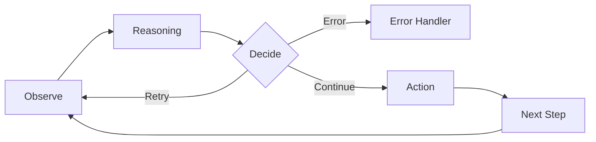
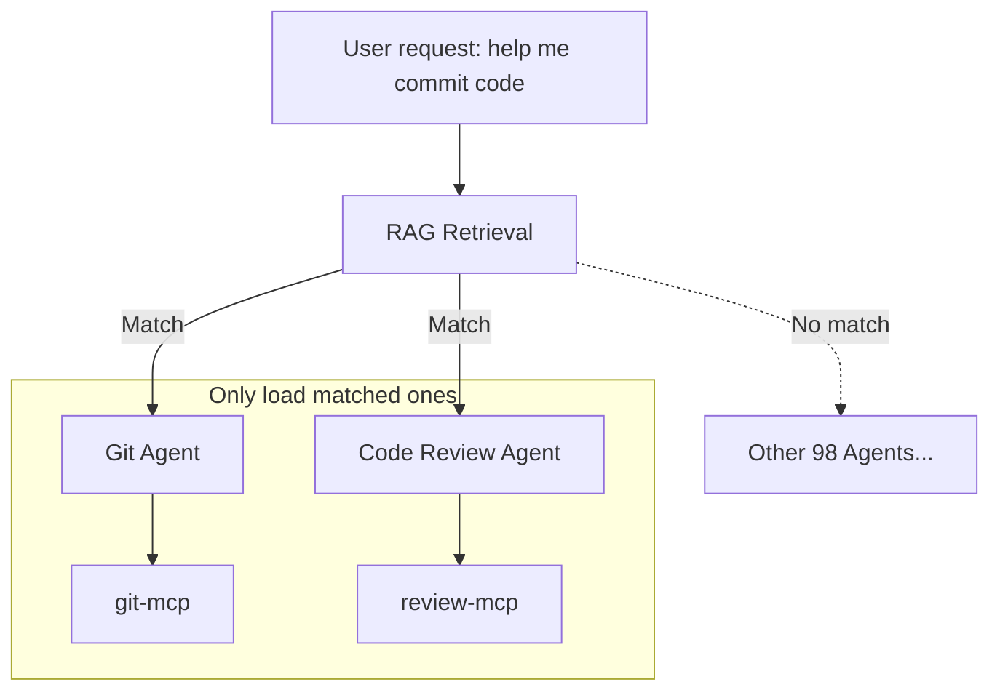
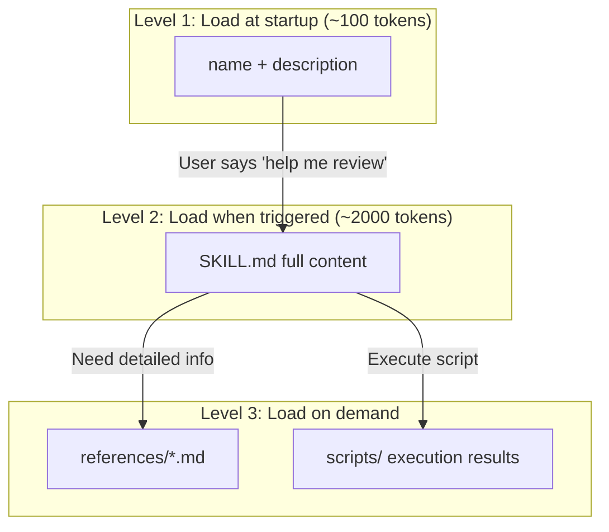

This article was written on January 19, 2026.

Recently, terms like Skills and Plugins have been trending in AI developer communities. At first, I was confused—aren't these all about "letting AI call tools"? Why do we need so many concepts?

After examining the code of several Skills, I finally understood what problems each of them is solving.

This article doesn't focus on definitions. Instead, I want to start from **engineering pain points** and gradually deduce why we need these things. If you're also confused by these new terms, I hope this article can help clarify your thoughts.

<!-- more -->


## 1. The Root of Everything: Context is Expensive

Everyone knows that Function Calling (Tool Use) is the foundation of Agents. But what many people don't realize is that **letting the model "know" what tools it has is itself extremely expensive**.

In demos, you see `get_weather` like this:

```python
# Demo version of get_weather
def get_weather(city):
    """Get weather for city"""
    pass
```

But in enterprise production environments, a real tool definition looks like this:

```json
{
  "name": "get_production_weather",
  "description": "Retrieves weather data from verified enterprise providers with fallback logic.",
  "parameters": {
    "type": "object",  
    "properties": {
      "location": { "type": "string", "description": "City name or coordinates" },
      "provider": { "type": "string", "enum": ["aws", "gcp", "azure", "openweather"] },
      "units": { "type": "string", "enum": ["metric", "imperial"] },
      "retry_policy": {
        "type": "object",
        "properties": { "max_attempts": { "type": "integer" }, "backoff": { "type": "string" } }
      },
      "auth_context": { "description": "JWT token for auth", "type": "string" }
    },
    // ... another 20 lines ...
    "required": ["location", "auth_context"]
  }
}
```

This is just the tool **definition**. When actually calling it, your code probably looks like this:

```python
import anthropic

client = anthropic.Anthropic()

# 1. Define tools (this part consumes context tokens)
tools = [{
    "name": "get_weather",
    "description": "Get weather for specified city",
    "input_schema": {
        "type": "object",
        "properties": {
            "city": {"type": "string", "description": "City name"}
        },
        "required": ["city"]
    }
}]

# 2. Send request, model may decide to call tool
response = client.messages.create(
    model="claude-sonnet-4-20250514",
    max_tokens=1024,
    tools=tools,  # Must include complete tools definition with every request
    messages=[{"role": "user", "content": "What's the weather like in Beijing?"}]
)

# 3. Check if model wants to call tool
for block in response.content:
    if block.type == "tool_use":
        tool_name = block.name      # "get_weather"
        tool_input = block.input    # {"city": "Beijing"}

        # 4. Execute tool, get result
        weather_result = call_weather_api(tool_input["city"])

        # 5. Return result to model (consumes context again)
        messages.append({"role": "assistant", "content": response.content})
        messages.append({
            "role": "user",
            "content": [{
                "type": "tool_result",
                "tool_use_id": block.id,
                "content": weather_result
            }]
        })
```

See the problem? Just **telling** the model "I have this tool," before even calling it, has already consumed 300-500 context tokens. And every round of conversation, this tools definition must be resent.

If you want to build an all-capable Agent and attach 50 such tools to it, it means **the user's System Prompt starts with 15,000+ tokens of tool definitions**.

This is **Context Pollution**. This leads to two fatal consequences:
1. **Expensive**: Every conversation is burning money.
2. **Dumb**: "Lost in the Middle" phenomenon. Too many tool definitions, the model doesn't know which to choose, or hallucinates.

## 2. MCP: Solved Connection Standards, Not Pollution

Model Context Protocol (MCP) is great—it standardizes the **connection method** for tools.

* **Before**: You had to write Python glue code to stuff GitHub API into system prompt.
* **MCP**: You just need one line of configuration to connect `github-mcp-server`.

But MCP **did not** solve the Context Pollution problem above. On the contrary, it made it worse. Because connecting tools became so easy, developers can unknowingly attach 20 MCP Servers to an Agent, each Server bringing 10 tools.

Boom! Your Context exploded.

So, we need **divide and conquer**.

## 3. Multi-Agent Solutions: Solving Context Pollution

Since one Agent can't hold 100 tools, why not split them up?

This is the engineering essence of **Multi-Agent** architecture: **Specialization**.

* **God Mode Agent**: Has 100 tools, 50k context, slow response, prone to errors.
* **Team of Agents**:
  * `Git Agent`: Only has 5 git tools.
  * `Database Agent`: Only has 5 sql tools.
  * `Writer Agent`: Only has 2 file tools.


In the context of Agent frameworks, this is called **Sub-agents**. The difference:
* **Multi-Agent**: Usually refers to peer Agents that can even chat with each other (Peer).
* **Sub-agent**: Hierarchical, ephemeral. Main Agent encounters a git task, wakes up a clean Sub-agent, gives it the task, and it **disappears** after completion.

**Core value**: Sub-agent always has the cleanest Context. It doesn't need to know about the previous 100 rounds of conversation, it only needs to know "now we need to commit this file".

## 4. Agentic Workflow: Intelligent Orchestration

With so many Agents, who directs them?

This leads to the problem of **Orchestration**. The answer is **Agentic Workflow**: Using LLM itself for routing and decision-making.

**The essence of Agentic Workflow**: Agents don't execute according to fixed scripts, but **observe, think, decide, and act** at every step.



This means:
- All "decision nodes" are **intelligent**
- Step 1 failed? Agent thinks whether to retry, skip, or change approach
- Got unexpected results? Agent can dynamically adjust strategy

This is why it's called **Agentic** — every step has Agent's intelligence involved, not rigid `if-else`.

## 5. RAG: When You Have Too Many Agents and MCPs to Fit

The previous problem was "too many tools", Multi-Agent solved it by splitting. But what if your system is complex enough?

Imagine: You've built a multi-agent system with **1000 sub-agents**, each can connect **dozens of MCP servers**. Combined, there might be tens of thousands of tool definitions.

It's impossible to stuff all agent descriptions and MCP tool definitions into context when the main agent starts—isn't that back to "God Mode Agent"?

**Solution: Do RAG on agent and MCP descriptions**



**Workflow**:
1. User question comes in: "Help me commit code to main branch"
2. RAG retrieves agent descriptions → matches Git Agent
3. Only load Git Agent and the MCP it needs (git-mcp)
4. Definitions of the other 99 agents **never enter context**

This way, the main agent doesn't need to "know" details of all sub-tools, it just needs to be able to "find" them when needed.

**Another typical scenario: Spec Coding**

When planning large projects, you might generate hundreds of spec documents, each several hundred lines:
- `spec/authentication.md` - Authentication module design
- `spec/database-schema.md` - Database design
- `spec/api-endpoints.md` - API endpoint definitions
- ... 97 more ...

If you stuff all specs into context, it would explode long ago.

**Solution is also RAG**: When the agent needs to implement "user login" functionality, the retrieval system automatically loads `authentication.md` and `api-endpoints.md`, other specs never enter context.

## 6. The "Still Too Much" Problem -> Skills & Plugins

Okay, now we have:
* **Multi-Agent**: Isolated environments, divide and conquer tools.
* **Agentic Workflow**: Intelligent orchestration.
* **RAG**: On-demand retrieval of agents and MCPs.

Seems perfect? No. Two problems remain unsolved.


### Problem One: No Place for SOPs

We have **data** (RAG), we have **tools** (MCP), but we're missing one thing: **process knowledge (Know-How)**.

For example, "how to conduct Code Review in this project". This is neither a tool nor pure data, it's a set of **SOP (Standard Operating Procedures)**:
- What to look at first
- What to check next
- What common pitfalls to watch out for

If you stuff all these SOPs into System Prompt: "You are a Code Reviewer, you should first look at ... then look at ... watch out for ...". Congratulations, your System Prompt exploded again.

### Problem Two: Uncontrollable Quality of Runtime Generated Code

As AI's coding ability gets stronger, many developers choose to use **Code Sandbox**—letting agents generate code at runtime to complete tasks.

This seems flexible, but has a fatal problem: **generated code quality is uncontrollable**.
- Code generated today might work
- Tomorrow it might use a different approach
- Results might be different each time

For some **stable, reproducible** logic (like security checks, code formatting), you don't want agents to "reinvent the wheel" every time.

**Solution**: Encapsulate verified logic as **scripts**, let agents call them instead of regenerating.

### Why Can't Sub-agents Solve This?

You might think: Since Sub-agents can isolate Context, why not put SOPs and scripts into Sub-agents too?

**Two reasons:**

**1. Fixed code in prompts is too long**

Sub-agent prompts are also limited. If you stuff a 200-line security check script into Sub-agent's system prompt, isn't that just "polluting" in a different place?

Skill's solution: **Scripts are in the file system, only execution results enter context**.

**2. Context isolation is a double-edged sword**

Sub-agent and main agent's context are separated:
- ✅ **When you want isolation**: Git Agent doesn't need to know about previous 100 rounds of conversation
- ❌ **When you don't want isolation**: Code Review Skill needs to see current file content, previous discussion records

Skills are loaded into the **current conversation**, they can see all context. While Sub-agents are "use and dispose" clean rooms.

**So: Sub-agents solve "tool isolation", Skills solve "knowledge lazy loading".**

This is where **Skills** come in.

## 7. Skills & Plugins: Lazy Loading "Know-How"

What is the essence of a Skill?

**Skill = SOP + Tools + Scripts**

It's not just a prompt file, but a complete **mini-workflow**:
- **SKILL.md**: Process instructions (SOP), telling Claude "how to do"
- **allowed-tools**: Restricting available tools, avoiding random calls
- **scripts/**: Executable scripts, only output consumes context during execution

Its killer feature is **Lazy Loading** — managing Context through **progressive disclosure**.

### 7.1 Three-Layer Progressive Disclosure Architecture

This is Skill's core secret for saving Context:



**Three layers meaning**:
- **Level 1**: Only `name` and `description` in system prompt (always loaded)
- **Level 2**: Full `SKILL.md` loaded only when user triggers (includes SOP, checklist, etc.)
- **Level 3**: Referenced `references/*.md` loaded only when Agent reads; `scripts/` code doesn't enter context during execution, only stdout does

**Official Example: Skill Development Skill's Three-Layer Architecture**

Using the official **Skill Development Skill** as an example, see the real effect of progressive disclosure:

| Layer | Content | Size | When Loaded |
|------|------|------|---------|
| Level 1 | `name` + `description` | ~200 tokens | At startup (always in context) |
| Level 2 | SKILL.md body | ~22,000 words | When user says "create a skill" |
| Level 3 | `references/*.md` | Thousands of words/file | When Claude actively reads |

Without progressive disclosure, these **22,000+ words** would be stuffed into context at the start of every conversation. But in reality, most conversations don't need the "create skill" functionality at all.

### 7.2 A Skill's Lifecycle

Let's see how this three-layer architecture works in practice:

1. **At startup (Level 1)**:
   Claude only knows: `name: "code_review_skill", description: "Use this for reviewing PRs"`.
   *(Consumes: only ~100 tokens)*

2. **Triggering**:
   You tell Claude: "Help me Review this PR".

3. **Loading (Level 2)**:
   Claude decides to call `code_review_skill`.
   **At this point**, that detailed 2000-token SOP document (`SKILL.md`) is injected into Context.

4. **On-demand loading (Level 3)**:
   If SKILL.md writes "refer to @security-checklist.md", its content is loaded only when Claude actually reads this file.

5. **Script execution**:
   If Skill calls `scripts/analyze.py`, the Python code itself **doesn't enter context**, only the execution result (stdout) does.

### 7.3 Script Fixation: Zero-Context Execution

This is an easily overlooked technique:

```bash
# scripts/security-check.sh
#!/bin/bash
# When this script executes, Claude doesn't need to "see" its 200 lines of code
# Only the execution result (stdout) enters context

grep -r "password" --include="*.py" . | wc -l
# Output: "3"  <- Only these 3 characters enter context
```

If you have some **fixed analysis logic**, writing it as a script is much more efficient than having Claude regenerate it every time:
- **Save Context**: Script code doesn't enter context
- **Save Tokens**: Don't need Claude to generate repetitive code
- **More reliable**: Scripts are tested, no LLM randomness

**Official Example: `hook-linter.sh` in Hook Development Skill**

The official Hook Development Skill includes a 4,200 bytes `hook-linter.sh` script for validating hook configuration correctness. Without this script, Claude would need to regenerate validation logic every time—not only consuming tokens, but also prone to errors.

```bash
#!/bin/bash
# hook-linter.sh - Validate hook configuration
# When Claude executes this script, 4,200 bytes of code don't enter context
# Only the final validation result enters context

set -euo pipefail
# ... complex JSON schema validation logic ...
echo "✅ Hook configuration is valid"  # <- Only this line enters context
```

This is the value of "script fixation": **Encapsulate deterministic logic as scripts, let Claude focus on parts requiring intelligent judgment**.

### 7.4 Plugins: Packaging Multiple Skills

**Plugins** are just a **packaging format** for these Skills, Prompts, and MCP configurations, for easy distribution.

A Plugin can contain:
- Multiple Skills (one directory per Skill)
- Slash Commands (shortcuts)
- MCP Server configurations
- Shared prompts

### 7.5 Skill's Relationship with Current Context

This is a key question many people haven't figured out: **After a Skill is loaded, what's its relationship with conversation history?**

**Answer: They share the same Context Window.**

```
┌─────────────────────────────────────────────────┐
│                 Context Window                   │
├─────────────────────────────────────────────────┤
│  System Prompt (CLAUDE.md, Skills metadata...)  │
│  ─────────────────────────────────────────────  │
│  Conversation history (User: ... Assistant: ...)│
│  ─────────────────────────────────────────────  │
│  Currently active Skill content (full SKILL.md) │
│  ─────────────────────────────────────────────  │
│  Tool results, file contents, etc.              │
└─────────────────────────────────────────────────┘
```

This means:
- If your conversation is long, Skill content might be "squeezed out" (summarized or truncated)
- If you activate multiple Skills simultaneously, they compete for Context space
- Skills **don't** run independently, they can see your previous conversation

### 7.6 Skill's Limitation: One SKILL.md Restriction

This is an important trade-off in Skill design:

**Advantages:**
- Forces you to keep skills focused (single responsibility)
- Achieves true lazy loading
- Each skill has single responsibility, easy to maintain

**Disadvantages:**
- A skill can only have one main prompt (SKILL.md)
- If your workflow has multiple stages, each needing different detailed instructions...
  - Either stuff everything into one SKILL.md (becomes very long)
  - Or split into multiple skills (loses atomicity)

**Practical impact:**

For example, you want to do a "complete PR Review" process:
1. First check code style
2. Then check security issues
3. Finally check performance

If each stage has a 500-line detailed checklist, stuffing them into one SKILL.md becomes 1500 lines.
But if split into 3 skills, you need to manually chain them, losing the convenience of "one-click execution".

**Solutions:**
- Use supporting files (reference.md etc.) to split content
- Use scripts to fix reusable logic
- Or use Plugins to package multiple related skills, implementing workflow chaining through configuration

## 8. One Diagram Summary: The Art of Context Management

Let's put all concepts in one table, you'll find they're all fighting with **Context Window**.

| Concept | Core Pain Point Solved | Context Strategy |
| :--- | :--- | :--- |
| **Multi-Agent** | Too many tools, Context pollution | **Divide and Conquer** (Isolation) |
| **Agentic Workflow** | Process too rigid | **Intelligent Orchestration** (Dynamic Routing) |
| **RAG** | Too many Agents/MCPs/Specs, can't fit | **Retrieval** |
| **Skills** | SOP too long + uncontrollable runtime code quality | **Lazy Loading** |

## 9. Practice: How to Build This (How to Build)

After so much theory, how to write?

### 9.1 Skill Directory Structure

A simple Skill can have just one file:

```text
.claude/skills/my-skill/
└── SKILL.md              # Required: main file
```

But the official **Hook Development Skill** shows a complete directory structure:

```text
hook-development/
├── SKILL.md              # Main file (~700 lines, core instructions)
├── references/           # Detailed reference docs (key to progressive disclosure!)
│   ├── patterns.md       # Common hook patterns
│   └── migration.md      # Migration guide
├── examples/             # Examples ready to use
│   └── load-context.sh   # SessionStart hook example
└── scripts/              # Tool scripts
    ├── hook-linter.sh    # Hook config validator
    ├── test-hook.sh      # Hook test framework
    └── validate-hook-schema.sh  # Schema validation
```

**Key points**:

- **`references/`**: Stores detailed docs, loaded only when Claude actively reads (implements progressive disclosure)
- **`examples/`**: Code inside is **runnable**, not pseudocode
- **`scripts/`**: Can be directly executed by Claude, script code doesn't enter context, only output does

**Note**: Skills use `SKILL.md` file (not skill.json), this is Claude Code's convention.

### 9.2 SKILL.md Structure

SKILL.md consists of two parts: **YAML Frontmatter** + **Markdown content**

Below is the real frontmatter from the official **Hook Development Skill** (excerpt):

```yaml
---
name: Hook Development
description: This skill should be used when the user asks to "create a hook",
  "add a PreToolUse/PostToolUse/Stop hook", "validate tool use",
  "implement prompt-based hooks", or mentions hook events (PreToolUse,
  PostToolUse, Stop, SubagentStop, SessionStart, SessionEnd).
version: 0.1.0
---
```

**Note these key details:**

1. **`description` uses third person**: "This skill should be used when..." not "Use this skill when..."
2. **Includes specific trigger phrases**: Directly write what users might say ("create a hook", "add a PreToolUse hook")
3. **Lists specific scenarios**: Not vague "for hook development", but detailed listing of which event types

**Why write like this?**

Because the `description` field is injected into Claude's system prompt. Claude relies on this text to decide "whether the user's current request needs to load this Skill". If you write too vaguely, Claude won't know when to use it.

Below is the typical structure of the Markdown body:

```markdown
# Hook Development for Claude Code Plugins

## Overview
Hooks are event-driven automation scripts that execute in response
to Claude Code events. Use hooks to validate operations, enforce
policies, add context, and integrate external tools into workflows.

## Hook Types
### Prompt-Based Hooks (Recommended)
...

### Command Hooks
...
```

### 9.3 Frontmatter Fields Explanation

```yaml
---
# Required
name: my-skill                    # lowercase, use hyphens, max 64 chars
description: What this skill does # max 1024 chars, this is how Claude discovers skills!

# Optional
allowed-tools: Read, Bash(git:*) # Restrict available tools
model: claude-sonnet-4-20250514  # Override default model
user-invocable: true              # Whether to show in / menu
---
```

### 9.3.1 Description Writing is Crucial

This is the pitfall most people fall into when writing Skills: **description too vague**.

Compare:

❌ **Wrong way** (too vague, Claude doesn't know when to use):

```yaml
description: Helps with code reviews
```

✅ **Correct way** (official style, includes trigger phrases):

```yaml
description: This skill should be used when the user asks to "review this PR",
  "check code quality", "find security issues in code", or needs guidance on
  code review best practices for this project.
```

**Why write like this?**

1. **Claude relies on description to decide whether to load Skill** - If too generic, Claude might not load when needed, or mistakenly load when not needed
2. **Include phrases users will actually say** - "review this PR", "check code quality" are actual user inputs
3. **Use third person** - Since this text is injected into system prompt, third person is more natural

### 9.4 Plugin Structure (Packaging Multiple Skills)

If you have multiple related Skills, you can package them as a Plugin:

```text
my-plugin/
├── claude_plugin.json     # Plugin manifest
├── skills/
│   ├── code-review/
│   │   ├── SKILL.md
│   │   └── scripts/
│   ├── test-runner/
│   │   └── SKILL.md
│   └── deploy/
│       └── SKILL.md
├── commands/              # Slash commands
│   └── review.md
└── mcp/                   # MCP server configs
    └── servers.json
```

**claude_plugin.json**:
```json
{
  "name": "my-dev-toolkit",
  "version": "1.0.0",
  "description": "Development workflow automation",
  "skills": ["skills/*"],
  "commands": ["commands/*"]
}
```

### 9.5 Storage Location and Priority

| Location | Path | Scope | Priority |
|------|------|---------|--------|
| Project level | `.claude/skills/` | Current repo | Highest |
| Personal level | `~/.claude/skills/` | All projects | Medium |
| Plugin | `plugins/xxx/skills/` | Plugin users | Lowest |

Same-named Skill, higher priority overrides lower priority.

### 9.6 Real Use Cases for Skills

According to community statistics, **739+ Skills** have been deployed, covering 20+ categories. Here are some typical scenarios:

**Document Automation**
- Word/PDF/PowerPoint document generation (with brand templates)
- Extract text from PDFs, merge/split, process forms

**Development Workflow**
- MCP Server generator: Automatically create compliant MCP services
- Browser automation testing (Playwright): E2E test script generation
- Frontend design Skill: Avoid generic "AI flavor" designs

**Security Analysis**
- Web Fuzzing (FFUF): Penetration testing and vulnerability scanning
- Static code auditing: Security vulnerability detection

**Enterprise Scenarios**
- Brand guideline application: Make AI output match company style
- Internal report generation: Weekly reports, Newsletter templates

**My Practical Experience**:
- **Repetitive review processes**: Code Review, PR Review
- **Project-specific workflows**: This project's deployment process, test specifications
- **Tasks requiring fixed scripts**: Security scanning, performance analysis

**Skills are encapsulating "thought processes" into modules that can be dynamically plugged in at runtime.**

## Conclusion: It's All About Context Management

Looking back at the full article, you'll find all these concepts are solving the same problem: **Context Window is limited**.

| Problem | Solution | Context Strategy |
|------|---------|-------------|
| Too many tool definitions | Multi-Agent | Divide and conquer isolation |
| Process too rigid | Agentic Workflow | Intelligent orchestration |
| Too many Agents/MCPs/Specs | RAG | On-demand retrieval |
| SOP too long | Skills | Lazy loading |
| Runtime code unstable | Scripts (in Skills) | Zero-Context execution |

They're not mutually exclusive options, but strategies that can be combined:
- Main Agent uses **RAG** to find suitable Sub-agent
- Sub-agent loads **Skill** to get SOP
- Skill calls **Script** to execute fixed logic

Understanding this, you won't be scared by new terms—they're all different sized wrenches for the "screw" of Context Window.
