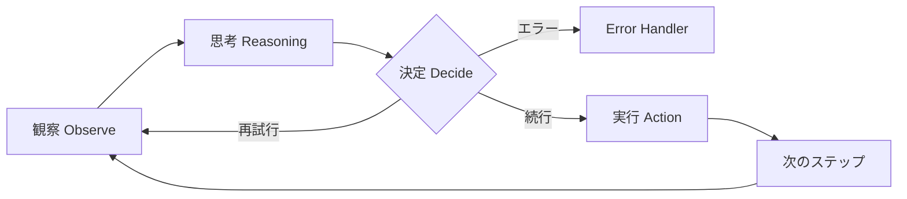
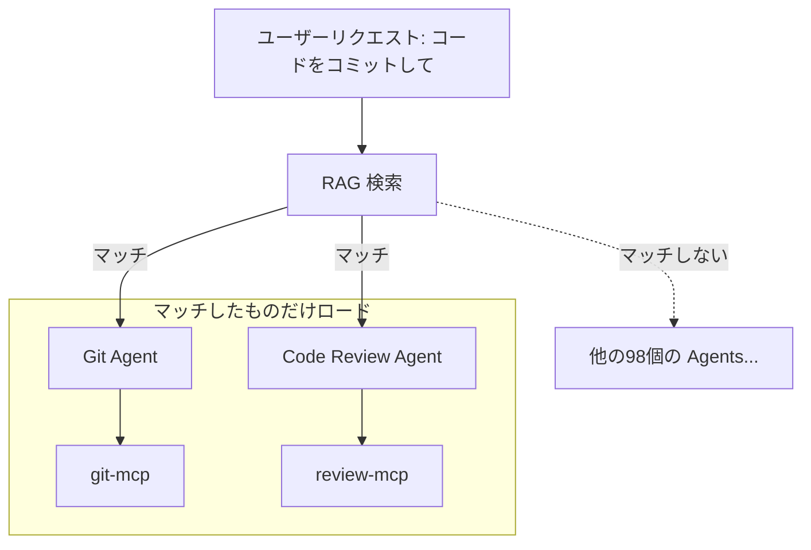
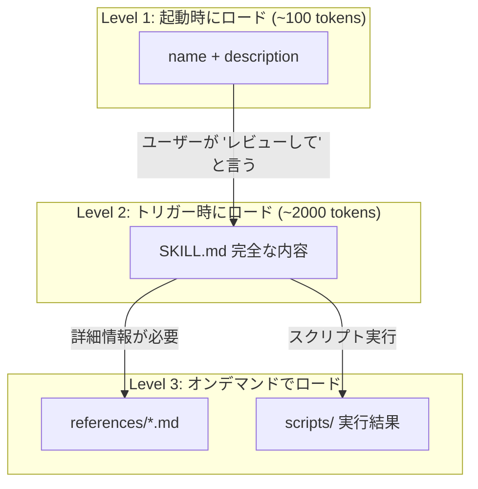

この記事は2026年1月19日に書かれました。

最近、AI開発者コミュニティで Skills、Plugins といった言葉が頻繁に見られるようになりました。最初は混乱していました—これらは全て「AIにツールを呼び出させる」ことではないのか？なぜこれほど多くの概念が必要なのか？

いくつかの Skill のコードを見た後、ようやくそれぞれが何の問題を解決しているのかを理解しました。

この記事は定義を語るのではなく、**エンジニアリングの課題**から出発し、なぜこれらが必要なのかを段階的に導き出したいと思います。もしあなたもこれらの新しい用語に混乱しているなら、この記事が考えを整理する助けになれば幸いです。

<!-- more -->


# 1. すべての根源：Context はコストが高い

誰もが Function Calling (Tool Use) が Agent の基礎であることを知っています。しかし、多くの人が気づいていないのは、**モデルに「どんなツールを持っているか」を知らせること自体が極めてコストが高い**ということです。

デモでは、`get_weather` は次のように見えます：

```python
# Demo 版の get_weather
def get_weather(city):
    """Get weather for city"""
    pass
```

しかし、エンタープライズ本番環境では、実際のツール定義は次のようになります：

```json
{
  "name": "get_production_weather",
  "description": "Retrieves weather data from verified enterprise providers with fallback logic.",
  "parameters": {
    "type": "object",
    "properties": {
      "location": { "type": "string", "description": "City name or coordinates" },
      "provider": { "type": "string", "enum": ["aws", "gcp", "azure", "openweather"] },
      "units": { "type": "string", "enum": ["metric", "imperial"] },
      "retry_policy": {
        "type": "object",
        "properties": { "max_attempts": { "type": "integer" }, "backoff": { "type": "string" } }
      },
      "auth_context": { "description": "JWT token for auth", "type": "string" }
    },
    // ... さらに20行 ...
    "required": ["location", "auth_context"]
  }
}
```

これはツール**定義**だけです。実際に呼び出すとき、コードは次のようになります：

```python
import anthropic

client = anthropic.Anthropic()

# 1. ツールを定義（この部分が context tokens を消費）
tools = [{
    "name": "get_weather",
    "description": "指定された都市の天気を取得",
    "input_schema": {
        "type": "object",
        "properties": {
            "city": {"type": "string", "description": "都市名"}
        },
        "required": ["city"]
    }
}]

# 2. リクエストを送信、モデルがツールを呼び出すかもしれない
response = client.messages.create(
    model="claude-sonnet-4-20250514",
    max_tokens=1024,
    tools=tools,  # 毎回のリクエストで完全な tools 定義を含める必要がある
    messages=[{"role": "user", "content": "北京の天気はどうですか？"}]
)

# 3. モデルがツールを呼び出したいかチェック
for block in response.content:
    if block.type == "tool_use":
        tool_name = block.name      # "get_weather"
        tool_input = block.input    # {"city": "北京"}

        # 4. ツールを実行、結果を取得
        weather_result = call_weather_api(tool_input["city"])

        # 5. 結果をモデルに返す（再び context を消費）
        messages.append({"role": "assistant", "content": response.content})
        messages.append({
            "role": "user",
            "content": [{
                "type": "tool_result",
                "tool_use_id": block.id,
                "content": weather_result
            }]
        })
```

問題が見えますか？モデルに「このツールがあります」と**伝える**だけで、呼び出す前から 300-500 個の context tokens を消費しています。そして、会話のたびに、この tools 定義を再送信する必要があります。

もし万能な Agent を作りたくて、50個のこのようなツールを装着したら、**ユーザーの System Prompt は最初から 15,000+ tokens のツール定義で埋め尽くされます**。

これが **Context Pollution（コンテキスト汚染）** です。これは2つの致命的な結果をもたらします：
1. **高コスト**：毎回の会話がお金を燃やしている。
2. **愚鈍化**："Lost in the Middle" 現象。ツール定義が多すぎて、モデルがどれを選ぶべきかわからなくなったり、幻覚を起こしたりする。

# 2. MCP：接続標準を解決したが、汚染は解決していない

Model Context Protocol (MCP) は素晴らしいです—ツールの**接続方法**を標準化しました。

* **以前**：GitHub API を system prompt に詰め込むために Python glue code を書く必要がありました。
* **MCP**：`github-mcp-server` に接続するための1行の設定だけで済みます。

しかし、MCP は上記の Context Pollution 問題を**解決していません**。むしろ、それを悪化させました。ツールの接続が簡単になりすぎたため、開発者は気づかないうちに Agent に 20 個の MCP Server を装着し、各 Server が 10 個のツールを持っている可能性があります。

ドーン！Context が爆発しました。

そこで、**分割統治**が必要です。

# 3. Multi-Agent Solutions：Context 汚染の解決

1つの Agent が 100 個のツールを収容できないなら、分割すればいいのでは？

これが **Multi-Agent（マルチエージェント）** アーキテクチャのエンジニアリング本質です：**専門化（Specialization）**。

* **God Mode Agent**：100 個のツールを持ち、50k の context、反応が遅く、エラーが起きやすい。
* **Team of Agents**：
  * `Git Agent`：5 個の git ツールのみ。
  * `Database Agent`：5 個の sql ツールのみ。
  * `Writer Agent`：2 個の file tools のみ。


Agent フレームワークの文脈では、これは **Sub-agents** と呼ばれます。違いは：
* **Multi-Agent**：通常、お互いにチャットできる対等な Agent ネットワーク（Peer）を指します。
* **Sub-agent**：階層化され、使い捨て（Ephemeral）です。メイン Agent が git タスクに遭遇したら、クリーンな Sub-agent を起こし、タスクを渡し、完了したら**消える**。

**核心価値**：Sub-agent は常に最もクリーンな Context を持っています。前の 100 ラウンドの会話を知る必要はなく、「今このファイルをコミットする必要がある」ことだけを知っていればいいのです。

# 4. Agentic Workflow：インテリジェント・オーケストレーション

これほど多くの Agents がいる場合、誰が指揮するのでしょうか？

これが **Orchestration（オーケストレーション）** の問題を引き起こします。答えは **Agentic Workflow**：LLM 自体をルーティングと意思決定に使用します。

**Agentic Workflow の本質**：Agent は固定スクリプトに従って実行するのではなく、各ステップで**観察、思考、決定、行動**します。



これは次のことを意味します：
- すべての「意思決定ノード」が**インテリジェント**
- Step 1 が失敗した？Agent は再試行、スキップ、または方法を変更するかを考える
- 予期しない結果が返された？Agent は動的に戦略を調整できる

これが **Agentic** と呼ばれる理由です — すべてのステップに Agent のインテリジェンスが関与し、硬直した `if-else` ではありません。

# 5. RAG：Agent と MCP が多すぎて収まらない時

以前の問題は「ツールが多すぎる」でしたが、Multi-Agent が分割で解決しました。しかし、システムが十分に複雑な場合は？

想像してください：**1000個の sub-agents** を持つ multi-agent システムを構築し、各 agent が**数十の MCP server** に接続できます。合わせると、数万のツール定義がある可能性があります。

メイン agent 起動時にすべての agent descriptions と MCP tool definitions を context に詰め込むことは不可能です—それは "God Mode Agent" に戻ってしまいます。

**解決策：agent と MCP の記述に RAG を行う**



**ワークフロー**：
1. ユーザーの質問が来る："main ブランチにコードをコミットして"
2. RAG が agent descriptions を検索 → Git Agent にマッチ
3. Git Agent とそれが必要とする MCP（git-mcp）のみロード
4. 他の 99 個の agent の定義は**完全に context に入らない**

このように、メイン agent はすべてのサブツールの詳細を「知る」必要はなく、必要な時に「見つける」ことができればいいのです。

**もう1つの典型的なシナリオ：Spec Coding**

大規模プロジェクトを計画する際、数百の spec ドキュメントを生成する可能性があり、各数百行：
- `spec/authentication.md` - 認証モジュール設計
- `spec/database-schema.md` - データベース設計
- `spec/api-endpoints.md` - API エンドポイント定義
- ... あと97個 ...

すべての spec を context に詰め込んだら、とっくに爆発しています。

**解決策も RAG**：agent が「ユーザーログイン」機能を実装する必要がある時、検索システムは自動的に `authentication.md` と `api-endpoints.md` をロードし、他の spec は context に入りません。

# 6. "Still Too Much" 問題 -> Skills & Plugins

さて、今私たちは持っています：
* **Multi-Agent**：隔離環境、分割統治ツール。
* **Agentic Workflow**：インテリジェント・オーケストレーション。
* **RAG**：オンデマンドで agent と MCP を検索。

完璧に見えますか？いいえ。まだ2つの問題が未解決です。


### 問題1：SOP の置き場所がない

私たちには**データ**（RAG）があり、**ツール**（MCP）があります。しかし、1つ欠けているものがあります：**プロセス知識（Know-How）**。

例えば「このプロジェクトで Code Review を実施する方法」。これはツールでも純粋なデータでもなく、**SOP（標準作業手順）**のセットです：
- 最初に何を見るか
- 次に何をチェックするか
- どんな一般的な落とし穴に注意するか

もしこれらの SOP をすべて System Prompt に詰め込んだら："あなたは Code Reviewer です、まず ... を見て、次に ... を見て、注意 ..."。おめでとうございます、あなたの System Prompt はまた爆発しました。

### 問題2：実行時に生成されるコードの品質が制御不能

AI のコーディング能力が強くなるにつれて、多くの開発者が **Code Sandbox** を選択するようになりました—agent に実行時にコードを生成させてタスクを完了させます。

これは柔軟に見えますが、致命的な問題があります：**生成されるコードの品質が制御不能**。
- 今日生成されたコードは動く
- 明日は別の書き方をするかもしれない
- 実行するたびに結果が異なるかもしれない

一部の**安定した、再現可能な**ロジック（セキュリティチェック、コードフォーマットなど）では、agent に毎回「車輪の再発明」をしてほしくありません。

**解決策**：検証済みのロジックを **scripts** としてカプセル化し、agent に再生成させるのではなく呼び出させます。

### なぜ Sub-agent で解決できないのか？

あなたは思うかもしれません：Sub-agent が Context を隔離できるなら、なぜ SOP とスクリプトも Sub-agent に入れないのか？

**2つの理由：**

**1. 固定コードを prompt に入れるには長すぎる**

Sub-agent の prompt も限られています。200行のセキュリティチェックスクリプトを Sub-agent の system prompt に詰め込んだら、それは別の場所で「汚染」を続けているだけではないですか？

Skill の解決策：**スクリプトはファイルシステムにあり、実行結果のみが context に入る**。

**2. Context 隔離は諸刃の剣**

Sub-agent とメイン agent の context は分離されています：
- ✅ **隔離したい時**：Git Agent は前の 100 ラウンドの会話を知る必要がない
- ❌ **隔離したくない時**：Code Review Skill は現在のファイル内容、以前の議論記録を見る必要がある

Skill は**現在の会話**にロードされ、すべての context を見ることができます。一方、Sub-agent は「使い捨て」のクリーンルームです。

**したがって：Sub-agent は「ツール隔離」を解決し、Skill は「知識の遅延読み込み」を解決します。**

これが **Skills** が登場する場所です。

# 7. Skills & Plugins：Know-How の遅延読み込み

Skill の本質は何でしょうか？

**Skill = SOP + Tools + Scripts**

これは単なる prompt ファイルではなく、完全な **mini-workflow** です：
- **SKILL.md**：プロセス説明（SOP）、Claude に「どうやるか」を教える
- **allowed-tools**：利用可能なツールを制限し、無秩序な呼び出しを避ける
- **scripts/**：実行可能スクリプト、実行時に output のみが context を消費

その殺し技は **Lazy Loading（遅延読み込み）** — **段階的開示**を通じて Context を管理します。

### 7.1 段階的開示の3層アーキテクチャ

これが Skill が Context を節約する核心的秘密です：



**3層の意味**：
- **Level 1**：system prompt に `name` と `description` のみ（常にロード）
- **Level 2**：ユーザーがトリガーした時のみ完全な `SKILL.md` をロード（SOP、チェックリストなどを含む）
- **Level 3**：参照される `references/*.md` は Agent が読む時のみロード；`scripts/` 実行時にコードは context に入らず、stdout のみが入る

**公式例：Skill Development Skill の3層アーキテクチャ**

公式の **Skill Development Skill** を例に、段階的開示の実際の効果を見てみましょう：

| レイヤー | 内容 | サイズ | いつロードされるか |
|------|------|------|---------|
| Level 1 | `name` + `description` | ~200 tokens | 起動時（常に context に） |
| Level 2 | SKILL.md 本体 | ~22,000 words | ユーザーが "skill を作成" と言った時 |
| Level 3 | `references/*.md` | 数千語/ファイル | Claude が積極的に読む時 |

段階的開示がなければ、これら **22,000+ words** は毎回の会話開始時に context に詰め込まれます。しかし実際には、ほとんどの会話は「skill を作成」機能を全く必要としません。

### 7.2 Skill のライフサイクル

この3層アーキテクチャが実際にどのように機能するかを見てみましょう：

1. **起動時（Level 1）**：
   Claude は次のことだけを知っています：`name: "code_review_skill", description: "Use this for reviewing PRs"`。
   *（消費：わずか ~100 tokens）*

2. **トリガー時**：
   あなたが Claude に言います："この PR をレビューして"。

3. **ロード時（Level 2）**：
   Claude は `code_review_skill` を呼び出すことを決定します。
   **この時点で**、その詳細な 2000 tokens の SOP ドキュメント（`SKILL.md`）が Context に注入されます。

4. **オンデマンドロード（Level 3）**：
   もし SKILL.md に "@security-checklist.md を参照" と書かれていたら、Claude が実際にこのファイルを読む時のみ、その内容がロードされます。

5. **スクリプト実行**：
   もし Skill が `scripts/analyze.py` を呼び出したら、Python コード自体は**context に入らず**、実行結果（stdout）のみが入ります。

### 7.3 スクリプト固定化：Zero-Context Execution

これは見落とされがちなテクニックです：

```bash
# scripts/security-check.sh
#!/bin/bash
# このスクリプトが実行される時、Claude はその200行のコードを「見る」必要がない
# 実行結果（stdout）のみが context に入る

grep -r "password" --include="*.py" . | wc -l
# 出力: "3"  <- この3文字だけが context に入る
```

もし**固定の分析ロジック**があれば、スクリプトとして書く方が Claude に毎回再生成させるよりはるかに効率的です：
- **Context 節約**：スクリプトコードは context に入らない
- **Token 節約**：Claude が重複コードを生成する必要がない
- **より信頼性が高い**：スクリプトはテスト済みで、LLM のランダム性がない

**公式例：Hook Development Skill の `hook-linter.sh`**

公式の Hook Development Skill には、hook 設定の正しさを検証するための 4,200 bytes の `hook-linter.sh` スクリプトが含まれています。このスクリプトがなければ、Claude は毎回検証ロジックを再生成する必要があります—トークンを消費するだけでなく、エラーも起こしやすいです。

```bash
#!/bin/bash
# hook-linter.sh - hook 設定を検証
# Claude がこのスクリプトを実行する時、4,200 bytes のコードは context に入らない
# 最終的な検証結果のみが context に入る

set -euo pipefail
# ... 複雑な JSON schema 検証ロジック ...
echo "✅ Hook configuration is valid"  # <- この行だけが context に入る
```

これが「スクリプト固定化」の価値です：**確定的なロジックをスクリプトとしてカプセル化し、Claude をインテリジェントな判断が必要な部分に集中させる**。

### 7.4 Plugins：複数の Skills をパッケージング

**Plugins** は、これらの Skills、Prompts、MCP 設定の**パッケージング形式**であり、配布を容易にするだけです。

1つの Plugin には次のものが含まれます：
- 複数の Skills（各 Skill は1つのディレクトリ）
- Slash Commands（ショートカットコマンド）
- MCP Server 設定
- 共有 prompts

### 7.5 Skill と現在の Context の関係

これは多くの人が理解していない重要な問題です：**Skill がロードされた後、会話履歴とどのような関係にあるのか？**

**答え：同じ Context Window を共有します。**

```
┌─────────────────────────────────────────────────┐
│                 Context Window                   │
├─────────────────────────────────────────────────┤
│  System Prompt (CLAUDE.md, Skills metadata...)  │
│  ─────────────────────────────────────────────  │
│  会話履歴 (User: ... Assistant: ...)            │
│  ─────────────────────────────────────────────  │
│  現在アクティブな Skill 内容 (SKILL.md 全文)   │
│  ─────────────────────────────────────────────  │
│  Tool results, ファイル内容, etc.              │
└─────────────────────────────────────────────────┘
```

これは次のことを意味します：
- もし会話が長ければ、Skill の内容が「押し出される」可能性がある（要約または切り捨て）
- もし複数の Skills を同時にアクティブにすると、Context スペースを競合する
- Skill は**独立して**実行されるのではなく、以前の会話を見ることができる

### 7.6 Skill の制限：1つの SKILL.md の制約

これは Skill 設計における重要なトレードオフです：

**利点：**
- skill を focused（単一責任）に保つことを強制
- 真の lazy loading を実現
- 各 skill は単一責任で、メンテナンスしやすい

**欠点：**
- 1つの skill は1つのメインプロンプト（SKILL.md）しか持てない
- もしワークフローに複数のステージがあり、各ステージが異なる詳細な指示を必要とする場合...
  - すべてを1つの SKILL.md に詰め込む（非常に長くなる）
  - または複数の skills に分割する（原子性を失う）

**実際の影響：**

例えば、「完全な PR Review」プロセスを実行したい場合：
1. まずコードスタイルをチェック
2. 次にセキュリティ問題をチェック
3. 最後にパフォーマンスをチェック

各ステージに 500 行の詳細なチェックリストがあれば、1つの SKILL.md に詰め込むと 1500 行になります。
しかし、3つの skills に分割すると、手動でそれらをチェーンする必要があり、「ワンクリック実行」の便利さを失います。

**解決策：**
- supporting files（reference.md など）を使用してコンテンツを分割
- scripts を使用して再利用可能なロジックを固定化
- または Plugin を使用して関連する複数の skills をパッケージ化し、設定を通じてワークフローチェーンを実装

# 8. 1つの図でまとめ：Context 管理の芸術

すべての概念を1つの表にまとめると、それらはすべて **Context Window** と戦っていることがわかります。

| 概念 | 解決する核心的課題 | Context 戦略 |
| :--- | :--- | :--- |
| **Multi-Agent** | ツールが多すぎる、Context 汚染 | **分割統治** (Isolation) |
| **Agentic Workflow** | プロセスが硬直しすぎ | **インテリジェント・オーケストレーション** (Dynamic Routing) |
| **RAG** | Agent/MCP/Spec が多すぎて収まらない | **検索** (Retrieval) |
| **Skills** | SOP が長すぎる + 実行時コード品質が制御不能 | **遅延読み込み** (Lazy Loading) |

# 9. 実践：これらを構築する方法 (How to Build)

多くの理論を語りましたが、どのように書くのでしょうか？

### 9.1 Skill のディレクトリ構造

シンプルな Skill は1つのファイルだけで済みます：

```text
.claude/skills/my-skill/
└── SKILL.md              # 必須：メインファイル
```

しかし、公式の **Hook Development Skill** は完全なディレクトリ構造を示しています：

```text
hook-development/
├── SKILL.md              # メインファイル（~700行、核心指示を含む）
├── references/           # 詳細参照ドキュメント（段階的開示の鍵！）
│   ├── patterns.md       # 一般的な hook パターン
│   └── migration.md      # 移行ガイド
├── examples/             # そのまま使用できる例
│   └── load-context.sh   # SessionStart hook の例
└── scripts/              # ツールスクリプト
    ├── hook-linter.sh    # Hook 設定検証器
    ├── test-hook.sh      # Hook テストフレームワーク
    └── validate-hook-schema.sh  # Schema 検証
```

**重要なポイント**：

- **`references/`**：詳細なドキュメントを保存し、Claude が積極的に読む時のみロード（段階的開示を実現）
- **`examples/`**：中のコードは**実行可能**で、疑似コードではない
- **`scripts/`**：Claude が直接実行でき、スクリプトコードは context に入らず、出力のみが入る

**注意**：Skill は `SKILL.md` ファイルを使用します（skill.json ではない）、これは Claude Code の慣例です。

### 9.2 SKILL.md の構造

SKILL.md は2つの部分から構成されます：**YAML Frontmatter** + **Markdown 内容**

以下は公式 **Hook Development Skill** の実際の frontmatter（抜粋）です：

```yaml
---
name: Hook Development
description: This skill should be used when the user asks to "create a hook",
  "add a PreToolUse/PostToolUse/Stop hook", "validate tool use",
  "implement prompt-based hooks", or mentions hook events (PreToolUse,
  PostToolUse, Stop, SubagentStop, SessionStart, SessionEnd).
version: 0.1.0
---
```

**ここで重要な詳細に注意してください：**

1. **`description` は三人称を使用**："This skill should be used when..." であって "Use this skill when..." ではない
2. **具体的なトリガーフレーズを含む**：ユーザーが言う可能性のあることを直接書き込む（"create a hook"、"add a PreToolUse hook"）
3. **具体的なシナリオをリスト**：曖昧な "hook 開発用" ではなく、どの event タイプかを詳細にリスト

**なぜこのように書くのか？**

`description` フィールドは Claude の system prompt に注入されるからです。Claude はこのテキストに依存して「ユーザーの現在のリクエストがこの Skill をロードする必要があるか」を決定します。曖昧に書きすぎると、Claude はいつ使うべきかわかりません。

以下は Markdown 本体部分の典型的な構造です：

```markdown
# Hook Development for Claude Code Plugins

## Overview
Hooks are event-driven automation scripts that execute in response
to Claude Code events. Use hooks to validate operations, enforce
policies, add context, and integrate external tools into workflows.

## Hook Types
### Prompt-Based Hooks (Recommended)
...

### Command Hooks
...
```

### 9.3 Frontmatter フィールド説明

```yaml
---
# 必須
name: my-skill                    # 小文字、ハイフン使用、最大64文字
description: What this skill does # 最大1024文字、これが Claude が skill を発見する根拠！

# オプション
allowed-tools: Read, Bash(git:*) # 利用可能なツールを制限
model: claude-sonnet-4-20250514  # デフォルトモデルを上書き
user-invocable: true              # / メニューに表示するか
---
```

### 9.3.1 description の書き方は極めて重要

これは多くの人が Skill を書く時に最も陥りやすい落とし穴です：**description が曖昧すぎる**。

比較してみましょう：

❌ **間違った書き方**（曖昧すぎて、Claude がいつ使うべきかわからない）：

```yaml
description: コードレビューを支援
```

✅ **正しい書き方**（公式スタイル、トリガーフレーズを含む）：

```yaml
description: This skill should be used when the user asks to "review this PR",
  "check code quality", "find security issues in code", or needs guidance on
  code review best practices for this project.
```

**なぜこのように書くのか？**

1. **Claude は description に依存して Skill をロードするかを決定** - 曖昧すぎると、Claude は必要な時にロードしなかったり、不要な時に誤ってロードしたりする可能性がある
2. **ユーザーが実際に言う言葉を含める** - "review this PR"、"check code quality" はすべてユーザーが実際に入力するフレーズ
3. **三人称を使用** - このテキストは system prompt に注入されるため、三人称の方が自然

### 9.4 Plugin の構造（複数の Skills をパッケージング）

もし複数の関連する Skills があれば、Plugin としてパッケージングできます：

```text
my-plugin/
├── claude_plugin.json     # Plugin manifest
├── skills/
│   ├── code-review/
│   │   ├── SKILL.md
│   │   └── scripts/
│   ├── test-runner/
│   │   └── SKILL.md
│   └── deploy/
│       └── SKILL.md
├── commands/              # Slash commands
│   └── review.md
└── mcp/                   # MCP server configs
    └── servers.json
```

**claude_plugin.json**:
```json
{
  "name": "my-dev-toolkit",
  "version": "1.0.0",
  "description": "Development workflow automation",
  "skills": ["skills/*"],
  "commands": ["commands/*"]
}
```

### 9.5 保存場所と優先順位

| 場所 | パス | 適用範囲 | 優先順位 |
|------|------|---------|--------|
| プロジェクトレベル | `.claude/skills/` | 現在のリポジトリ | 最高 |
| 個人レベル | `~/.claude/skills/` | すべてのプロジェクト | 中 |
| Plugin | `plugins/xxx/skills/` | Plugin ユーザー | 最低 |

同名の Skill、高優先度が低優先度を上書きします。

### 9.6 Skills の実際の使用シナリオ

コミュニティの統計によると、現在 **739+ Skills** がデプロイされ、20+ のカテゴリをカバーしています。以下はいくつかの典型的なシナリオです：

**ドキュメント自動化**
- Word/PDF/PowerPoint ドキュメント生成（ブランドテンプレート付き）
- PDF からテキストを抽出、結合/分割、フォーム処理

**開発ワークフロー**
- MCP Server ジェネレーター：規準に準拠した MCP サービスを自動作成
- ブラウザ自動化テスト（Playwright）：エンドツーエンドテストスクリプト生成
- フロントエンドデザイン Skill：一般的な「AI 味」のデザインを回避

**セキュリティ分析**
- Web Fuzzing（FFUF）：ペネトレーションテストと脆弱性スキャン
- 静的コード監査：セキュリティ脆弱性検出

**企業シナリオ**
- ブランドガイドライン適用：AI 出力を会社のスタイルに合わせる
- 内部レポート生成：週報、Newsletter テンプレート化

**私の実践経験**：
- **繰り返しのレビュープロセス**：Code Review、PR Review
- **プロジェクト固有のワークフロー**：このプロジェクトのデプロイプロセス、テスト仕様
- **固定スクリプトを実行する必要があるタスク**：セキュリティスキャン、パフォーマンス分析

**Skill は「思考回路」を実行時に動的にプラグインできるモジュールとしてカプセル化したものです。**

# 結語：すべては Context 管理

全文を振り返ると、これらすべての概念が同じ問題を解決していることがわかります：**Context Window は有限である**。

| 問題 | 解決策 | Context 戦略 |
|------|---------|-------------|
| ツール定義が多すぎる | Multi-Agent | 分割統治隔離 |
| プロセスが硬直しすぎ | Agentic Workflow | インテリジェント・オーケストレーション |
| Agent/MCP/Spec が多すぎる | RAG | オンデマンド検索 |
| SOP が長すぎる | Skills | 遅延読み込み |
| 実行時コードが不安定 | Scripts (in Skills) | Zero-Context 実行 |

それらは相互排他的な選択肢ではなく、組み合わせて使用できる戦略です：
- メイン Agent は **RAG** を使用して適切な Sub-agent を見つける
- Sub-agent は **Skill** をロードして SOP を取得
- Skill は **Script** を呼び出して固定ロジックを実行

これを理解すれば、新しい用語に怖がることはありません—それらはすべて Context Window という「ネジ」に対する異なるサイズのレンチです。
