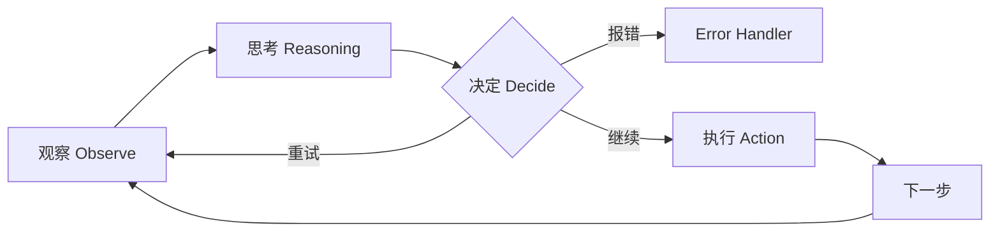
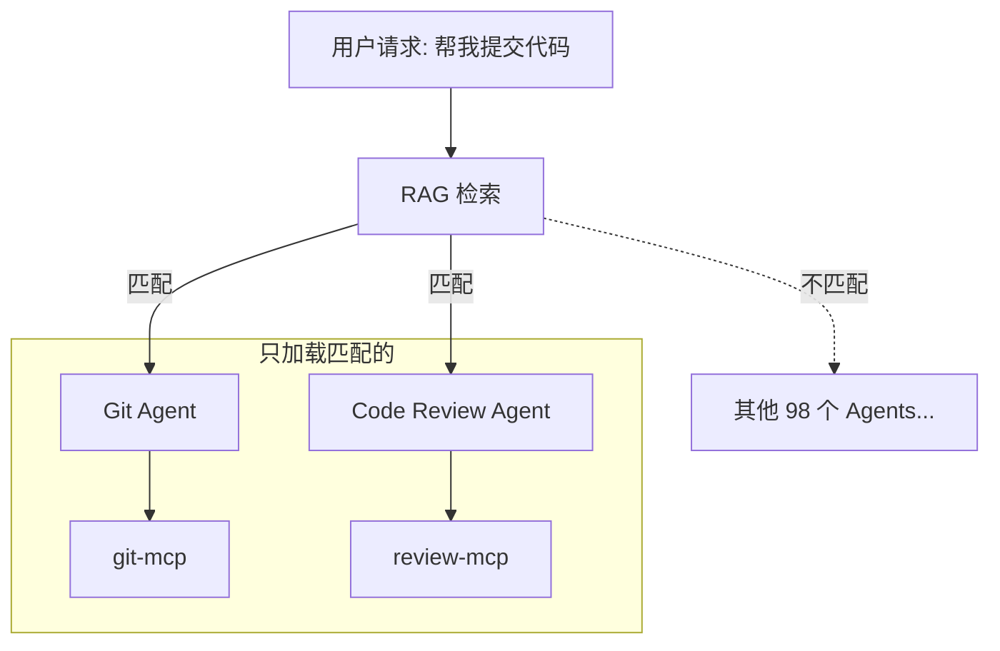
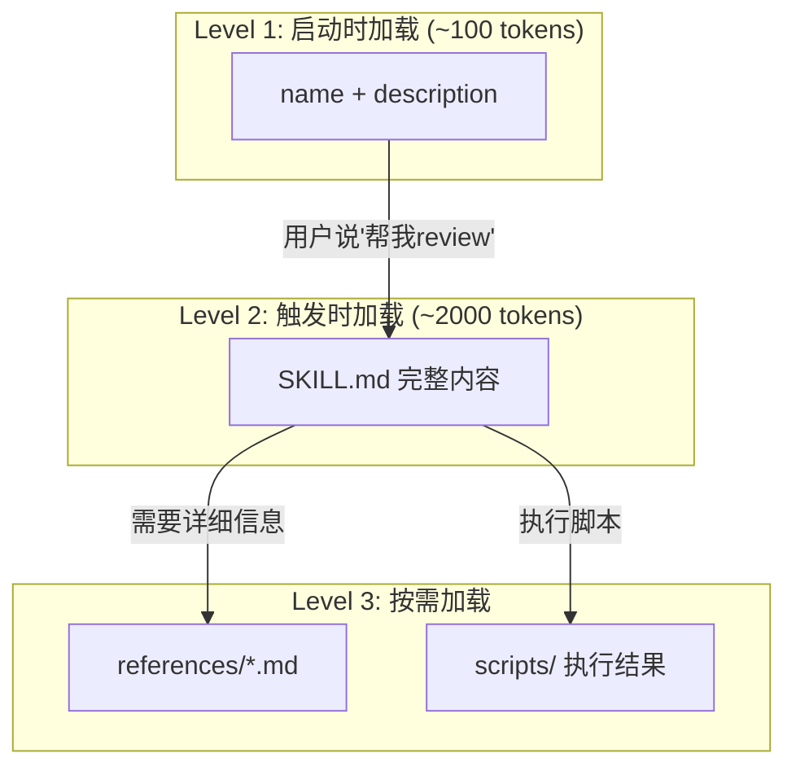

本文写于2026年1月19日。

最近在各种AI开发者社区里，Skills、Plugins这些词被刷屏了。我一开始也是一头雾水——这些东西不都是"让AI调用工具"吗？为什么要搞这么多概念？

在看了好几个Skill的代码之后，我才理解它们各自在解决什么问题。

这篇文章不讲定义，我想从**工程痛点**出发，一步步推导出为什么我们需要这些东西。如果你也被这些新词搞得晕头转向，希望这篇文章能帮你理清思路。

<!-- more -->


## 1. 一切的源头：Context 是昂贵的

所有人都知道 Function Calling (Tool Use) 是 Agent 的基础。但很多人没意识到的是，**让模型"知道"它有什么工具，本身就是极昂贵的**。

在 Demo 里，你看到的 `get_weather` 是这样的：

```python
# Demo 版 get_weather
def get_weather(city):
    """Get weather for city"""
    pass
```

但在企业级生产环境里，一个真实的工具定义是这样的：

```json
{
  "name": "get_production_weather",
  "description": "Retrieves weather data from verified enterprise providers with fallback logic.",
  "parameters": {
    "type": "object",
    "properties": {
      "location": { "type": "string", "description": "City name or coordinates" },
      "provider": { "type": "string", "enum": ["aws", "gcp", "azure", "openweather"] },
      "units": { "type": "string", "enum": ["metric", "imperial"] },
      "retry_policy": { 
        "type": "object", 
        "properties": { "max_attempts": { "type": "integer" }, "backoff": { "type": "string" } }
      },
      "auth_context": { "description": "JWT token for auth", "type": "string" }
    },
    // ... 还有20行 ...
    "required": ["location", "auth_context"]
  }
}
```

这还只是工具**定义**。实际调用时，你的代码大概长这样：

```python
import anthropic

client = anthropic.Anthropic()

# 1. 定义工具（这部分会消耗context tokens）
tools = [{
    "name": "get_weather",
    "description": "获取指定城市的天气",
    "input_schema": {
        "type": "object",
        "properties": {
            "city": {"type": "string", "description": "城市名"}
        },
        "required": ["city"]
    }
}]

# 2. 发送请求，模型可能决定调用工具
response = client.messages.create(
    model="claude-sonnet-4-20250514",
    max_tokens=1024,
    tools=tools,  # 每次请求都要带上完整的tools定义
    messages=[{"role": "user", "content": "北京天气怎么样？"}]
)

# 3. 检查模型是否想调用工具
for block in response.content:
    if block.type == "tool_use":
        tool_name = block.name      # "get_weather"
        tool_input = block.input    # {"city": "北京"}

        # 4. 执行工具，获取结果
        weather_result = call_weather_api(tool_input["city"])

        # 5. 把结果返回给模型（又消耗context）
        messages.append({"role": "assistant", "content": response.content})
        messages.append({
            "role": "user",
            "content": [{
                "type": "tool_result",
                "tool_use_id": block.id,
                "content": weather_result
            }]
        })
```

发现问题了吗？光是**告诉**模型"我有这个工具"，还没开始调用，就已经消耗了 300-500 个 context tokens。而且每一轮对话，这个tools定义都要重复发送。

如果你想做一个全能 Agent，给他挂载了 50 个这样的工具。意味着**用户的 System Prompt 一上来就塞进了 15,000+ tokens 的工具定义**。

这就是**Context Pollution（上下文污染）**。这导致了两个致命后果：
1.  **贵**：每次对话都在烧钱。
2.  **蠢**："Lost in the Middle" 现象。工具定义太多，模型反而不知道该选哪个，或者产生幻觉。

## 2. MCP：解决了连接标准，没解决污染

Model Context Protocol (MCP) 很棒，它标准化了工具的**连接方式**。

*   **以前**：你要自己写 Python glue code 把 GitHub API 塞进 system prompt。
*   **MCP**：你也只要一行配置连接 `github-mcp-server`。

但是，MCP **并没有**解决上面的 Context Pollution 问题。相反，它让这个问题更严重了。因为连接工具变得太容易，开发者很容易不知不觉就给 Agent 挂了 20 个 MCP Servers，每个 Server 带 10 个工具。

砰！你的 Context 爆炸了。

所以，我们需要**分治**。

## 3. Multi-Agent Solutions：解决上下文污染

既然一个 Agent 装不下 100 个工具，那把它们拆开不就行了？

这就是 **Multi-Agent (多智能体)** 架构的工程本质：**Specialization (专业化)**。

*   **God Mode Agent**：拥有 100 个工具，上下文 50k，反应慢，容易出错。
*   **Team of Agents**：
    *   `Git Agent`：只有 5 个 git 工具。
    *   `Database Agent`：只有 5 个 sql 工具。
    *   `Writer Agent`：只有 2 个 file tools。


在 Agent 框架的语境下，这被称为 **Sub-agents**。区别在于：
*   **Multi-Agent**：通常指平级的、甚至可以互相聊天的 Agent 网络（Peer）。
*   **Sub-agent**：是层级化的、用完即走的（Ephemeral）。主 Agent 碰到 git 任务，叫醒一个干净的 Sub-agent，把任务给它，它做完就**消失**。

**核心价值**：Sub-agent 永远拥有最干净的 Context。它不需要知道之前的 100 轮对话，它只需要知道"现在要把这个文件 commit 掉"。

## 4. Agentic Workflow：智能编排

有了这么多 Agents，谁来指挥它们？

这就引出了 **Orchestration (编排)** 的问题。答案是 **Agentic Workflow**：用 LLM 本身来做路由和决策。

**Agentic Workflow 的本质**：Agent 不是按固定脚本执行，而是在每一步都**观察、思考、决定、行动**。



这意味着：
- 所有的"决策节点"都是**智能的**
- Step 1 报错了？Agent 会思考是重试、跳过还是换个方法
- 返回了意料之外的结果？Agent 可以动态调整策略

这就是为什么叫 **Agentic** —— 每一步都有 Agent 的智能参与，而不是死板的 `if-else`。

## 5. RAG：当 Agent 和 MCP 多到装不下

前面的问题是"工具太多"，Multi-Agent 通过拆分解决了。但如果你的系统足够复杂呢？

想象一下：你搭建了一个 multi-agent 系统，有 **1000个 sub-agents**，每个 agent 可以连接**数十个 MCP server**。加起来可能有上万个工具定义。

不可能在主 agent 启动时把所有 agent descriptions 和 MCP tool definitions 都塞进 context——那不是又回到 "God Mode Agent" 了吗？

**解法：对 agent 和 MCP 的描述做 RAG**



**工作流程**：
1. 用户问题进来："帮我提交代码到 main 分支"
2. RAG 检索 agent descriptions → 匹配到 Git Agent
3. 只加载 Git Agent 和它需要的 MCP（git-mcp）
4. 其他 99 个 agent 的定义**完全不进入 context**

这样，主 agent 不需要"知道"所有子工具的细节，只需要在需要时能"找到"它们。

**另一个典型场景：Spec Coding**

在做大型项目规划时，你可能会生成上百个 spec 文档，每个几百行：
- `spec/authentication.md` - 认证模块设计
- `spec/database-schema.md` - 数据库设计
- `spec/api-endpoints.md` - API 接口定义
- ... 还有 97 个 ...

如果把所有 spec 都塞进 context，早就爆了。

**解法同样是 RAG**：当 agent 要实现 "用户登录" 功能时，检索系统自动加载 `authentication.md` 和 `api-endpoints.md`，其他 spec 根本不进 context。

## 6. The "Still Too Much" Problem -> Skills & Plugins

好了，现在我们有：
*   **Multi-Agent**：隔离环境，分治工具。
*   **Agentic Workflow**：智能编排。
*   **RAG**：按需检索 agent 和 MCP。

看似完美了？不。还有两个问题没解决。


### 问题一：SOP 无处安放

我们有了**数据**（RAG），有了**工具**（MCP），但还缺一样东西：**流程知识 (Know-How)**。

比如"如何在这个项目中进行 Code Review"。这既不是一个工具，也不是纯数据，它是一套 **SOP (标准作业程序)**：
- 先看什么
- 再检查什么
- 有哪些常见的坑要注意

如果你把这些 SOP 全部塞进 System Prompt："你是一个 Code Reviewer，你要先看 ... 再看 ... 注意 ..."。恭喜你，你的 System Prompt 又炸了。

### 问题二：运行时生成代码的质量不可控

现在 AI 写代码的能力越来越强，很多开发者选择用 **Code Sandbox**——让 agent 在运行时自己生成代码来完成任务。

这看起来很灵活，但有一个致命问题：**生成的代码质量不可控**。
- 今天生成的代码能跑
- 明天可能就换了一种写法
- 每次执行的结果可能都不一样

对于一些**需要稳定、可复现**的逻辑（比如安全检查、代码格式化），你不希望 agent 每次都"重新发明轮子"。

**解法**：把经过验证的逻辑封装成 **scripts**，让 agent 调用而不是重新生成。

### 为什么不能用 Sub-agent 解决？

你可能会想：既然 Sub-agent 可以隔离 Context，为什么不把 SOP 和脚本也放到 Sub-agent 里？

**两个原因：**

**1. 固定代码放 prompt 里太长**

Sub-agent 的 prompt 也是有限的。如果你把 200 行的安全检查脚本塞进 Sub-agent 的 system prompt，那不是换了个地方继续"污染"吗？

Skill 的解法是：**脚本在文件系统里，只有执行结果进入 context**。

**2. Context 隔离是双刃剑**

Sub-agent 和主 agent 的 context 是分离的：
- ✅ **想隔离时**：Git Agent 不需要知道之前 100 轮对话讲了什么
- ❌ **不想隔离时**：Code Review Skill 需要看到当前文件的内容、之前的讨论记录

Skill 是加载到**当前对话**里的，它能看到所有 context。而 Sub-agent 是"用完即走"的干净房间。

**所以：Sub-agent 解决的是"工具隔离"，Skill 解决的是"知识懒加载"。**

这就是 **Skills** 登场的地方。

## 7. Skills & Plugins：Lazy Loading "Know-How"

Skill 的本质是什么？

**Skill = SOP + Tools + Scripts**

它不只是一个prompt文件，而是一个完整的**mini-workflow**：
- **SKILL.md**：流程说明（SOP），告诉Claude"怎么做"
- **allowed-tools**：限制可用工具，避免乱调用
- **scripts/**：可执行脚本，执行时只有output消耗context

它的杀手级特性是 **Lazy Loading (懒加载)** —— 通过**渐进式披露**来管理Context。

### 7.1 渐进式披露三层架构

这是Skill省Context的核心秘密：



**三层含义**：
- **Level 1**：只有 `name` 和 `description` 在 system prompt 里（始终加载）
- **Level 2**：用户触发时才加载完整的 `SKILL.md`（包含 SOP、检查清单等）
- **Level 3**：引用的 `references/*.md` 只在 Agent 读取时加载；`scripts/` 执行时代码不进 context，只有 stdout 进去

**官方示例：Skill Development Skill 的三层架构**

以官方的 **Skill Development Skill** 为例，看看渐进式披露的真实效果：

| 层级 | 内容 | 大小 | 何时加载 |
|------|------|------|---------|
| Level 1 | `name` + `description` | ~200 tokens | 启动时（始终在 context） |
| Level 2 | SKILL.md 主体 | ~22,000 words | 用户说"创建一个skill"时 |
| Level 3 | `references/*.md` | 数千字/文件 | Claude 主动读取时 |

如果没有渐进式披露，这 **22,000+ words** 会在每次对话开始时就塞进 context。但实际上，绝大多数对话根本不需要"创建 skill"这个功能。

### 7.2 一个Skill的生命周期

让我们看看这三层架构如何在实际中工作：

1.  **启动时 (Level 1)**：
    Claude 只知道：`name: "code_review_skill", description: "Use this for reviewing PRs"`。
    *(消耗：仅 ~100 tokens)*

2.  **触发时**：
    你对 Claude 说："帮我 Review 这个 PR"。

3.  **加载时 (Level 2)**：
    Claude 决定调用 `code_review_skill`。
    **此时**，那个长达 2000 tokens 的详细 SOP 文档 (`SKILL.md`) 才会被注入到 Context 中。

4.  **按需加载 (Level 3)**：
    如果SKILL.md里写了"参考@security-checklist.md"，只有Claude真正去读这个文件时，它的内容才会加载。

5.  **脚本执行**：
    如果Skill调用了 `scripts/analyze.py`，Python代码本身**不进入context**，只有执行结果（stdout）进去。

### 7.3 脚本固定化：Zero-Context Execution

这是一个很容易被忽视的技巧：

```bash
# scripts/security-check.sh
#!/bin/bash
# 这个脚本被执行时，Claude不需要"看"它的200行代码
# 只有执行结果（stdout）会进入context

grep -r "password" --include="*.py" . | wc -l
# 输出: "3"  <- 只有这3个字符进入context
```

如果你有一些**固定的分析逻辑**，把它写成脚本比让Claude每次重新生成要高效得多：
- **省Context**：脚本代码不进context
- **省Token**：不需要Claude生成重复的代码
- **更可靠**：脚本经过测试，不会有LLM的随机性

**官方示例：Hook Development Skill 里的 `hook-linter.sh`**

官方的 Hook Development Skill 包含一个 4,200 bytes 的 `hook-linter.sh` 脚本，用于验证 hook 配置是否正确。如果没有这个脚本，Claude 每次都需要重新生成验证逻辑——不仅消耗 tokens，还可能出错。

```bash
#!/bin/bash
# hook-linter.sh - 验证 hook 配置
# Claude 执行这个脚本时，4,200 bytes 的代码都不进入 context
# 只有最终的验证结果进入 context

set -euo pipefail
# ... 复杂的 JSON schema 验证逻辑 ...
echo "✅ Hook configuration is valid"  # <- 只有这行进入 context
```

这就是"脚本固定化"的价值：**把确定性的逻辑封装成脚本，让 Claude 专注于需要智能判断的部分**。

### 7.4 Plugins：打包多个Skills

**Plugins** 只是这些 Skills、Prompts、MCP 配置的**打包格式**，方便分发而已。

一个Plugin可以包含：
- 多个Skills（每个Skill一个目录）
- Slash Commands（快捷命令）
- MCP Server配置
- 共享的prompts

### 7.5 Skill与当前Context的关系

这是一个很多人没搞清楚的关键问题：**Skill加载后，它和对话历史是什么关系？**

**答案：共享同一个Context Window。**

```
┌─────────────────────────────────────────────────┐
│                 Context Window                   │
├─────────────────────────────────────────────────┤
│  System Prompt (CLAUDE.md, Skills metadata...)  │
│  ─────────────────────────────────────────────  │
│  对话历史 (User: ... Assistant: ...)            │
│  ─────────────────────────────────────────────  │
│  当前激活的Skill内容 (SKILL.md全文)             │
│  ─────────────────────────────────────────────  │
│  Tool results, 文件内容, etc.                   │
└─────────────────────────────────────────────────┘
```

这意味着：
- 如果你对话很长，Skill的内容可能被"挤出去"（被summarize或truncate）
- 如果你同时激活多个Skills，它们会竞争Context空间
- Skill**不是**独立运行的，它能看到你之前的对话

### 7.6 Skill的局限性：一个SKILL.md的限制

这是Skill设计中一个重要的trade-off：

**优点：**
- 强制你保持skill focused（单一职责）
- 实现真正的lazy loading
- 每个skill职责单一，易于维护

**缺点：**
- 一个skill只能有一个主prompt（SKILL.md）
- 如果你的workflow有多个阶段，每个阶段需要不同的详细指令...
  - 要么全塞进一个SKILL.md（变得很长）
  - 要么拆成多个skills（失去了原子性）

**实际影响：**

比如你想做一个"完整的PR Review"流程：
1. 先检查代码风格
2. 再检查安全问题
3. 最后检查性能

如果每个阶段都有500行的详细checklist，塞进一个SKILL.md就变成1500行。
但如果拆成3个skills，你需要手动串联它们，失去了"一键执行"的便利。

**解决方案：**
- 使用supporting files（reference.md等）来拆分内容
- 使用scripts来固定化可复用的逻辑
- 或者用Plugin来打包多个相关skills，通过配置实现workflow串联

## 8. 一张图总结：Context 管理的艺术

让我们把所有概念放在一张表里，你会发现它们全都是在与 **Context Window** 做斗争。

| 概念 | 解决的核心痛点 | Context 策略 |
| :--- | :--- | :--- |
| **Multi-Agent** | 工具太多，Context 污染 | **分治** (Isolation) |
| **Agentic Workflow** | 流程太死板 | **智能编排** (Dynamic Routing) |
| **RAG** | Agent/MCP/Spec 太多，装不下 | **检索** (Retrieval) |
| **Skills** | SOP 太长 + 运行时代码质量不可控 | **懒加载** (Lazy Loading) |

## 9. 实战：如何构建这一套 (How to Build)

说了这么多理论，怎么写？

### 9.1 Skill的目录结构

一个简单的Skill可以只有一个文件：

```text
.claude/skills/my-skill/
└── SKILL.md              # 必须：主文件
```

但官方的 **Hook Development Skill** 展示了一个完整的目录结构：

```text
hook-development/
├── SKILL.md              # 主文件（~700行，包含核心指令）
├── references/           # 详细参考文档（渐进式披露的关键！）
│   ├── patterns.md       # 常见 hook 模式
│   └── migration.md      # 迁移指南
├── examples/             # 可直接复制使用的示例
│   └── load-context.sh   # SessionStart hook 示例
└── scripts/              # 工具脚本
    ├── hook-linter.sh    # Hook 配置校验器
    ├── test-hook.sh      # Hook 测试框架
    └── validate-hook-schema.sh  # Schema 验证
```

**关键点**：

- **`references/`**：存放详细文档，只有 Claude 主动读取时才加载（实现渐进式披露）
- **`examples/`**：里面的代码是**可运行的**，不是伪代码
- **`scripts/`**：可以被 Claude 直接执行，脚本代码不进 context，只有输出进去

**注意**：Skill使用的是`SKILL.md`文件（不是skill.json），这是Claude Code的约定。

### 9.2 SKILL.md的结构

SKILL.md由两部分组成：**YAML Frontmatter** + **Markdown内容**

下面是官方 **Hook Development Skill** 的真实 frontmatter（截取）：

```yaml
---
name: Hook Development
description: This skill should be used when the user asks to "create a hook",
  "add a PreToolUse/PostToolUse/Stop hook", "validate tool use",
  "implement prompt-based hooks", or mentions hook events (PreToolUse,
  PostToolUse, Stop, SubagentStop, SessionStart, SessionEnd).
version: 0.1.0
---
```

**注意这里的关键细节：**

1. **`description` 用第三人称**："This skill should be used when..." 而不是 "Use this skill when..."
2. **包含具体的触发短语**：把用户可能说的话直接写进去（"create a hook"、"add a PreToolUse hook"）
3. **列出具体场景**：不是笼统的"用于 hook 开发"，而是详细列出哪些 event 类型

**为什么这样写？**

因为 `description` 字段会被注入到 Claude 的 system prompt 里。Claude 靠这段文字决定"用户当前的请求是否需要加载这个 Skill"。如果你写得太模糊，Claude 就不知道什么时候该用它。

下面是 Markdown 主体部分的典型结构：

```markdown
# Hook Development for Claude Code Plugins

## Overview
Hooks are event-driven automation scripts that execute in response
to Claude Code events. Use hooks to validate operations, enforce
policies, add context, and integrate external tools into workflows.

## Hook Types
### Prompt-Based Hooks (Recommended)
...

### Command Hooks
...
```

### 9.3 Frontmatter字段说明

```yaml
---
# 必填
name: my-skill                    # 小写，用连字符，最多64字符
description: What this skill does # 最多1024字符，这是Claude发现skill的依据！

# 可选
allowed-tools: Read, Bash(git:*) # 限制可用工具
model: claude-sonnet-4-20250514  # 覆盖默认模型
user-invocable: true              # 是否在/菜单中显示
---
```

### 9.3.1 description 的写法至关重要

这是很多人写 Skill 时最容易踩的坑：**description 写得太模糊**。

对比一下：

❌ **错误写法**（太模糊，Claude 不知道什么时候该用）：

```yaml
description: 帮助进行代码审查
```

✅ **正确写法**（官方风格，包含触发短语）：

```yaml
description: This skill should be used when the user asks to "review this PR",
  "check code quality", "find security issues in code", or needs guidance on
  code review best practices for this project.
```

**为什么要这样写？**

1. **Claude 靠 description 决定是否加载 Skill** - 如果写得太笼统，Claude 可能在用户需要时不加载，或者在不需要时误加载
2. **包含用户会说的原话** - "review this PR"、"check code quality" 这些都是用户真实会输入的短语
3. **用第三人称** - 因为这段文字会被注入到 system prompt，第三人称更自然

### 9.4 Plugin的结构（打包多个Skills）

如果你有多个相关的Skills，可以打包成Plugin：

```text
my-plugin/
├── claude_plugin.json     # Plugin manifest
├── skills/
│   ├── code-review/
│   │   ├── SKILL.md
│   │   └── scripts/
│   ├── test-runner/
│   │   └── SKILL.md
│   └── deploy/
│       └── SKILL.md
├── commands/              # Slash commands
│   └── review.md
└── mcp/                   # MCP server configs
    └── servers.json
```

**claude_plugin.json**:
```json
{
  "name": "my-dev-toolkit",
  "version": "1.0.0",
  "description": "Development workflow automation",
  "skills": ["skills/*"],
  "commands": ["commands/*"]
}
```

### 9.5 存放位置与优先级

| 位置 | 路径 | 作用范围 | 优先级 |
|------|------|---------|--------|
| 项目级 | `.claude/skills/` | 当前仓库 | 最高 |
| 个人级 | `~/.claude/skills/` | 所有项目 | 中 |
| Plugin | `plugins/xxx/skills/` | Plugin用户 | 最低 |

同名Skill，高优先级覆盖低优先级。

### 9.6 Skills 的真实使用场景

根据社区统计，目前已有 **739+ Skills** 被部署，覆盖 20+ 个类别。以下是几个典型场景：

**文档自动化**
- Word/PDF/PowerPoint 文档生成（带品牌模板）
- 从 PDF 提取文本、合并拆分、处理表单

**开发工作流**
- MCP Server 生成器：自动创建符合规范的 MCP 服务
- 浏览器自动化测试（Playwright）：端到端测试脚本生成
- 前端设计 Skill：避免"AI 味"的通用设计

**安全分析**
- Web Fuzzing（FFUF）：渗透测试和漏洞扫描
- 静态代码审计：安全漏洞检测

**企业场景**
- 品牌指南应用：让 AI 输出符合公司风格
- 内部报告生成：周报、Newsletter 模板化

**我的实践心得**：
- **重复性的审查流程**：Code Review、PR Review
- **项目特定的工作流**：这个项目的部署流程、测试规范
- **需要执行固定脚本的任务**：安全扫描、性能分析

**Skill 就是把"大脑回路"封装成可以在运行时动态插拔的模块。**

## 结语：一切都是 Context 管理

回顾全文，你会发现所有这些概念都在解决同一个问题：**Context Window 是有限的**。

| 问题 | 解决方案 | Context 策略 |
|------|---------|-------------|
| 工具定义太多 | Multi-Agent | 分治隔离 |
| 流程太死板 | Agentic Workflow | 智能编排 |
| Agent/MCP/Spec 太多 | RAG | 按需检索 |
| SOP 太长 | Skills | 懒加载 |
| 运行时代码不稳定 | Scripts (in Skills) | 零 Context 执行 |

它们不是互斥的选项，而是可以组合使用的策略：
- 主 Agent 用 **RAG** 找到合适的 Sub-agent
- Sub-agent 加载 **Skill** 获取 SOP
- Skill 调用 **Script** 执行固定逻辑

理解这一点，你就不会被新名词吓倒——它们都是 Context Window 这个"螺丝"的不同型号扳手。
