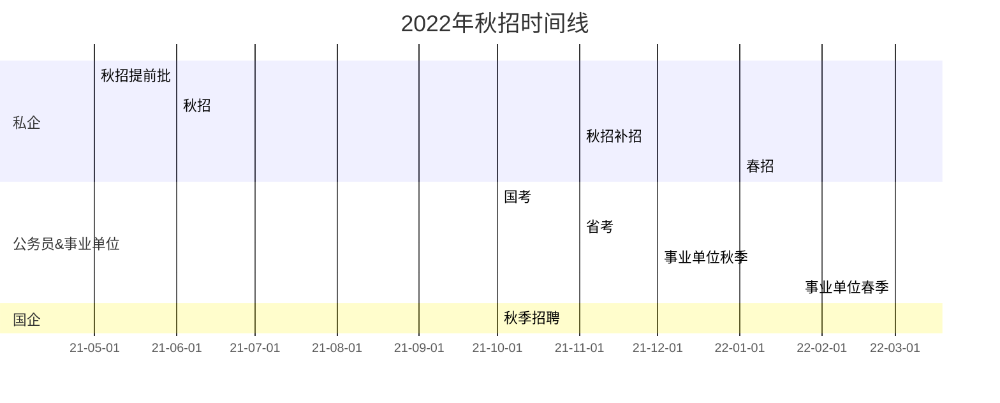

8.2号就答辩了。

这几天都是睡在实验室里，也许答辩完或者写完最后的论文会再整理一点东西写出来吧。

忽然想起来，自己这个博客一开始也只想纯写技术型的东西，后来就慢慢地不得不加入了很多个人生活的东西。因为自己很难有别的地方去抒发这么长篇大论的感受。

2022.1.28解封，总结并且做一下春招的计划

2022.7.1加入春招和经验总结

<!-- more -->

# 开始之前的个人牢骚

今天早晨起来看到了一个化学转CS的[经历贴](\- https://www.1point3acres.com/bbs/thread-765926-1-1.html)，关于他为什么要转CS，文里是这么写的

>**计算化学**，我认为它是一条河流，这个河流连接的一端是严谨的物理的理论，另一端是可以定量的预测和解释化学反应和性质的能力。
>
>这条河流分为三个部分，可以理解为一条河流的**上游、中游和下游**。
>
>上游是用物理的方法去根据已有的物理定律去建立一个有效的模型，这个模型里面可能做了某些近似，那么我们需要根据化学的直觉以及扎实的物理基础来建立这些模型。
>
>中游叫做算法，就是说建立一个模型之后，我们如何用一定的方法去求解这个模型，才能从这个模型中得出我们预测的结果。
>
>下游是做应用，也就是说如何把模型用到一个有化学价值的体系里面。
>
>那么这三个部分就也就决定了计算化学它要用到一些物理、应用数学以及计算机科学的知识。
>
>因为我做了很多研究的项目，我在做这个项目的时候发现一个共同点：我在做这个研究的时候，好像关注的不是它背后有多么深刻的物理的原理，也没有去观察它能利用哪些化学直觉，然后做哪些化学的体系，而是更多的把精力放在了第二步，也就是说算法那一步。
>
>如何去有效的求解这些模型是我最关心的，也是任何一个项目最使我感到有意思的一部分。
>
>在这种情况下，我就逐渐的意识到，其实我计算化学之所以能做出一定的研究成果，并不是因为我对化学甚至物理有多大的兴趣，而是说我比较喜欢研究这些计算方面的方法，而这个东西本质上和我用到哪个学科里是没有关系的。
>
>另一方面，我个人其实在写代码的时候是有一种比较独特的情感，我会觉得这种解决工程问题的过程中它有一种非常有意思的动手实践的感觉，它有一种及时的反馈；而我在思考一些更偏科学的问题的时候，我觉得我没有这种愉悦感。
>
>所以说，这种表面的认同和实际经验中的快乐的区别是我在成长的过程中意识到的重要的一个心法，一种思考问题的方式。

其实我的情况和这个差不多。

本科的时候能让我开心的从来不是生物的化学的知识，而是数学上清楚地推导。

现在能让我沉浸的也不是什么奇特的有趣的现象，而是物理光学之类的原理，和数学统计上的推导。

不同的是，可能我对算法并没有最关注，可能这三步我关注的点大概是442这样。

就是自己认识的太晚了，不过好歹自己没有盲目的继续去读博，否则会更痛苦。

所以我真的觉得，大学四年里，考多少分什么的，真的都不重要。

重要的是认识自己，而不是认识世界。

学会与自己相处永远是最重要的内容。

很遗憾自己迟来了两年，但也很庆幸自己只晚了两年。

希望我还能找个工作然后让我去学我喜欢的东西吧，推公式这种事情永远是让我最享受的。

可能这也是为啥我和我老板分歧比较严重，我老板可能是118的感觉。

# 秋招进程

自己的背景可以从博客里面找到，我就不浪费时间了，大方向是水色遥感，无论文无实习。

自己的秋招大概投了游戏，选调，遥感和外企和其他这几类

## 游戏公司

基本上能听说到名字的游戏的游戏公司都投了，什么网易米哈游腾讯莉莉丝，甚至很多小公司也投了。

主要是游戏策划。

游戏策划这个岗位最主要的需求还是要求你做demo或者游戏拆解，自己在这方面确实做的不够好。而且国内厂家做手游网游比较多，自己的游戏经历偏向单机。

而且自己游戏经历也没那么多。

最终收到了一家套皮公司14*14的offer，选择没去。

如果公司的产品自己都不喜欢，那为什么还要去呢？

## 选调

自己一开始有想法，去江浙沪，广州常州这种。

后来选调的时候看到一栏就不想做了，那一栏是学生工作经历，或者叫党团委经历。

我填啥？填和团委对着骂么？

## 遥感

遥感能投的公司基本都投了

放个具体列表吧，因为遥感秋招的信息真的挺少的

有过面试或者联系过面试的：

大地新亚，航天宏图，清华苏州创新研究院，中科星图，中科天启，湖州遥感，广州测绘院

投递之后无反应的

四维图新，空天院，滴滴出行，高德地图，湛江湾实验室，长光卫星，航天科技集团下属，中国四维测绘技术有限公司
，大地量子，中交水利水电建设有限公司，中海油，三峡集团，广核，中国城市规划设计研究院，季华实验室。

感受就是 遥感要么进体制内 要么转CS，这些公司可能有些国企比较好，但是碍于我留学生的身份又没有论文，进不去。

另外，这些公司的性质，基本都是外包。

## 外企和其他

thoughtworks，super X，群面挂

广州联通软件开发，面试挂

amazon ba，简历挂

哈罗单车测试，简历挂

极米测开，简历挂

paypal da，简历挂。

# 总结

遥感水色遥感这行的问题之前也提过了，在[这里](https://lifeodyssey.github.io/posts/a5da9b38.html)。

不清楚陆地是不是这样。

总结一下，遥感如果继续走技术类的工作。

要么进体制内，要么转行CS。

然后其他的像软件开发和策划，自己可以进，就是没有准备好。春招可以再试试。

加油吧。

# 春招

说是春招，其实是冬天开始的。

2022年应届的春招其实是从2021年12月秋招补招开始的，这一阶段无法投递之前投递过的公司。

第二阶段的春招在春节之后开启，也有很多公司会在春节之前开始收简历，春节之后面试。

由于众所周知的原因和一些个人原因，今年春招hc 不多 我投递的公司不再以游戏公司为主，主要以国内外企为主，外加一个事业单位和国企相关公司。国企相关公司由于保密政策把我拒了，事业单位由于疫情至今没有进行笔试，外企技术岗大多数挂在面试，基本上4月初春招就基本结束了。

真难啊

# 对留学生的建议

首先，我建议留学生尽量在当地先工作，而不是直接回国。

其次，一定要在境外找到国内的工作并且拿到具有法律效力的offer之后，再回国，不要想着回国之后再找工作。如果一个工作要求笔试面试全部线下进行，在现在疫情留学生很难回来的情况下，这就代表着他对留学生没有特殊偏好，或者更直接的说，不欢迎留学生。

国内公司招聘倾向于招聘有实际经历的人，因此有机会的话，一定要进行实习，或者自己去做小的项目，b站 youtub github很多资源。写简历的时候要记住一定要只放相关的项目，哪怕是跟着教程做出来的toy也比放一个完全不相关的东西要好。

# 国内春秋招时间线

在开始之前，一定要提前一年甚至两年先确定自己毕业证上写的时间和你想要去的单位的招聘时间，两年应届生的身份的说法可以当扯蛋不存在，国内私企对于当年应届生的定义一般为去年9月到当年8月，也有去年10月到当年9月或者当年1月到当年12月的。体制内单位则各有个的不同，有的定义为两年内没有确定工作(无社保)，有的定义为去年10月到当年9月或者去年9月到当年8月，也有的定义为当年。以2022年应届生招聘为例的话，大概如下表。2023年应届生招聘的话请自行在年份上+1。

| 所写时间           | 实际毕业时间                       |
| ------------------ | ---------------------------------- |
| 去年9月到当年8月   | 2021.9.1-2022.8.31                 |
| 当年1月到当年12月  | 2022.1.1-2022.12.31                |
| 去年10月到当年9月  | 2021.10.1-2022.9.1                 |
| 两年内没有确定工作 | 截止到考试时间或者报名时间的两年前 |
| 当年               | 2022.1.1-2022.12.31                |

写了一下一个2022年秋招最普遍的各种单位的招聘时间线，具体到你想去的单位请自行查阅，银行没有，因为没经历过，国企和事业转企业的单位投的少可能不准。没有人才引进，没有军队文职，因为我没经历过。没有具体到开始时间，因为每家公司都不同，你可以视为在时间段的开始之前就会有信息，时间段之内你会有机会参与，时间段之后彻底结束。

